# 📋 METODOLOGI PENELITIAN
## Klasifikasi Depresi menggunakan Machine Learning pada Data Aktivitas Motorik

---

## 🎯 PENDAHULUAN METODOLOGI

### Latar Belakang Pendekatan

Penelitian ini mengadopsi pendekatan **data-driven** untuk mengidentifikasi pola aktivitas motorik yang dapat membedakan individu dengan depresi dari individu sehat. Depresi mayor merupakan gangguan mental yang mempengaruhi tidak hanya aspek psikologis, tetapi juga manifestasi fisik seperti pola aktivitas harian, ritme sirkadian, dan kualitas tidur.

Penggunaan data aktigrafi (sensor aktivitas yang dapat dikenakan) menawarkan beberapa keunggulan dibanding penilaian subjektif tradisional:
- **Objektif**: Tidak bergantung pada laporan diri pasien
- **Kontinyu**: Monitoring 24/7 dalam kondisi natural
- **Non-invasif**: Tidak mengganggu aktivitas sehari-hari
- **Kuantitatif**: Data numerik yang dapat dianalisis secara statistik

### Tujuan Metodologi

Mengembangkan model klasifikasi yang:
1. **Akurat**: Mampu mengidentifikasi depresi dengan presisi tinggi
2. **Robust**: Stabil terhadap variasi data
3. **Interpretable**: Dapat dijelaskan secara klinis
4. **Praktis**: Implementable untuk screening atau monitoring

### Kerangka Penelitian

Penelitian ini mengikuti paradigma **supervised learning** dimana model belajar dari data berlabel (condition vs control) untuk kemudian memprediksi kasus baru. Pendekatan ini dipilih karena:
- Tersedianya ground truth (diagnosis klinis)
- Tujuan klasifikasi binary yang jelas
- Kebutuhan akan interpretabilitas untuk aplikasi medis

---

## 📊 DIAGRAM ALUR PENELITIAN

```mermaid
flowchart TD
    Start([Mulai Penelitian]) --> DataCollection[📁 Pengumpulan Data]
    
    DataCollection --> DataDesc{Deskripsi Data}
    DataDesc --> Condition[Condition Group<br/>23 subjek depresi]
    DataDesc --> Control[Control Group<br/>32 subjek sehat]
    DataDesc --> Scores[Scores Data<br/>MADRS & HDRS]
    
    Condition --> DataLoading[1️⃣ DATA LOADING]
    Control --> DataLoading
    Scores --> DataLoading
    
    DataLoading --> LoadTS[Load Time Series<br/>Activity Data]
    LoadTS --> LoadScores[Load Clinical Scores]
    LoadScores --> TotalData[Total: 55 Subjek<br/>23 Condition + 32 Control]
    
    TotalData --> Preprocessing[2️⃣ PREPROCESSING]
    
    Preprocessing --> PreStep1[Handling Missing Values<br/>Forward Fill Method]
    PreStep1 --> PreStep2[Outlier Detection<br/>IQR Method]
    PreStep2 --> PreStep3[Data Normalization<br/>Z-Score]
    PreStep3 --> PreStep4[Time Alignment<br/>Hourly Resampling]
    
    PreStep4 --> FeatureExt[3️⃣ FEATURE EXTRACTION]
    
    FeatureExt --> StatFeatures[Statistical Features<br/>Mean, Std, Variance, etc.]
    FeatureExt --> TimeFeatures[Temporal Features<br/>Hourly, Daily, Weekly]
    FeatureExt --> SleepFeatures[Sleep Features<br/>Duration, Onset, Wake Time]
    FeatureExt --> CircadianFeatures[Circadian Features<br/>Rhythm Strength, Acrophase]
    FeatureExt --> ActivityFeatures[Activity Features<br/>Peak, Valley, Transitions]
    
    StatFeatures --> FeatureMatrix[Feature Matrix<br/>73 Features × 55 Samples]
    TimeFeatures --> FeatureMatrix
    SleepFeatures --> FeatureMatrix
    CircadianFeatures --> FeatureMatrix
    ActivityFeatures --> FeatureMatrix
    
    FeatureMatrix --> EDA[4️⃣ EXPLORATORY DATA ANALYSIS]
    
    EDA --> EDAViz1[Distribution Analysis]
    EDA --> EDAViz2[Correlation Analysis]
    EDA --> EDAViz3[Class Balance Check]
    EDA --> EDAViz4[Feature Importance]
    
    EDAViz1 --> FeatureSelection[5️⃣ FEATURE SELECTION]
    EDAViz2 --> FeatureSelection
    EDAViz3 --> FeatureSelection
    EDAViz4 --> FeatureSelection
    
    FeatureSelection --> VarThreshold[Variance Threshold<br/>Remove Low Variance]
    VarThreshold --> CorrFilter[Correlation Filter<br/>Remove Redundancy]
    CorrFilter --> SelectKBest[SelectKBest<br/>Chi-Square Test]
    SelectKBest --> SelectedFeatures[Selected Features<br/>30 Features]
    
    SelectedFeatures --> DataSplit[6️⃣ DATA SPLITTING]
    
    DataSplit --> TrainSet[Training Set<br/>80% Data]
    DataSplit --> TestSet[Test Set<br/>20% Data]
    
    TrainSet --> ImbalanceHandle[7️⃣ IMBALANCED DATA HANDLING]
    
    ImbalanceHandle --> Strategy1[Strategy 1: Original<br/>No Handling]
    ImbalanceHandle --> Strategy2[Strategy 2: Class Weights<br/>Balanced Weights]
    ImbalanceHandle --> Strategy3[Strategy 3: SMOTE<br/>Synthetic Oversampling]
    ImbalanceHandle --> Strategy4[Strategy 4: ADASYN<br/>Adaptive Sampling]
    ImbalanceHandle --> Strategy5[Strategy 5: SMOTE+Weights<br/>Combined Approach]
    
    Strategy1 --> ModelTraining[8️⃣ MODEL TRAINING]
    Strategy2 --> ModelTraining
    Strategy3 --> ModelTraining
    Strategy4 --> ModelTraining
    Strategy5 --> ModelTraining
    
    ModelTraining --> GNB[Gaussian Naive Bayes<br/>5 Variants]
    ModelTraining --> DT[Decision Tree<br/>5 Variants]
    
    GNB --> TotalModels[Total: 10 Models<br/>2 Algorithms × 5 Strategies]
    DT --> TotalModels
    
    TotalModels --> CrossVal[9️⃣ CROSS-VALIDATION]
    CrossVal --> CV5Fold[5-Fold CV<br/>Training Performance]
    
    CV5Fold --> TestEval[🔟 TEST EVALUATION]
    TestEval --> Metrics[Performance Metrics<br/>Accuracy, Precision, Recall<br/>F1-Score, AUC-ROC]
    
    Metrics --> ModelComp[1️⃣1️⃣ MODEL COMPARISON]
    ModelComp --> StatTest[Statistical Tests<br/>Friedman Test<br/>Wilcoxon Test]
    
    StatTest --> BestModel[1️⃣2️⃣ BEST MODEL SELECTION]
    
    BestModel --> Visualization[1️⃣3️⃣ VISUALIZATION]
    Visualization --> ConfMatrix[Confusion Matrix]
    Visualization --> ROCCurve[ROC Curves]
    Visualization --> FeatureImp[Feature Importance]
    Visualization --> ActivityPattern[Activity Patterns]
    Visualization --> ModelComp2[Model Comparison]
    
    ConfMatrix --> Results[1️⃣4️⃣ HASIL & KESIMPULAN]
    ROCCurve --> Results
    FeatureImp --> Results
    ActivityPattern --> Results
    ModelComp2 --> Results
    
    Results --> End([Selesai])
    
    style Start fill:#e1f5e1
    style End fill:#e1f5e1
    style Winner fill:#ffd700
    style BestModel fill:#90EE90
    style DataCollection fill:#E6F3FF
    style Preprocessing fill:#FFE6F0
    style FeatureExt fill:#FFF4E6
    style EDA fill:#F0E6FF
    style FeatureSelection fill:#E6FFF9
    style ModelTraining fill:#FFE6E6
    style Results fill:#FFFFCC
```



---

## 1️⃣ PENGUMPULAN DATA

### 1.1 Konteks Dataset

Dataset yang digunakan dalam penelitian ini merupakan data aktivitas motorik dari pasien dengan depresi mayor dan kelompok kontrol sehat. Data dikumpulkan menggunakan **aktigraf**, yaitu sensor akselerometer yang dikenakan di pergelangan tangan untuk merekam pergerakan tubuh secara kontinyu.

**Signifikansi Klinis:**
Aktivitas motorik merupakan indikator penting dalam depresi karena:
- **Psychomotor retardation**: Perlambatan gerakan adalah gejala karakteristik depresi
- **Ritme sirkadian**: Gangguan pola tidur-bangun umum terjadi pada depresi
- **Anhedonia**: Kehilangan minat aktivitas tercermin dalam penurunan aktivitas fisik
- **Fatigue**: Kelelahan kronis mempengaruhi tingkat aktivitas harian

### 1.2 Desain Pengumpulan Data

**Prosedur Pengumpulan:**
- Subjek mengenakan aktigraf selama beberapa hari berturut-turut (rata-rata 6 hari)
- Sensor merekam aktivitas setiap menit tanpa henti
- Subjek menjalani aktivitas normal sehari-hari (natural setting)
- Tidak ada intervensi atau instruksi khusus untuk aktivitas
- Data dikumpulkan di lingkungan rawat jalan dan rawat inap

**Penilaian Klinis Paralel:**
Selain data aktigrafi, dilakukan penilaian klinis menggunakan:
- **MADRS** (Montgomery-Åsberg Depression Rating Scale): Skala 10 item untuk mengukur severitas depresi
- **HDRS** (Hamilton Depression Rating Scale): Skala 17-21 item, gold standard penilaian depresi
- **Demografi**: Usia, jenis kelamin, pendidikan, status pernikahan, pekerjaan
- **Karakteristik klinis**: Tipe depresi, fitur melankolis, status rawat inap/jalan

### 1.3 Struktur Data

#### Data Time Series (`data/condition/` & `data/control/`)
```
├── condition/       # 23 files (condition_1.csv - condition_23.csv)
├── control/         # 32 files (control_1.csv - control_32.csv)
```

### 1.4 Karakteristik Sampel

**Komposisi Sampel:**
- **Total subjek**: 55 individu
- **Kelompok Condition (Depresi)**: 23 subjek (41.8%)
- **Kelompok Control (Sehat)**: 32 subjek (58.2%)

**Implikasi Ketidakseimbangan Data:**
Rasio 1:1.39 menunjukkan **slight imbalance** yang perlu diantisipasi dalam modeling. Ketidakseimbangan ini mencerminkan:
- Realitas klinis dimana prevalensi kondisi berbeda
- Ketersediaan subjek dalam setting penelitian
- Kebutuhan teknik khusus untuk mencegah bias terhadap kelas mayoritas

Ketidakseimbangan ini **bukan masalah fatal** namun memerlukan strategi khusus dalam:
- Splitting data (stratified sampling)
- Training model (class weights, oversampling)
- Evaluasi (metrics yang tepat seperti F1-score, bukan hanya accuracy)

**Pertimbangan Etis:**
- Semua subjek memberikan informed consent
- Data telah dianonimisasi
- Penelitian mematuhi protokol etik penelitian medis

---*Temporal Resolution**: 1 menit
- **Features**: timestamp, activity level
- **Duration**: Bervariasi per subjek (beberapa hari)

#### Data Scores (`data/scores.csv`)
| number | days | gender | age | afftype | melanch | inpatient | edu | marriage | work | madrs1 | madrs2 | hdrs1 | hdrs2 |
|--------|------|--------|-----|---------|---------|-----------|-----|----------|------|--------|--------|-------|-------|
| 1 | 6 | M | 39 | 1 | 2 | 1 | 2 | 2 | 1 | 30 | 17 | 27 | 13 |
## 2️⃣ PREPROCESSING DATA

Tahap preprocessing merupakan fondasi kritis yang menentukan kualitas analisis selanjutnya. Data sensor mentah seringkali mengandung noise, missing values, dan inkonsistensi yang dapat mengganggu proses learning.

### 2.1 Penanganan Missing Values

**Permasalahan:**
Data aktigrafi dapat mengalami missing values karena berbagai alasan:
- Sensor terlepas atau tidak dikenakan sementara
- Gangguan teknis pada perangkat
- Kesalahan transfer atau penyimpanan data

**Solusi: Forward Fill Method**
Metode ini dipilih dengan pertimbangan:
- **Kontinuitas temporal**: Aktivitas manusia cenderung berubah secara gradual, bukan tiba-tiba
- **Asumsi persistence**: Level aktivitas pada waktu t cenderung mirip dengan t-1
- **Minimalisir artefak**: Dibanding interpolasi yang mungkin menciptakan pola artificial
- **Preservasi pola natural**: Tidak mengubah distribusi data secara signifikan

Untuk missing values di awal series, digunakan backward fill sebagai backup. Namun, subjek dengan missing values ekstensif (>20%) dipertimbangkan untuk dieksklusi guna menjaga integritas data.

### 2.2 Deteksi dan Penanganan Outlier

**Rasional:**
Data sensor dapat mengandung nilai ekstrem yang bukan merepresentasikan aktivitas sebenarnya, melainkan:
- Artefak gerakan: Misalnya sensor terbentur benda keras
- Anomali teknis: Spike akibat gangguan elektronik
- Aktivitas non-representatif: Misalnya olahraga ekstrem yang tidak mewakili pola harian

**Pendekatan: IQR (Interquartile Range) Method**

**Formula IQR:**
$$IQR = Q_3 - Q_1$$
$$\text{Lower Bound} = Q_1 - 1.5 \times IQR$$
$$\text{Upper Bound} = Q_3 + 1.5 \times IQR$$

Dimana:
- $Q_1$ = Kuartil pertama (25th percentile)
- $Q_3$ = Kuartil ketiga (75th percentile)
- Values di luar bounds dianggap outliers

Metode statistik robust ini dipilih karena:
- **Non-parametrik**: Tidak mengasumsikan distribusi tertentu
- **Robust**: Tidak terpengaruh oleh outlier itu sendiri
- **Standard practice**: Diterima luas dalam analisis data sensor

**Strategi Penanganan:**
Menggunakan **winsorization** (capping) dibanding removal karena:
- Preservasi jumlah data points (penting untuk time series)
- Mengurangi dampak ekstrem tanpa menghilangkan informasi temporal
- Menjaga kontinuitas series

### 2.3 Normalisasi Data

**Motivasi:**
Setiap individu memiliki baseline aktivitas yang berbeda dipengaruhi oleh:
- Usia dan kondisi fisik
- Gaya hidup dan pekerjaan
- Karakteristik individual lainnya

Tanpa normalisasi, model mungkin lebih belajar tentang perbedaan inter-individual daripada pola depresi vs non-depresi.

**Metode: Z-Score Normalization (Per Subjek)**

**Formula:**
$$z = \frac{x - \mu}{\sigma}$$

Dimana:
- $x$ = nilai aktivitas original
- $\mu$ = mean aktivitas subjek tersebut
- $\sigma$ = standard deviation aktivitas subjek
- $z$ = nilai normalized (mean=0, std=1)

Normalisasi dilakukan **per subjek** dengan alasan:
- **Fokus pada pola relatif**: Yang penting adalah pola aktivitas relatif terhadap baseline individu
- **Menghilangkan bias skala**: Semua subjek di-standarisasi ke skala yang sama
- **Preservasi struktur temporal**: Pola harian tetap terjaga

### 2.4 Alignment Temporal

**Tujuan:** Menyeragamkan resolusi temporal data untuk konsistensi analisis

**Masalah:**
Data aktigrafi dapat memiliki resolusi berbeda:
- Beberapa sensor record per menit
- Lainnya per 30 detik atau per 5 menit
- Timestamps mungkin tidak aligned perfectly

**Solusi: Resampling to Hourly Intervals**

**Formula Resampling (Mean Aggregation):**
$$\bar{x}_h = \frac{1}{n_h}\sum_{i=1}^{n_h} x_i$$

Dimana:
- $\bar{x}_h$ = aktivitas rata-rata untuk jam h
- $n_h$ = jumlah measurements dalam jam h
- $x_i$ = aktivitas individual measurements

**Keuntungan Hourly Resolution:**
- **Reduced dimensionality**: Dari ~8640 points/6 days → 144 hourly points
- **Noise reduction**: Averaging smooths sensor noise
- **Computational efficiency**: Lebih cepat untuk feature extraction
- **Clinical relevance**: Hourly patterns meaningful untuk behavior

---

## 3️⃣ EKSTRAKSI FITUR

Feature extraction merupakan jantung dari pendekatan machine learning untuk data time series. Proses ini mentransformasi raw time series menjadi representasi numerik yang menangkap karakteristik esensial pola aktivitas.

**Filosofi Feature Engineering:**
Dalam konteks depresi, kita tidak hanya ingin tahu "berapa banyak" aktivitas, tapi juga:
- **Kapan** aktivitas terjadi (temporal patterns)
- **Bagaimana** pola berubah sepanjang hari (circadian rhythm)
- **Seberapa konsisten** pola tersebut (variability)
- **Bagaimana kualitas tidur** (sleep features)

Total **73 features** diekstrak, dikelompokkan dalam 5 kategori utama yang masing-masing menangkap aspek berbeda dari aktivitas motorik.

### 3.1 Fitur Statistik Deskriptif (15 features)

**Tujuan:** Menangkap karakteristik distribusi aktivitas secara keseluruhan

**Kategori Features:**td=1, namun pola temporalnya tetap unik.

### 2.4 Alignment Temporal
#### a) Measures of Central Tendency
- **Mean (Rata-rata)**: Level aktivitas rata-rata keseluruhan

**Formula:**
$$\mu = \frac{1}{n}\sum_{i=1}^{n} x_i$$

  - Hipotesis: Pasien depresi cenderung memiliki mean aktivitas lebih rendah
  
- **Median**: Nilai tengah, lebih robust terhadap outlier

**Formula:**
$$Median = \begin{cases}
x_{(n+1)/2} & \text{jika n ganjil} \\
\frac{x_{n/2} + x_{(n/2)+1}}{2} & \text{jika n genap}
\end{cases}$$

- **Mode**: Nilai paling sering muncul (nilai dengan frekuensi tertinggi)

#### b) Measures of Dispersion
- **Standard Deviation**: Variabilitas aktivitas

**Formula:**
$$\sigma = \sqrt{\frac{1}{n}\sum_{i=1}^{n}(x_i - \mu)^2}$$

  - Depresi dapat dikaitkan dengan variabilitas yang lebih rendah (pola lebih monoton)
  
- **Variance**: Kuadrat dari standard deviation

**Formula:**
$$\sigma^2 = \frac{1}{n}\sum_{i=1}^{n}(x_i - \mu)^2$$

- **Range**: Selisih maksimum-minimum

**Formula:**
$$Range = x_{max} - x_{min}$$

  - Range yang sempit mungkin mengindikasikan kurangnya variasi aktivitas
  
- **IQR (Interquartile Range)**: Range untuk 50% data tengah, robust measure

**Formula:**
$$IQR = Q_3 - Q_1$$

Dimana $Q_1$ dan $Q_3$ adalah kuartil pertama dan ketiga.

#### c) Measures of Shape
- **Skewness**: Asimetri distribusi

**Formula:**
$$Skewness = \frac{n}{(n-1)(n-2)}\sum_{i=1}^{n}\left(\frac{x_i - \mu}{\sigma}\right)^3$$

  - Positive skew: Lebih banyak nilai rendah dengan beberapa spike tinggi
  - Negative skew: Lebih banyak nilai tinggi dengan beberapa drop rendah
  - Depresi mungkin menunjukkan pola skewness tertentu
  
- **Kurtosis**: "Tail heaviness" distribusi

**Formula:**
$$Kurtosis = \frac{n(n+1)}{(n-1)(n-2)(n-3)}\sum_{i=1}^{n}\left(\frac{x_i - \mu}{\sigma}\right)^4 - \frac{3(n-1)^2}{(n-2)(n-3)}$$

  - High kurtosis: Lebih banyak nilai ekstrem
  - Low kurtosis: Distribusi lebih uniform

#### d) Additional Statistics

- **Coefficient of Variation**: Mengukur variabilitas relatif

**Formula:**
$$CV = \frac{\sigma}{\mu} \times 100\%$$

- **Percentiles**: Membagi distribusi menjadi bagian-bagian

**Formula untuk Percentile ke-p:**
$$P_p = x_{(n \cdot p/100)}$$

Dimana percentile membagi data terurut menjadi 100 bagian sama.

#### a) Aktivitas Per Jam (24 features)
Ekstraksi rata-rata aktivitas untuk setiap jam (00:00-23:00).

**Rasional:**
- Manusia adalah makhluk diurnal dengan pola aktivitas 24 jam yang jelas
- Depresi sering mengacaukan ritme sirkadian normal
- Waktu-waktu tertentu mungkin lebih diskriminatif (misalnya pagi vs malam)

**Hipotesis Klinis:**
- **Morning activity**: Pasien depresi sering mengalami "morning worsening" - kesulitan memulai aktivitas pagi
- **Evening activity**: Perbedaan pola aktivitas sore/malam
- **Night activity**: Insomnia atau broken sleep dapat meningkatkan aktivitas nokturnal

#### b) Segmentasi Day/Night (3 features)
Membagi hari menjadi periode siang (06:00-22:00) dan malam (22:00-06:00).

**Features:**
- Day activity mean: Aktivitas rata-rata siang
- Night activity mean: Aktivitas rata-rata malam
- **Day/Night Ratio**: Rasio aktivitas siang vs malam

**Signifikansi:**
- Orang sehat: Rasio tinggi (aktif siang, istirahat malam)
- Depresi dengan insomnia: Rasio menurun (aktivitas malam meningkat)
- Depresi dengan hypersomnia: Rasio sangat tinggi atau pola irregular

#### c) Pola Weekday vs Weekend (2 features)
Membandingkan aktivitas hari kerja dengan akhir pekan.

**Hipotesis:**
- Orang sehat: Perbedaan jelas antara weekday-weekend (struktur vs relaksasi)
- Depresi: Perbedaan berkurang (loss of structure, anhedonia membuat weekend tidak berbeda)

#### d) Identifikasi Peak Activity (4 features)
- **Peak hour**: Jam dengan aktivitas tertinggi
- **Valley hour**: Jam dengan aktivitas terendah  
- **Peak value & Valley value**: Magnitude puncak dan lembah

**Interpretasi:**
- Timing dari peak dapat mengindikasikan chronotype dan circadian alignment
- Amplitude (peak-valley difference) mengukur variasi diurnal
- Depresi dapat menggeser atau meratakan kurva aktivitas harian

### 3.3 Fitur Tidur (8 features)

**Motivasi:** Gangguan tidur adalah salah satu gejala kardinal depresimin(),
    'activity_max': df['activity'].max(),
    'activity_median': df['activity'].median(),
    'activity_variance': df['activity'].var(),
    'activity_range': df['activity'].max() - df['activity'].min(),
    'activity_iqr': df['activity'].quantile(0.75) - df['activity'].quantile(0.25),
    'activity_skewness': df['activity'].skew(),
    'activity_kurtosis': df['activity'].kurtosis()
}
```

#### Advanced Statistics
- **Coefficient of Variation**: `std / mean`
- **Percentiles**: P10, P25, P75, P90
- **Zero Crossings**: Jumlah crossing mean

### 3.2 Temporal Features (33 features)

#### Deteksi Tidur dari Data Aktivitas

**Prinsip:** Periode tidur ditandai dengan aktivitas motorik yang sangat rendah dan berlangsung cukup lama.

**Kriteria:**
- **Threshold**: Aktivitas < threshold tertentu (ditentukan per subjek berdasarkan persentil bawah)
- **Minimum duration**: Episode low-activity ≥ 4 jam (menyingkirkan nap singkat atau false positives)

**Validasi:** Metode ini telah divalidasi dalam literatur aktigrafi sebagai proxy yang reasonable untuk sleep/wake, meskipun tidak sempurna seperti polysomnography.

#### Metrics Tidur yang Diekstrak

**a) Total Sleep Time (TST)**
Jumlah total menit/jam tidur dalam periode observasi.
- Depresi dapat menunjukkan **insomnia** (TST menurun) atau **hypersomnia** (TST meningkat)

**b) Number of Sleep Periods**
Berapa kali tidur terjadi dalam periode observasi.
- **Fragmented sleep**: Banyak episode pendek (sleep maintenance insomnia)
- **Consolidated sleep**: Satu episode panjang (tidur normal)

#### Analisis Cosinor

**Metode:** Memfitting kurva cosinus ke data aktivitas 24 jam untuk mengkuantifikasi ritme sirkadian.

**Model Matematika:**
Aktivitas di-modelkan sebagai fungsi cosinus:
$$A(t) = M + A \cdot \cos\left(\frac{2\pi}{24}(t - \phi)\right)$$

Dimana:
- $t$ = waktu (jam, 0-23)
- $M$ = **Mesor** (Midline Estimating Statistic Of Rhythm) - level aktivitas baseline
- $A$ = **Amplitude** - kekuatan ritme (setengah dari peak-to-trough difference)
- $\phi$ = **Acrophase** - timing dari puncak aktivitas (phase shift dalam jam)

**Goodness of Fit (R²):**
$$R^2 = 1 - \frac{\sum(y_i - \hat{y}_i)^2}{\sum(y_i - \bar{y})^2}$$

**Features yang Diekstrak:**

**a) Circadian Mesor**
Baseline aktivitas rata-rata sepanjang hari.
- Berbeda dengan simple mean karena memperhitungkan struktur periodik

**b) Circadian Amplitude**
Kekuatan ritme sirkadian.
- **High amplitude**: Perbedaan jelas antara siang-malam (ritme sehat)
- **Low amplitude**: Pola datar, ritme lemah (circadian disruption)
- Hipotesis: Amplitude berkurang pada depresi

**c) Circadian Acrophase**
Waktu puncak aktivitas dalam siklus 24 jam.
- Normal: Sore hari (14:00-18:00)
- **Phase advance**: Puncak lebih awal (elderly depression)
- **Phase delay**: Puncak lebih larut (atypical depression)

**d) Rhythm Strength (R²)**
Goodness-of-fit dari model cosinor.
- High R²: Data fit well dengan model cosinus (strong rhythm)
- Low R²: Pola tidak mengikuti ritme reguler (weak/absent rhythm)

**e) Intradaily Variability (IV)**
Mengukur fragmentasi ritme dalam satu hari.

**Formula:**
$$IV = \frac{n \sum_{i=1}^{n-1}(x_{i+1} - x_i)^2}{(n-1)\sum_{i=1}^{n}(x_i - \bar{x})^2}$$

Dimana:
- $n$ = jumlah measurements per hari
- $x_i$ = aktivitas pada time point i
- Higher IV = more fragmented rhythm

- High IV: Aktivitas sangat fluktuatif, tidak smooth
#### a) Rolling Window Statistics
Menghitung standard deviation dalam sliding windows berbagai ukuran (1 jam, 3 jam, 6 jam).

**Rasional:**
- Menangkap variabilitas pada multiple time scales
- 1-jam: Fluktuasi mikro
- 3-jam: Variabilitas jangka menengah
- 6-jam: Variabilitas dalam quarter-day segments

**Interpretasi:**
- High rolling std: Aktivitas sangat fluktuatif (restlessness, agitation)
- Low rolling std: Aktivitas stabil/monoton (psychomotor retardation)

#### b) Activity Change Rate
Rata-rata perubahan absolut aktivitas dari satu time point ke berikutnya.

**Formula:**
$$Change\_Rate = \frac{1}{n-1}\sum_{i=1}^{n-1}|x_{i+1} - x_i|$$

**Mengukur:**
- Seberapa cepat aktivitas berubah
- Smoothness vs abruptness transitions
- Depresi: Change rate mungkin lebih rendah (slower, more sluggish movements)

#### c) Transition Analysis
Mengkategorikan aktivitas ke levels (low/medium/high) dan menghitung frekuensi perpindahan antar levels.

**Metrics:**
- Total number of transitions
- Transitions per hour (normalized)

**Signifikansi:**
- High transitions: Aktivitas sangat bervariasi (mixed activity levels)
- Low transitions: Stuck in one level (prolonged inactivity atau overactivity)

#### d) Activity Entropy
Mengukur "unpredictability" atau kompleksitas distribusi aktivitas.

**Formula Shannon Entropy:**
$$H = -\sum_{i=1}^{N} p_i \log_2(p_i)$$

Dimana:
- $p_i$ = probabilitas aktivitas level i (dari histogram)
- $N$ = jumlah bins dalam histogram aktivitas
- $H$ = 0 when fully predictable (satu value saja)
- $H$ = $\log_2(N)$ when maximally unpredictable (uniform distribution)

**Interpretasi:**
- **High entropy**: Distribusi uniform, activity levels terdistribusi merata (complex behavior)
- **Low entropy**: Distribusi concentrated, didominasi beberapa levels (simple/monotonous behavior)
- Hipotesis: Depresi associated dengan lower entropy (reduced behavioral repertoire)

#### e) Sustained Inactivity Periods
Durasi dan frekuensi periode inaktivitas berkepanjangan (bukan tidur).

**Clinical relevance:**
- Prolonged inactivity during day: Anergia, apathy (core symptoms depresi)
- Berbeda dari rest periods normal

#### f) Activity Burst Detection
Identifikasi episode aktivitas tinggi yang singkat dan intens.

**Relevansi:**
- Agitation episodes dalam depresi anxious
- Akativasi singkat sebelum kembali ke hypoactivity

**Ringkasan 73 Features:**
- Statistical: 15 features
- Temporal: 33 features
- Sleep: 8 features
- Circadian: 6 features
- Activity patterns: 11 features

**Filosofi:** Feature set ini komprehensif namun redundan. Tahap selanjutnya (feature selection) akan memilih subset optimal.

---ep_mask = df['activity'] < SLEEP_THRESHOLD
sleep_periods = identify_continuous_periods(sleep_mask, MIN_SLEEP_DURATION)
```

#### Sleep Metrics
- **Total Sleep Time**: Sum of all sleep periods
- **Number of Sleep Periods**: Fragmentation indicator
- **Average Sleep Duration**: Mean sleep episode length
- **Sleep Onset Hour**: Average bedtime
- **Wake Time Hour**: Average wake time
- **Sleep Efficiency**: Sleep time / total time
- **Sleep Fragmentation**: Number of interruptions

### 3.4 Circadian Features (6 features)

#### Cosinor Analysis
```python
from scipy.optimize import curve_fit

def cosinor_model(t, mesor, amplitude, acrophase):
    """
    Cosinor model for circadian rhythm
    mesor: Mean level
    amplitude: Peak-to-trough difference / 2
    acrophase: Time of peak
    """
    return mesor + amplitude * np.cos(2*np.pi*(t - acrophase)/24)

# Fit to hourly data
hours = np.arange(24)
hourly_activity = [df[df.index.hour == h]['activity'].mean() for h in hours]

params, _ = curve_fit(cosinor_model, hours, hourly_activity)
mesor, amplitude, acrophase = params
```

**Features:**
- `circadian_mesor`: Baseline activity level
- `circadian_amplitude`: Rhythm strength
- `circadian_acrophase`: Peak time
- `circadian_rhythm_strength`: Goodness of fit
- `circadian_phase_shift`: Deviation from normal
- `intradaily_variability`: Within-day fragmentation

#### Autocorrelation
```python
# 24-hour lag autocorrelation
from statsmodels.tsa.stattools import acf
autocorr_24h = acf(hourly_activity, nlags=24)[24]
```

### 3.5 Activity Pattern Features (11 features)

#### Variability Metrics
```python
# Rolling window statistics
rolling_1h = df['activity'].rolling(window=60).std()
rolling_3h = df['activity'].rolling(window=180).std()
rolling_6h = df['activity'].rolling(window=360).std()

features['rolling_std_1h'] = rolling_1h.mean()
features['activity_change_rate'] = df['activity'].diff().abs().mean()
```

#### Transition Analysis
```python
# Activity level transitions
ACTIVITY_LEVELS = ['low', 'medium', 'high']
thresholds = df['activity'].quantile([0.33, 0.67])

def categorize_activity(value):
    if value < thresholds[0.33]:
        return 'low'
    elif value < thresholds[0.67]:
        return 'medium'
    else:
        return 'high'

df['activity_level'] = df['activity'].apply(categorize_activity)
transitions = (df['activity_level'] != df['activity_level'].shift()).sum()
transitions_per_hour = transitions / (len(df) / 60)
```

#### Entropy
```python
from scipy.stats import entropy

# Activity distribution entropy
hist, _ = np.histogram(df['activity'], bins=50)
activity_entropy = entropy(hist + 1e-10)
```

**Total Features Extracted: 73**

---

## 4️⃣ ANALISIS EKSPLORATORI DATA (EDA)

EDA merupakan tahap krusial untuk memahami karakteristik data sebelum modeling. Tujuan utama adalah mengidentifikasi pola, anomali, dan relationship yang akan menginformasikan keputusan modeling.

### 4.1 Analisis Distribusi

#### Distribusi Kelas Target
Dengan 23 condition vs 32 control (rasio 1:1.39), kita menghadapi **slight class imbalance**. Ini bukan masalah kritis tetapi perlu diantisipasi dalam:
- Stratified sampling untuk preserve proporsi
- Pemilihan metrics evaluasi (F1-score lebih tepat dari accuracy)
- Teknik balancing jika diperlukan

#### Distribusi Features
Eksplorasi distribusi setiap feature dilakukan untuk:

**a) Uji Normalitas**
Menggunakan Shapiro-Wilk test untuk mengidentifikasi features yang terdistribusi normal vs non-normal.
- **Penting untuk**: Pemilihan algoritma (Gaussian NB assumes normality)
- **Temuan umum**: Banyak features activity tidak perfectly normal (common untuk behavioral data)
- **Implikasi**: Perlu transformasi atau gunakan non-parametric methods

**b) Identifikasi Outliers**
Visualisasi box plots untuk mendeteksi extreme values.
- **Outliers legitimate**: Aktivitas ekstrem yang real (misal olahraga)
- **Outliers artifactual**: Sensor errors
- **Keputusan**: Winsorization sudah dilakukan di preprocessing

**c) Skewness dan Kurtosis**
- Heavy right-skew umum untuk activity data (banyak low activity, sedikit high activity)
- Transformasi log atau square root dapat dipertimbangkan jika needed

### 4.2 Analisis Korelasi

**Tujuan:** Mengidentifikasi redundansi informasi antar features

#### Feature Intercorrelations
Matrix korelasi 73×73 mengungkapkan:

**Expected High Correlations:**
- Hourly features yang berdekatan (activity_hour_08 vs activity_hour_09)
- Statistical measures terkait (mean vs median, std vs variance)
- Circadian parameters yang linked (amplitude vs rhythm strength)

**Problematic Multicollinearity:**
Korelasi sangat tinggi (>0.95) mengindikasikan redundansi:
- Dapat menyebabkan instability dalam model
- Meningkatkan dimensionality tanpa tambahan informasi
- Solusi: Feature selection akan mengatasi ini

#### Feature-Target Correlation
Identifikasi features dengan discriminative power tinggi:
- Statistical tests (t-test, Mann-Whitney)
- Effect size calculation (Cohen's d)
- **Ekspektasi**: Temporal dan circadian features likely most discriminative

### 4.3 Analisis Perbedaan Antar Kelompok

**Pendekatan:** Univariate comparison untuk setiap feature

#### Statistical Testing
Untuk setiap feature, bandingkan distribusi condition vs control:
- **Parametric**: Independent t-test (jika assumption met)
- **Non-parametric**: Mann-Whitney U test (safer untuk non-normal data)
- **Significance level**: α = 0.05 (dengan Bonferroni correction untuk multiple testing)

**Multiple Testing Problem:**
Dengan 73 tests, probabilitas false positive meningkat.
- **Bonferroni correction**: α_corrected = 0.05/73 ≈ 0.0007
- **False Discovery Rate**: Kontrol proportion false positives
- **Trade-off**: Lebih conservative (mengurangi false positives, risk melewatkan signals)

#### Visualisasi Perbedaan
- **Box plots**: Menunjukkan median, quartiles, outliers per kelompok
- **Violin plots**: Menambahkan informasi density distribution
- **Strip plots**: Menunjukkan individual data points (penting dengan n kecil)

**Interpretasi Klinis:**
Features dengan perbedaan signifikan mengindikasikan **biomarkers potensial** untuk depresi.

### 4.4 Analisis Dimensionalitas

**Challenge:** 73 features dalam 55 samples = high-dimensional problem (p >> n dalam statistik klasik)

#### Principal Component Analysis (PCA)
**Tujuan:** Reduksi dimensi untuk visualisasi dan understanding struktur data

**Findings Tipikal:**
- First 2-3 PCs explain ~40-60% variance
- PC1: Often captures overall activity level (general hypo/hyperactivity)
- PC2: Often captures circadian strength or temporal patterns
- PC3: Captures variability or fragmentation

**Visualization:**
- Scatter plot PC1 vs PC2, colored by class
- **Interpretasi**: 
  - Clear separation = classes linearly separable in PC space (good prognosis)
  - Overlap = more complex, non-linear patterns (need sophisticated models)

#### t-SNE Analysis
Non-linear dimensionality reduction untuk melihat cluster structure.
- Lebih baik menangkap non-linear relationships
- **Caveat**: Hyperparameter sensitive, jangan over-interpret

#### Feature Space Geometry
**Insight dari dimensionality analysis:**
- Apakah classes well-separated atau overlapping?
- Apakah ada outlier subjects yang perlu investigasi?
- Apakah curse of dimensionality concern?

**Implikasi untuk Modeling:**
- High separation → Simple models mungkin cukup
- High overlap → Need more complex models atau better features
- Clear clusters → Supervised learning promising

#### Autocorrelation Analysis

**Tujuan:** Mengukur kemiripan time series dengan versi delayed-nya

**Formula Autocorrelation dengan Lag k:**
$$ACF(k) = \frac{\sum_{t=1}^{n-k}(x_t - \mu)(x_{t+k} - \mu)}{\sum_{t=1}^{n}(x_t - \mu)^2}$$

Dimana:
- $k$ = lag (delay) dalam time steps
- $x_t$ = nilai pada waktu t
- $\mu$ = mean dari series
- $ACF(k)$ berkisar -1 hingga +1

**Interpretasi:**
- $ACF(24)$ tinggi → Strong 24-hour rhythm
- $ACF(24)$ rendah → Weak or disrupted daily pattern
- Depresi mungkin menunjukkan autocorrelation lebih rendah (less predictable patterns)

---

## 5️⃣ SELEKSI FITUR

Feature selection adalah proses krusial yang menentukan keberhasilan model, terutama dengan dataset kecil dan dimensi tinggi.

**Motivasi:**
- **Curse of dimensionality**: Dengan 55 samples dan 73 features, risk overfitting sangat tinggi
- **Redundansi**: Banyak features berkorelasi tinggi (informasi duplikat)
- **Interpretabilitas**: Fewer features = model lebih mudah dijelaskan
- **Generalisasi**: Model sederhana cenderung generalize lebih baik
- **Efisiensi**: Training dan prediction lebih cepat

**Trade-off:** 
- Terlalu sedikit features → Underfitting (miss important patterns)
- Terlalu banyak features → Overfitting (learn noise)
- **Goal**: Sweet spot yang optimal

### 5.1 Pendekatan Multi-Stage

Pipeline seleksi menggunakan **sequential filtering** dengan 3 tahap, masing-masing mengatasi masalah berbeda:
1. Remove uninformative features (variance threshold)
2. Remove redundant features (correlation filter)
### 5.2 Tahap 1: Variance Threshold

**Prinsip:** Feature dengan variance sangat rendah mengandung sedikit informasi

**Formula Variance:**
$$\text{Var}(X) = \frac{1}{n}\sum_{i=1}^{n}(x_i - \bar{x})^2$$

**Rasional:**
- Jika feature hampir konstan across all subjects, tidak bisa membedakan classes
- Contoh: Jika semua subjek punya nilai sleep_onset_hour ≈ 22:00 ± 0.1, feature ini tidak diskriminatif
- **Unsupervised**: Tidak melihat label, hanya distribusi feature

**Threshold Selection:**
Threshold = 0.01 (1% dari variance setelah normalisasi)
- Terlalu ketat → Buang features informatif
- Terlalu longgar → Retain noise
- 1% adalah balance reasonable untuk data normalized

**Expected Outcome:**
- Input: 73 features
- Output: ~65-70 features
- Removed: Features near-constant (rare dalam data aktivitas yang naturally varies)
- Input: 73 features
- Output: ~65 features

### 5.3 Stage 2: Correlation Filter
### 5.3 Tahap 2: Correlation Filter

**Prinsip:** Dua features sangat berkorelasi mengandung informasi redundant

**Formula Korelasi Pearson:**
$$r_{xy} = \frac{\sum_{i=1}^{n}(x_i - \bar{x})(y_i - \bar{y})}{\sqrt{\sum_{i=1}^{n}(x_i - \bar{x})^2}\sqrt{\sum_{i=1}^{n}(y_i - \bar{y})^2}}$$

**Problem Multicollinearity:**
Features dengan korelasi |r| > 0.95 essentially mengukur hal yang sama:
- Contoh: `activity_hour_08` dan `activity_hour_09` mungkin sangat berkorelasi
- Tidak menambah informasi baru, hanya noise
- Dapat menyebabkan instability model (especially untuk linear models)
- Meningkatkan dimensionality tanpa benefit

**Strategi:**
Untuk setiap pasangan features dengan korelasi > 0.95:
1. Hitung variance masing-masing
2. **Retain**: Feature dengan variance lebih tinggi (lebih informatif)
3. **Drop**: Feature dengan variance lebih rendah

**Threshold Justification:**
- 0.95 = sangat tinggi, hanya drop truly redundant features
- Preserves features dengan correlation 0.7-0.9 (complementary information)
- Conservative approach (better keep than drop prematurely)

**Expected Outcome:**
- Input: ~65-70 features
- Output: ~45-55 features
- Typical removal: Highly correlated hourly features, duplicate statistical measures
### 5.4 Stage 3: SelectKBest (Chi-Square)

**Tujuan**: Select top k most informative features
### 5.4 Tahap 3: SelectKBest (Supervised Selection)

**Prinsip:** Pilih features dengan discriminative power tertinggi

**Supervised Approach:**
Berbeda dengan 2 tahap sebelumnya, ini menggunakan **label information**:
- Test seberapa baik setiap feature dapat memisahkan condition vs control
- Ranking features berdasarkan statistical association dengan target
- **Univariate**: Evaluasi setiap feature independently

**Metode: Chi-Square Test**

**Formula Chi-Square:**
$$\chi^2 = \sum_{i=1}^{n} \frac{(O_i - E_i)^2}{E_i}$$

Dimana:
- $O_i$ = Observed frequency dalam kategori i
- $E_i$ = Expected frequency jika independent (null hypothesis)
- $\chi^2$ = Test statistic (higher = stronger association)

Test statistik untuk mengukur independensi antara feature dan label:
- **H₀**: Feature independent dari label (no association)
- **H₁**: Feature dependent on label (has discriminative power)
- Higher χ² score = stronger association = more informative

**Why Chi-Square?**
- Cocok untuk non-negative features (activity data after scaling)
- Fast computation (penting untuk feature screening)
- Interpretable scores
- Well-established dalam feature selection literature

**Determining k (Number of Features):**
**k = 30** dipilih berdasarkan:
- **Rule of thumb**: n/2 samples (55/2 ≈ 27-30) untuk avoid overfitting
- **Balance**: Cukup informatif tanpa curse of dimensionality
- **Empirical**: Often sweet spot untuk dataset ini ukuran
- **Interpretability**: 30 features masih reasonable untuk dijelaskan

**Alternative Considerations:**
### 5.5 Karakterisasi Features Terpilih

**Distribusi Per Kategori:**
1. **Hourly Activity** (15 features): Jam-jam kritis seperti pagi (06, 08, 09), siang (11, 13-14), sore-malam (15-19, 21-23)
2. **Temporal Patterns** (5 features): day_night_ratio, peak_activity_hour, weekend patterns
3. **Circadian** (3 features): acrophase, rhythm strength, intradaily variability
4. **Sleep** (4 features): duration, onset/wake timing, fragmentation
5. **Activity Patterns** (3 features): transitions, variability, autocorrelation

**Observasi Penting:**

**a) Dominasi Temporal Features**
Lebih dari separuh features terpilih adalah temporal (hourly), mengindikasikan:
- **When** activity occurs lebih penting dari **how much**
- Depresi strongly affects temporal patterning of activity
- Circadian disruption adalah core feature

**b) Specific Hours Selected**
Not all 24 hours selected - yang terpilih adalah jam-jam diskriminatif:
- **Pagi (06-09)**: Morning activation problems dalam depresi
- **Siang (11, 13-14)**: Midday activity patterns
- **Sore-malam (15-19)**: Evening activity decline dalam depresi
- **Malam (21-23)**: Pre-sleep activity patterns

**c) Sleep Features**
Meskipun banyak sleep metrics diekstrak, hanya subset terpilih:
- Duration, timing, dan fragmentation most informative
- Efficiency dan number of periods less discriminative

**d) Circadian Rhythm**
Semua 3 circadian features terpilih menunjukkan central importance of circadian disruption.

**Implikasi Klinis:**
Feature set final ini merefleksikan **signature depresi** dalam aktivitas motorik:
- Disrupted temporal patterning
- Altered circadian rhythms  
- Sleep disturbances
- Reduced activity variability

---**Hourly Activity** (15 features): activity_hour_06, 08, 09, 11, 13-19, 21-23
2. **Temporal Patterns** (5 features): day_night_ratio, peak_activity_hour, weekend_activity_mean
3. **Circadian** (3 features): circadian_acrophase, circadian_rhythm_strength, intradaily_variability
4. **Sleep** (4 features): avg_sleep_duration, sleep_onset_hour, wake_time_hour, sleep_fragmentation
5. **Activity Patterns** (3 features): activity_transitions, moving_avg_std, autocorr_lag24

---

## 6️⃣ PEMBAGIAN DATA

### 6.1 Strategi Train-Test Split

**Rasio 80:20** dipilih sebagai standard practice untuk dataset berukuran sedang:
- **Training set (80%)**: 44 samples untuk learning patterns
- **Test set (20%)**: 11 samples untuk evaluasi unbiased

**Pertimbangan Ukuran Dataset:**
Dengan total 55 samples:
- 80:20 memberikan test set n=11 (cukup untuk evaluasi initial)
- 70:30 akan memberikan test n=16 (lebih robust tapi training data berkurang)
- 90:10 memberikan test n=5 (terlalu kecil, unreliable)

**Trade-off:** Lebih banyak training data vs lebih robust testing
- Pilihan 80:20 adalah **balance reasonable** untuk n=55

### 6.2 Stratified Sampling

**Critical Requirement:** Mempertahankan proporsi kelas dalam train dan test

**Why Stratification Matters:**
Tanpa stratifikasi, random split bisa menghasilkan:
- Test set dengan semua atau mayoritas satu kelas (unrepresentative)
- Train set dengan class imbalance ekstrem
- Hasil evaluasi yang misleading

**Dengan Stratifikasi:**

**Formula Proporsi:**
$$\frac{n_{condition}^{train}}{n_{total}^{train}} \approx \frac{n_{condition}^{test}}{n_{total}^{test}} \approx \frac{23}{55} \approx 0.42$$

**Hasil:**
- **Train**: 26 Control (59%), 18 Condition (41%)
- **Test**: 6 Control (55%), 5 Condition (45%)
- Proporsi kurang lebih preserved (~58% control di keduanya)

**Benefits:**
1. **Representative test set**: Mencerminkan populasi asli
2. **Fair evaluation**: Semua classes adequately represented  
3. **Reproducibility**: Dengan random seed fixed, split konsisten

### 6.3 Cross-Validation Strategy

**Limitation of Single Split:**
Dengan dataset kecil, satu train-test split bisa misleading:
- Performance bisa vary tergantung subjects mana di test set
- Specific subjects bisa "easy" atau "hard" to classify
- Single number tidak capture uncertainty

**Solusi: K-Fold Cross-Validation**

**5-Fold Stratified CV** diterapkan pada training set:
- **Training dibagi menjadi 5 folds**
- Setiap fold digunakan sekali sebagai validation, 4 lainnya untuk training
- Hasil: 5 performance estimates → mean ± std

**Why k=5?**
- **k=3**: Too few, high variance in estimates
- **k=5**: Good balance untuk small datasets
- **k=10**: Standard choice, tapi dengan n=44 mungkin terlalu aggressive (each fold n≈4-5)
- **Leave-one-out (k=n)**: Unbiased tapi high variance, computationally expensive

**Stratified CV:**
Setiap fold mempertahankan class proportions:
- Fold 1: ~7 control, ~5 condition
- Fold 2: ~7 control, ~5 condition
- Dll.

**Purpose CV:**
1. **Model selection**: Membandingkan algorithms/hyperparameters
2. **Performance estimation**: Lebih robust dari single train-test
3. **Detect overfitting**: Large train-val gap = overfitting
4. **Uncertainty quantification**: Std across folds = performance variability

### 6.4 Penanganan Data Leakage

**Critical Principle:** Test set harus benar-benar "unseen"

**Potential Leakage Sources:**
1. **Feature scaling**: Jika scaling menggunakan statistics dari semua data
   - **Correct**: Fit scaler pada train, transform train dan test separately
   
2. **Feature selection**: Jika selection melihat test set
   - **Correct**: Selection only pada train set
   
3. **Imputation**: Jika missing value imputation gunakan test data
   - **Correct**: Impute berdasarkan train statistics only

4. **Oversampling**: Jika SMOTE/ADASYN dilakukan sebelum split
   - **Correct**: Apply balancing ONLY pada train set, AFTER split

**Workflow Benar:**
```
1. Split data → Train + Test
2. Feature selection pada Train only
3. Fit preprocessing pada Train
4. Apply preprocessing ke Train dan Test
5. Imbalance handling pada Train only
6. Train model pada processed Train
7. Evaluate pada processed Test
```

**Konsekuensi Leakage:**
Overoptimistic performance yang tidak generalize ke data baru (fatal error dalam ML!)

---

## 7️⃣ PENANGANAN DATA TIDAK SEIMBANG

Class imbalance (23 vs 32) adalah karakteristik inherent dari banyak medical datasets dan perlu ditangani dengan hati-hati.

### 7.1 Mengapa Imbalance Menjadi Masalah?

**Problem dengan Standard Learning:**
Kebanyakan algoritma ML di-optimize untuk accuracy. Dengan imbalanced data:
- **Majority class bias**: Model cenderung prediksi majority class
- **Contoh ekstrem**: Prediksi semua samples sebagai "control" → accuracy 58%! (misleading)
- **Minority class underlearned**: Pola condition class terabaikan
- **Poor generalization**: Performance buruk pada real-world dengan prevalence berbeda

**Specific Concerns:**
- **Medical context**: False negative (miss depression) bisa berbahaya
- **Small sample**: Minority class hanya 18 training samples (very limited)
- **Need balance**: Sensitivity dan specificity harus keduanya tinggi

### 7.2 Filosofi Penanganan: Multi-Strategy Approach

Tidak ada "best" strategy universal untuk imbalance. Effectiveness tergantung pada:
- Dataset characteristics
- Algorithm choice
- Degree of imbalance
- Domain requirements

**Pendekatan Penelitian:**
Implementasikan **5 strategies berbeda** dan bandingkan empirically:
1. Baseline (no handling) - untuk reference
2-5. Various handling techniques

Ini memberikan **comprehensive evaluation** dan **robust conclusions** tentang strategy terbaik untuk kasus ini.

### 7.3 Strategy 1: Original (Baseline)

**Approach:** Tidak ada modifikasi, biarkan natural class distribution

**Rationale:**
- **Baseline reference**: Untuk mengukur benefit dari strategies lain
- **Mild imbalance**: 1:1.39 tidak ekstrem (compare dengan fraud detection 1:10000)
- **Some algorithms robust**: Tree-based models sometimes handle mild imbalance reasonably

**Expected Performance:**
- Mungkin bias ke majority class
- Decent overall accuracy tapi sensitivity mungkin rendah
- Benchmark untuk improvement

### 7.4 Strategy 2: Class Weighting

**Approach:** Assign higher weights ke minority class dalam loss function

**Mekanisme:**
Setiap training sample diberi weight berdasarkan class frequency:

**Formula Balanced Weight:**
$$w_i = \frac{n_{total}}{n_{classes} \times n_i}$$

Dimana:
- $w_i$ = weight untuk class i
- $n_{total}$ = total training samples (44)
- $n_{classes}$ = jumlah classes (2)
- $n_i$ = jumlah samples dalam class i

**Contoh Perhitungan:**
- **Control** (n=26): $w_{control} = \frac{44}{2 \times 26} = 0.846$
- **Condition** (n=18): $w_{condition} = \frac{44}{2 \times 18} = 1.222$

**How It Works:**
Model "pays more attention" ke minority class:
- Misclassifying minority sample = larger penalty
- Forces model learn minority patterns better
- **No data modification** - purely algorithmic adjustment

**Advantages:**
✅ Simple, elegant solution
✅ No synthetic data (preserve data integrity)
✅ No increase in training time
✅ Works well untuk many algorithms (SVM, trees, logistic regression)

**Limitations:**
⚠️ Not all algorithms support sample weights (e.g., standard Naive Bayes)
⚠️ Optimal weights might differ from balanced weights
⚠️ Doesn't add more minority examples (just reweights existing)

**Best For:** Tree-based models, linear models

### 7.5 Strategy 3: SMOTE (Synthetic Minority Over-sampling Technique)

**Approach:** Generate synthetic minority samples via interpolation

**Algorithm:**
Untuk setiap minority sample $x_i$:
1. Find k=5 nearest neighbors dari same class
2. Randomly select satu neighbor $x_{nn}$
3. Generate new sample di antara $x_i$ dan $x_{nn}$:
   $$x_{new} = x_i + \lambda \cdot (x_{nn} - x_i), \quad \lambda \sim U(0,1)$$
4. Repeat sampai classes balanced

**Example:**
- Before: 18 condition, 26 control
- After: 26 condition (8 synthetic), 26 control

**Intuition:**
Synthetic samples "fill in" the minority class space:
- Not duplicates (yang bisa cause overfitting)
- Plausible samples within class distribution
- Increases minority representation

**Advantages:**
✅ Increases minority training examples
✅ Interpolation-based (reasonable samples)
✅ Widely validated dalam research
✅ Often improves recall for minority class

**Limitations:**
⚠️ Can generate noisy samples near decision boundary
⚠️ Assumes linear interpolation reasonable (not always true)
⚠️ Doesn't consider data distribution (uniform sampling)
⚠️ Increases training time slightly

**Best For:** Linear classifiers, when need more minority examples

### 7.6 Strategy 4: ADASYN (Adaptive Synthetic Sampling)

**Approach:** Smarter version of SMOTE - adaptively generate samples

**Key Innovation:**
Not all minority samples are equally "difficult". ADASYN focuses on:
- **Hard samples**: Minority points surrounded by majority points (hard to learn)
- **Easy samples**: Minority points in dense minority regions (already well-represented)

**Algorithm:**
1. For each minority sample $x_i$, count majority neighbors: $\Gamma_i$
2. Calculate difficulty ratio: $r_i = \Gamma_i / k$
3. Normalize: $\hat{r}_i = r_i / \sum r_i$
4. Generate samples proportional to $\hat{r}_i$

**Effect:**
- More synthesis in **difficult regions** (improve decision boundary)
- Less synthesis in **easy regions** (avoid redundancy)
- **Density-based adaptation**

**Example:**
- Sample A: 4/5 neighbors are majority → high difficulty → generate 5 synthetic
- Sample B: 1/5 neighbors are majority → low difficulty → generate 1 synthetic

**Advantages:**
✅ **Adaptive**: Focuses resources where needed most
✅ **Better boundaries**: Improves classification at class edges
✅ **Efficient**: Less synthetic data needed untuk same improvement
✅ Often outperforms SMOTE empirically

**Limitations:**
⚠️ More complex than SMOTE
⚠️ Sensitive to k (neighbor parameter)
⚠️ Can still generate outliers
⚠️ Slightly slower than SMOTE

**Best For:** Complex decision boundaries, when SMOTE insufficient

### 7.7 Strategy 5: SMOTE + Class Weights (Hybrid)

**Approach:** Combine oversampling dan cost-sensitive learning

**Rationale:**
- SMOTE increases minority samples
- Class weights ensures they're weighted properly
- **Synergy**: Both mechanisms reinforce minority class learning

**Procedure:**
1. Apply SMOTE → Balanced dataset (26-26)
2. Compute balanced weights for SMOTE-d data
3. Train with weighted samples

**Advantages:**
✅ Double mechanism for handling imbalance
✅ Potentially most robust
✅ Combines data-level dan algorithm-level approaches

**Limitations:**
⚠️ Most complex strategy
⚠️ Risk of over-correcting (too much focus on minority)
⚠️ Longer training time
⚠️ More hyperparameters to tune

**Best For:** Severely imbalanced data, when single strategy insufficient

### 7.8 Strategy Comparison Framework

**Evaluation Dimensions:**
1. **Performance**: Which achieves best F1-score?
2. **Stability**: Which has lowest variance across CV folds?
3. **Computational cost**: Training time
4. **Simplicity**: Implementation complexity
5. **Interpretability**: Effect on model understanding

**Expected Outcomes:**
- No single strategy dominates all dimensions
- Best strategy likely differs for GNB vs DT
- Empirical testing reveals optimal choice

---

## 8️⃣ PEMILIHAN DAN TRAINING MODEL

### 8.1 Rasional Pemilihan Algoritma

Dari ratusan algoritma ML yang tersedia, penelitian ini memilih **2 algorithms** dengan karakteristik kontras:

#### A) Gaussian Naive Bayes
**Karakteristik:**
- **Probabilistic**: Berbasis Bayes Theorem
$$P(y|X) = \frac{P(X|y)P(y)}{P(X)} \propto P(y)\prod_{i=1}^{n}P(x_i|y)$$
- **Generative model**: Model distribusi masing-masing class
- **Gaussian assumption**: $P(x_i|y) \sim \mathcal{N}(\mu_{iy}, \sigma^2_{iy})$
- **Simplicity assumptions**: Features independent given class
- **Fast**: Computational efficiency tinggi

**Mengapa Dipilih:**
✅ **Cocok small datasets**: Performa baik dengan sample terbatas
✅ **Interpretable**: Output probabilitas class membership
✅ **Baseline**: Standard benchmark untuk classification
✅ **Medical precedent**: Sering digunakan dalam medical diagnosis
✅ **Efficiency**: Tidak butuh iterative optimization

**Potential Limitations:**
⚠️ **Independence assumption**: Rarely true (features often correlated)
⚠️ **Gaussian assumption**: Distribusi mungkin tidak normal
⚠️ **Rigid**: Model structure fixed, limited flexibility

**Best Case Scenario:**
Features relatively independent, normally distributed within each class, linear decision boundary.

#### B) Decision Tree
**Karakteristik:**
- **Non-parametric**: No distributional assumptions
- **Recursive partitioning**: Binary splits on features
- **Rule-based**: If-then decision rules
- **Hierarchical**: Tree structure
- **Algorithm**: CART (Classification and Regression Trees) - implementasi scikit-learn

**Teori Decision Tree:**

Decision Tree adalah algoritma supervised learning yang membangun model prediksi berbentuk pohon keputusan. Setiap node internal merepresentasikan "test" pada sebuah feature, setiap cabang merepresentasikan outcome dari test, dan setiap leaf node merepresentasikan class label.

**Algoritma CART (Classification and Regression Trees):**

CART membangun binary trees menggunakan feature dan threshold yang menghasilkan largest information gain pada setiap step.

**Proses Splitting:**

1. **Untuk setiap feature j dan threshold t**, partisi data menjadi:
   - $S_{left}(j,t) = \{(x,y) | x_j \leq t\}$
   - $S_{right}(j,t) = \{(x,y) | x_j > t\}$

2. **Cari split terbaik** yang minimizes impurity:
   $$J(j,t) = \frac{n_{left}}{n}H(S_{left}) + \frac{n_{right}}{n}H(S_{right})$$
   
   Dimana:
   - $j$ = feature index
   - $t$ = threshold value
   - $n$ = jumlah total samples di node
   - $n_{left}, n_{right}$ = jumlah samples di child nodes
   - $H(S)$ = impurity measure (Gini atau Entropy)

3. **Pilih** $(j^*, t^*)$ yang menghasilkan $J$ minimum

**Impurity Measures:**

**A. Gini Impurity (Default di scikit-learn):**
$$Gini(S) = 1 - \sum_{i=1}^{C} p_i^2$$

Dimana:
- $C$ = jumlah classes
- $p_i$ = proporsi samples dengan class i dalam node S
- $Gini = 0$ → pure node (semua samples satu class)
- $Gini = 0.5$ → maximum impurity (binary classification, 50-50 split)

**Interpretasi:** Gini mengukur probabilitas misclassification jika sample di-label secara random berdasarkan distribusi class di node.

**B. Entropy (Information Gain):**
$$Entropy(S) = -\sum_{i=1}^{C} p_i \log_2(p_i)$$

**Information Gain setelah split:**
$$IG(S, j, t) = Entropy(S) - \left[\frac{n_{left}}{n}Entropy(S_{left}) + \frac{n_{right}}{n}Entropy(S_{right}}\right]$$

Dimana:
- $Entropy = 0$ → pure node
- $Entropy = \log_2(C)$ → maximum uncertainty (uniform distribution)
- Higher Information Gain → better split

**Stopping Criteria:**

Tree berhenti tumbuh ketika salah satu kondisi terpenuhi:
1. **max_depth** tercapai (depth = longest path dari root ke leaf)
2. **min_samples_split**: Node memiliki samples < threshold untuk split
3. **min_samples_leaf**: Split akan menghasilkan leaf dengan samples < threshold
4. **Pure node**: Semua samples dalam node memiliki class sama
5. **No improvement**: Tidak ada split yang mengurangi impurity

**Prediction:**

Untuk sample baru $x$:
1. Traverse tree dari root mengikuti decision rules
2. Sampai mencapai leaf node
3. Return class yang paling frequent di leaf tersebut (majority voting)

**Matematika Probability:**
$$\hat{y} = \arg\max_{c} \frac{1}{|S_{leaf}|}\sum_{i \in S_{leaf}} \mathbb{1}(y_i = c)$$

**Mengapa Dipilih:**
✅ **Highly interpretable**: Dapat visualisasi pohon keputusan
✅ **No assumptions**: Distribution-free
✅ **Handles non-linearity**: Non-linear decision boundaries
✅ **Feature interactions**: Automatically captures interactions (split on A, then B)
✅ **Clinical utility**: Rules mudah dijelaskan ke klinisi
✅ **Imbalance handling**: Built-in support untuk class weights

**Potential Limitations:**
⚠️ **Overfitting prone**: Especially dengan small datasets (dapat grow too deep)
⚠️ **High variance**: Sensitive to data perturbations (small change → different tree)
⚠️ **Greedy algorithm**: Locally optimal splits (not globally optimal)
⚠️ **Instability**: Small variations di training data dapat produce very different trees

**Best Case Scenario:**
Non-linear relationships, feature interactions penting, need interpretable rules.

**Implementasi di Penelitian Ini:**
```python
from sklearn.tree import DecisionTreeClassifier

# Model dengan hyperparameter tuning
model = DecisionTreeClassifier(
    criterion='gini',           # atau 'entropy'
    max_depth=7,               # dari grid search
    min_samples_split=5,       # dari grid search
    min_samples_leaf=2,        # dari grid search
    random_state=42
)
```

### 8.2 Strategi Training: Grid Search dengan Cross-Validation

**Challenge:** Setiap algorithm punya hyperparameters yang mempengaruhi performance

**Solution: Hyperparameter Tuning via Grid Search**

**Prinsip:**
1. Define **grid** of hyperparameter combinations
2. For each combination:
   - Train model dengan 5-fold CV
   - Compute average CV performance
3. Select combination dengan **best CV score**
4. Retrain dengan best hyperparameters pada full training set

**Scoring Metric: F1-Macro**
- **Macro**: Average F1 across classes (treats classes equally)
- **Appropriate untuk imbalanced data**: Tidak bias ke majority class
- **Balanced**: Considers both precision dan recall

### 8.3 Hyperparameters: Gaussian Naive Bayes

**Parameter: var_smoothing**

**Purpose:** Portion of largest variance added to all variances untuk stability

**Why Needed:**
- Zero or very small variance → division by zero error
- Prevents numerical instability
- Regularization effect (smooth probability estimates)

**Grid:**
- Values: [1e-9, 1e-8, 1e-7, 1e-6, 1e-5]
- Range dari very small (1e-9) ke larger (1e-5)
- Logarithmic scale (orders of magnitude)

**Effect:**
- Smaller values: More strict Gaussian fitting (risk: instability)
- Larger values: More smoothing (risk: underfitting)

**Tuning Outcome:**
Cross-validation reveals optimal trade-off untuk dataset ini.

### 8.4 Hyperparameters: Decision Tree

**Multiple Parameters** dikontrol untuk balance fit vs generalization:

#### a) max_depth
**Meaning:** Maximum levels dalam tree

**Grid:** [3, 5, 7, 10, None]

**Trade-off:**
- **Shallow (3-5)**: Simple model, good generalization, risk underfitting
- **Medium (7-10)**: Balance
- **Deep (None)**: Full growth, perfect training fit, high risk overfitting

**Guideline:** Dengan n=44, optimal depth likely 5-7

#### b) min_samples_split
**Meaning:** Minimum samples required untuk split node

**Grid:** [2, 5, 10, 20]

**Trade-off:**
- **Small (2)**: Allows many splits, detailed model, overfitting risk
- **Large (20)**: Prevents excessive splitting, smoother model

**Effect:** Higher values → more pruning → simpler trees

#### c) min_samples_leaf
**Meaning:** Minimum samples required in leaf node

**Grid:** [1, 2, 5, 10]

**Trade-off:**
- **Small (1)**: Can create very specific rules, overfitting
- **Large (10)**: Forces leaves to have substantial support, generalization

**Regularization:** Acts as smoothing parameter

#### d) criterion
**Meaning:** Function to measure split quality

**Options:** ['gini', 'entropy']

**Gini Impurity:**
$$Gini = 1 - \sum_{i=1}^{C} p_i^2$$
- Measures probability of misclassification
- Faster to compute
- Tends to isolate largest class

**Entropy (Information Gain):**
$$Entropy = -\sum_{i=1}^{C} p_i \log_2(p_i)$$
$$\text{Information Gain} = Entropy(parent) - \sum_{j}\frac{n_j}{n}Entropy(child_j)$$
- Measures information content
- Information Gain mengukur pengurangan entropy setelah split
- More computationally intensive
- Tends to create more balanced trees

**Note:** Often similar performance, tuning reveals preference untuk dataset ini.

### 8.5 Training Workflow

**For Each of 10 Models** (2 algorithms × 5 imbalance strategies):

**Step 1: Data Preparation**
- Apply imbalance strategy ke training data
- Features already selected and scaled

**Step 2: Grid Search**
- Iterate through hyperparameter grid
- For each combination:
  * 5-fold stratified CV
  * Compute F1-macro per fold
  * Average across folds

**Step 3: Select Best**
- Identify hyperparameters dengan highest CV F1-macro
- This is our tuned model

**Step 4: Final Training**
- Retrain dengan best hyperparameters
- Use full training set (all 44 samples)
- Model ready untuk test evaluation

**Step 5: Save Model**
- Serialize trained model (pickle/joblib)
- Save untuk reproducibility dan deployment

**Computational Consideration:**
- Total: 10 models × ~50 hyperparameter combinations × 5 CV folds = ~2500 model fits
- Runtime: ~2-5 minutes pada modern CPU
- Parallel processing speeds up grid search

---

## 9️⃣ EVALUASI MODEL

### 9.1 Dual-Level Evaluation Framework

Evaluasi dilakukan pada **dua level** untuk comprehensive assessment:

**Level 1: Cross-Validation (Training Phase)**
- **Purpose**: Model selection, hyperparameter tuning, stability assessment
- **Data**: Training set only (44 samples)
- **Method**: 5-fold stratified CV
- **Output**: Mean ± Std performance across folds

**Level 2: Test Set (Final Evaluation)**
- **Purpose**: Unbiased performance estimation, generalization assessment
- **Data**: Held-out test set (11 samples)
- **Method**: Single evaluation pada unseen data
- **Output**: Final performance metrics

**Why Both Levels?**
- CV: Informs model development, robust estimation
- Test: Validates generalization, prevents overfitting to CV folds
- Together: Comprehensive view of model capability

### 9.2 Metrics Selection: Beyond Accuracy

**Challenge dengan Accuracy:**
Dengan imbalanced data, accuracy misleading:
- Prediksi semua "control" → 58% accuracy (useless model!)
- Tidak membedakan antara types of errors
- Tidak mengukur performance per class

**Solution: Multi-Metric Evaluation**

#### A) Confusion Matrix
Foundation untuk semua metrics lain:

|                | Predicted Negative | Predicted Positive |
|----------------|-------------------|-------------------|
| **Actual Negative** | True Negative (TN) | False Positive (FP) |
| **Actual Positive** | False Negative (FN) | True Positive (TP) |

**Interpretasi:**
- **TN**: Correctly identified controls (specificity numerator)
- **TP**: Correctly identified conditions (sensitivity numerator)
- **FP**: False alarms (healthy labeled as depressed)
- **FN**: Missed cases (depressed labeled as healthy) - most critical error!

#### B) Primary Metrics

**Precision (Positive Predictive Value):**
$$Precision = \frac{TP}{TP + FP}$$

**Meaning:** Of all predicted depressed, berapa proporsi benar-benar depressed?
- **Clinical relevance**: Confidence dalam positive diagnosis
- High precision → Few false alarms

**Recall (Sensitivity, True Positive Rate):**
$$Recall = \frac{TP}{TP + FN}$$

**Meaning:** Of all actual depressed, berapa proporsi terdeteksi?
- **Clinical relevance**: Case detection rate
- High recall → Few missed cases
- **Critical dalam medical screening**: Miss depression = patient tidak tertangani

**Specificity (True Negative Rate):**
$$Specificity = \frac{TN}{TN + FP}$$

**Meaning:** Of all actual healthy, berapa proporsi correctly identified?
- **Clinical relevance**: Avoiding unnecessary treatment
- High specificity → Few false positives

**F1-Score (Harmonic Mean):**
$$F1 = 2 \times \frac{Precision \times Recall}{Precision + Recall}$$

**Meaning:** Balance between precision and recall
- **Why harmonic?** Penalizes extreme imbalance (e.g., high precision but very low recall)
- Range: 0 (worst) to 1 (perfect)

**F1-Macro (For Imbalanced Data):**
$$F1_{macro} = \frac{F1_{class\_0} + F1_{class\_1}}{2}$$

**Why macro?** 
- Treats both classes equally important
- Not biased toward majority class
- **Primary metric untuk model comparison**

#### C) ROC-AUC (Receiver Operating Characteristic)

**Concept:** Trade-off antara sensitivity dan specificity across thresholds

**ROC Curve:**
- X-axis: False Positive Rate (1 - Specificity)
- Y-axis: True Positive Rate (Sensitivity)
- Plot for different classification thresholds

**AUC (Area Under Curve):**
- **AUC = 0.5**: Random classifier (no discrimination)
- **AUC = 1.0**: Perfect classifier (complete separation)
- **AUC 0.7-0.8**: Acceptable
- **AUC 0.8-0.9**: Excellent
- **AUC > 0.9**: Outstanding

**Interpretation:**
AUC = probability that randomly chosen positive sample ranks higher than randomly chosen negative sample.

**Advantages:**
- Threshold-independent (robust)
- Single number summarizing entire performance curve
- Comparable across different prevalences

### 9.3 Statistical Comparison: Beyond Point Estimates

**Problem:** Dengan small sample, performance bisa vary due to chance

**Solution: Statistical Hypothesis Testing**

#### Friedman Test (Non-parametric ANOVA)

**Purpose:** Test if multiple models have significantly different performance

**Setup:**
- **Null hypothesis (H₀)**: All models perform equally
- **Alternative (H₁)**: At least one model differs
- **Data**: CV scores across 5 folds untuk each model

**Why Friedman (not ANOVA)?**
- **Non-parametric**: No normality assumption
- **Repeated measures**: Same folds used across models
- **Robust**: Appropriate untuk small samples

**Interpretation:**
- **p < 0.05**: Reject H₀ → Models significantly different
- **p ≥ 0.05**: Fail to reject → No significant difference detected

#### Wilcoxon Signed-Rank Test (Pairwise)

**Purpose:** Pairwise comparison antara specific models

**When Used:** After Friedman shows overall difference, identify which pairs differ

**Setup:**
- Compare CV scores fold-by-fold
- Non-parametric alternative to paired t-test
- Tests if median difference = 0

**Interpretation:**
- **p < 0.05**: Significant difference between pair
- **p ≥ 0.05**: No significant difference (performance tie)

**Bonferroni Correction:**
Dengan multiple pairwise tests, adjust α:
- Original α = 0.05
- Adjusted α = 0.05 / (number of comparisons)
- **Controls family-wise error rate**

### 9.4 Interpretation Framework

**Good Performance Indicators:**
1. **High F1-macro** (> 0.8 excellent, > 0.9 outstanding)
2. **Balanced precision-recall** (tidak ada extreme trade-off)
3. **High AUC** (> 0.85 very good)
4. **Low CV std** (< 0.1 stable)
5. **Small train-test gap** (< 5% good generalization)

**Red Flags:**
- Very high training, low test (overfitting!)
- High variance across CV folds (unstable)
- Extreme precision-recall imbalance (biased)
- AUC < 0.7 (weak discrimination)

---

## 🔟 VISUALISASI DAN KOMUNIKASI HASIL

Visualisasi bukan sekadar "membuat grafik cantik" - ini adalah tool kritis untuk:
- **Understanding**: Mengungkap patterns yang tidak obvious dari angka
- **Validation**: Cross-check hasil dengan clinical intuition
- **Communication**: Menyampaikan findings ke stakeholders non-technical
- **Publication**: Supporting evidence untuk scientific writing

### 10.1 Confusion Matrix Visualization

**Purpose:** Menunjukkan classification performance secara intuitif

**Design Choices:**
- **Heatmap format**: Color intensity menunjukkan count
- **Annotations**: Exact numbers untuk precision
- **Color scheme**: Green (correct) vs Red (errors)
- **Normalization**: Percentages untuk interpretability

**Interpretasi:**
Matriks menunjukkan distribusi prediksi benar dan salah, memungkinkan identifikasi:
- True Positives dan True Negatives (prediksi benar)
- False Positives (Type I error) dan False Negatives (Type II error)
- Balance antara sensitivity dan specificity

### 10.2 ROC Curves Comparison

**Purpose:** Membandingkan discrimination capability across models

**Features:**
- **Multi-curve**: All 10 models pada satu plot
- **AUC values**: Annotated untuk quantitative comparison
- **Reference line**: Diagonal showing random classifier
- **Color coding**: By algorithm untuk membedakan model

**Interpretasi:**
- Kurva mendekati sudut kiri atas = model excellent
- Kurva mendekati diagonal = model lemah (seperti random guessing)
- Area di bawah kurva (AUC) quantifies overall performance
- Memungkinkan perbandingan threshold-independent antar model

### 10.3 Activity Patterns (24-Hour Profile)

**Purpose:** Visualize the biological signature of depression

**Design:**
- **Line plots**: Hourly activity untuk condition vs control
- **Error bands**: Show variability (mean ± SEM)
- **Color distinction**: Berbeda untuk setiap kelompok
- **Time axis**: 0-23 hours (full circadian cycle)

**Tujuan Analisis:**
Visualisasi pola aktivitas 24 jam memungkinkan:
- Identifikasi perbedaan temporal antara kelompok
- Validasi biological plausibility dari pola yang ditemukan
- Alignment dengan teori chronobiological depression
- Identifikasi waktu-waktu kritis yang membedakan kelompok

**Clinical Relevance:**
- Morning patterns: Indikator psychomotor retardation
- Evening patterns: Social engagement dan withdrawal
- Night patterns: Sleep quality dan circadian alignment
- Variability patterns: Rhythm strength dan consistency

### 10.4 Feature Importance Bars

**Purpose:** Explain what model learned

**Design:**
- **Horizontal bars**: Easier to read feature names
- **Descending order**: Most important at top
- **Color gradient**: Visual emphasis on top features
- **Threshold line**: Mark cutoff for "important" features

**Aplikasi Feature Importance:**

**Untuk Decision Tree:**
Feature importance dihitung berdasarkan total reduction dalam Gini impurity:

$$Importance(f) = \sum_{nodes\ using\ f} \frac{n_{node}}{n_{total}} \cdot \Delta Impurity$$

Dimana:
- $f$ = feature tertentu
- $n_{node}$ = jumlah samples di node
- $n_{total}$ = total training samples
- $\Delta Impurity$ = pengurangan impurity dari split

**Insights untuk Stakeholders:**
- **Clinicians**: Features mana yang paling predictive?
- **Researchers**: Mechanisms mana yang perlu investigasi lebih lanjut?
- **Patients**: Behaviors apa yang perlu dimonitor?
- **Developers**: Sensors/features mana yang harus diprioritaskan?

### 10.5 Model Comparison Chart

**Purpose:** Facilitate model selection decision

**Design:**
- **Grouped bar chart**: Side-by-side comparison
- **Multiple metrics**: F1, Precision, Recall, AUC
- **Error bars**: Show CV stability (std)
- **Ranking**: Visual hierarchy of performance

**Decision Support:**
Chart memfasilitasi keputusan pemilihan model berdasarkan:
- Overall performance across metrics
- Specific metric excellence (e.g., recall untuk medical screening)
- Stability vs volatility (error bars dari CV)
- Trade-offs antara different performance aspects

**Prinsip Perbandingan:**
- Tidak ada single "best" metric - context dependent
- Medical applications: Recall/sensitivity often prioritized (avoid false negatives)
- Stability important untuk production deployment
- Multiple metrics provide comprehensive view

---

## 1️⃣1️⃣ KESIMPULAN METODOLOGI

### 12.1 Ringkasan Kontribusi Metodologis

Penelitian ini mendemonstrasikan **end-to-end machine learning pipeline** untuk medical classification dengan beberapa kontribusi:

#### A) Comprehensive Feature Engineering
**Kontribusi:**
- **73 features** dari 5 kategori (statistical, temporal, sleep, circadian, activity)
- Captures multiple aspects dari motor activity
- Grounded dalam clinical phenomenology dan chronobiology

**Novelty:**
- Integration of circadian analysis dengan classical statistics
- Temporal granularity (hourly) yang balance informativeness vs dimensionality

**Impact:**
Rich feature space memungkinkan model learn nuanced patterns, bukan sekadar "high vs low activity"

#### B) Systematic Feature Selection
**Kontribusi:**
- **Multi-stage pipeline**: Variance → Correlation → Supervised selection
- Reduces 73 → 30 features (59% reduction)
- Balances informativeness vs overfitting risk

**Rationale:**
Setiap stage addresses different aspect of feature quality:
- Stage 1: Remove uninformative
- Stage 2: Remove redundant  
- Stage 3: Select discriminative

**Impact:**
Model training pada compact, informative feature set → better generalization

#### C) Multi-Strategy Imbalance Handling
**Kontribusi:**
- **5 strategies** systematically compared
- Provides empirical comparison untuk medical datasets
- Framework untuk systematic evaluation

**Value:**
Demonstrates importance of empirical testing - no one-size-fits-all solution

#### D) Rigorous Evaluation Framework
**Kontribusi:**
- Dual-level evaluation (CV + test)
- Multi-metric assessment (not just accuracy)
- Statistical significance testing
- Comprehensive visualization

**Strengthens:**
- Confidence in results
- Interpretability of findings
- Replicability of methods

### 11.2 Implikasi Klinis Potensial

#### A) Motor Activity sebagai Depression Biomarker

**Potensi:**
Penggunaan data aktivitas motorik untuk klasifikasi depresi menawarkan:
- **Objective assessment**: Complement terhadap subjective scales
- **Continuous monitoring**: Data 24/7 vs snapshot clinical visits
- **Non-invasive**: Sensor wearable yang tidak mengganggu
- **Quantitative**: Metrics yang dapat diukur dan dibandingkan

**Aplikasi Klinis Potensial:**
- **Screening tool**: Identifikasi early warning signs
- **Treatment monitoring**: Track response terhadap intervention
- **Relapse prediction**: Detect patterns sebelum relapse
- **Personalized care**: Tailor interventions berdasarkan patterns individual

#### B) Pendekatan Chronobiological

**Fokus Temporal dan Circadian:**
Metodologi menekankan pentingnya:
- Temporal patterning aktivitas (when, not just how much)
- Circadian rhythm integrity
- Day-night differentiation
- Sleep-wake cycle regularity

**Implikasi untuk Intervensi:**
- **Chronotherapy**: Light therapy, sleep restriction
- **Activity scheduling**: Structured daily routines
- **Circadian hygiene**: Regular sleep-wake times
- **Behavioral activation**: Timing-sensitive interventions

#### C) Heterogeneity dalam Depression

**Pertimbangan:**
Depresi merupakan kondisi heterogen dengan:
- Various severity levels (mild, moderate, severe)
- Different subtypes (melancholic, atypical, psychotic)
- Comorbidities (anxiety, substance abuse)
- Individual variations dalam presentation

**Implikasi Metodologi:**
Perlunya pendekatan yang dapat:
- Capture core features across subtypes
- Account untuk individual variability
- Extend ke multi-class classification (severity, subtypes)
- Integrate dengan clinical assessments

### 11.3 Keterbatasan dan Pertimbangan

**A) Sample Size**
- **Small datasets**: Challenges untuk machine learning
- **Limited test set**: Confidence intervals dapat wide
- **Overfitting risk**: High dimensionality relative to samples

**Mitigation Strategies:**
- Cross-validation untuk robust estimation
- Feature selection untuk reduce dimensionality
- Regularization dan hyperparameter tuning
- External validation essential untuk generalizability

**B) Generalizability**
- **Single dataset**: From specific clinical setting
- **Demographics**: Limited diversity exploration
- **Temporal**: Data from one time period

**Implications:**
- Results promising but need validation
- Performance might differ in:
  * Different populations (age, culture)
  * Different settings (community vs clinical)
  * Different sensors/protocols

**C) Clinical Context**
- **Binary classification**: Depresi vs sehat (no severity grading)
- **No longitudinal**: Cross-sectional design (tidak capture trajectories)
- **No causality**: Correlational findings (mechanism unclear)

**Future Directions:**
- Multi-class: Severity levels, subtypes
- Longitudinal: Predict course, relapse
- Mechanistic: Biological underpinnings

**D) Practical Implementation**
- **Compliance**: Patients must wear sensor consistently
- **Cost**: Aktigraf devices not universally available
- **Technical**: Data processing requires expertise
- **Integration**: Workflow integration dalam clinical practice

**Requirements untuk Translation:**
- User-friendly interfaces
- Automated processing
- Clinical decision support
- Validation studies in practice

### 11.4 Arah Pengembangan Selanjutnya

#### Short-Term (Immediate Next Steps)

**1. External Validation**
- **Priority 1**: Test pada independent depression dataset
- **Purpose**: Verify generalizability
- **Expected**: Some performance drop (80-90% realistic)

**2. Sensitivity Analysis**
- **Vary**: Feature selection threshold, CV folds, hyperparameters
- **Assess**: Stability of conclusions
- **Identify**: Critical vs peripheral design choices

**3. Algorithm Expansion**
- **Try**: Random Forest, XGBoost, SVM
- **Ensemble**: Combine multiple models
- **Deep Learning**: LSTM untuk temporal sequences

#### Medium-Term (Research Extensions)

**4. Multi-Class Classification**
- **Beyond binary**: Severity grading (mild/moderate/severe)
- **Subtypes**: Melancholic vs atypical vs psychotic
- **Differential diagnosis**: Depression vs bipolar vs anxiety

**5. Feature Learning**
- **Deep features**: Convolutional layers on raw time series
- **Automated engineering**: Genetic algorithms, AutoML
- **Domain adaptation**: Transfer learning from other datasets

**6. Multimodal Integration**
- **Combine**: Activity + heart rate + skin temperature
- **Add**: Sleep EEG, speech patterns, social media
- **Fusion**: Early vs late fusion strategies

#### Long-Term (Clinical Translation)

**7. Prospective Studies**
- **Real-world**: Deployment dalam clinical settings
- **Monitoring**: Longitudinal tracking of patients
- **Prediction**: Treatment response, relapse risk

**8. Intervention Studies**
- **Feedback**: Provide activity insights to patients
- **Behavioral**: Activity-based interventions
- **Efficacy**: Impact on outcomes

**9. Clinical Decision Support System**
- **Integration**: Embed dalam electronic health records
- **Alerts**: Flag concerning patterns for clinicians
- **Recommendations**: Suggest personalized interventions

**10. Regulatory Approval**
- **Validation**: FDA/regulatory standards
- **Clinical trials**: Demonstrate clinical utility
- **Market**: Commercialization for widespread use

### 12.5 Takeaways untuk Praktisi ML

**Lessons Applicable beyond This Study:**

**1. Domain Knowledge Essential**
- Understanding depression phenomenology guided feature engineering
- Clinical insights inform model interpretation
- **Lesson**: Collaboration dengan domain experts crucial

**2. Small Data Strategies**
- Feature engineering > brute force big data
- Careful regularization prevents overfitting
- **Lesson**: Smart methods can overcome limited samples

**3. Imbalance Handling Matters**
- Different strategies have different effects
- Strategy choice depends on algorithm dan data characteristics
- **Lesson**: Always try multiple approaches empirically

**4. Interpretability = Trust**
- Decision tree visualization aids clinical acceptance
- Feature importance matches clinical knowledge
- **Lesson**: Explainable AI critical untuk medical applications

**5. Rigorous Evaluation Non-Negotiable**
- Multiple metrics reveal full picture
- Statistical testing quantifies confidence
- **Lesson**: Single accuracy number insufficient

---

## 📚 REFERENSI METODOLOGI

### Konsep-Konsep Kunci

**Machine Learning:**
- Supervised learning paradigm
- Binary classification problem
- Cross-validation untuk model selection
- Hyperparameter tuning via grid search

**Imbalanced Learning:**
- Class weighting
- SMOTE (Synthetic Minority Over-sampling Technique)
- ADASYN (Adaptive Synthetic Sampling)
- Evaluation metrics untuk imbalanced data

**Feature Engineering:**
- Statistical features
- Temporal features
- Circadian rhythm analysis (Cosinor method)
- Feature selection (variance threshold, correlation filter, SelectKBest)

**Clinical Domain:**
- Depression phenomenology
- Motor activity as biomarker
- Chronobiology dan circadian rhythms
- Actigraphy methodology

### Tools dan Frameworks

**Primary:**
- Python 3.8+
- scikit-learn (ML algorithms, preprocessing, evaluation)
- imbalanced-learn (SMOTE, ADASYN)
- pandas (data manipulation)
- numpy (numerical computation)
- scipy (statistical tests)
- matplotlib/seaborn (visualization)

**Analysis Environment:**
- Jupyter notebooks untuk exploration
- Python scripts untuk production pipeline
- Version control (reproducibility)

---

## ✅ CHECKLIST VALIDASI METODOLOGI

### Design Quality
- [x] Clear research question defined
- [x] Appropriate dataset untuk question
- [x] Justified algorithm choices
- [x] Comprehensive feature engineering
- [x] Systematic feature selection

### Implementation Quality
- [x] Proper train-test split
- [x] No data leakage
- [x] Stratified sampling
- [x] Cross-validation performed
- [x] Hyperparameter tuning done

### Evaluation Quality
- [x] Multiple metrics reported
- [x] Confusion matrices analyzed
- [x] Statistical significance tested
- [x] Visualizations generated
- [x] Results interpreted clinically

### Reporting Quality
- [x] Methodology described clearly
- [x] Assumptions stated explicitly
- [x] Limitations acknowledged
- [x] Results contextualized
- [x] Reproducibility ensured

### Ethical Considerations
- [x] Data anonymization
- [x] Informed consent (dataset)
- [x] Potential biases discussed
- [x] Clinical implications considered
- [x] Limitations transparent

---

## 🎓 KESIMPULAN AKHIR

Metodologi penelitian ini mendemonstrasikan **pendekatan sistematis dan rigorous** untuk medical machine learning:

✅ **Theoretically grounded**: Rooted dalam clinical phenomenology dan ML best practices
✅ **Methodologically sound**: Proper validation, no leakage, appropriate metrics
✅ **Clinically relevant**: Features dan results interpretable dalam konteks medis
✅ **Reproducible**: Clear documentation, fixed seeds, saved models
✅ **Transparent**: Limitations acknowledged, assumptions explicit

**Key Achievement:**
Pengembangan framework klasifikasi depresi menggunakan activity data dengan methodology yang:
- Systematic dan reproducible
- Dapat direplikasi oleh peneliti lain
- Dapat diterapkan pada domains serupa
- Foundation untuk clinical tool development

**Broader Impact:**
Penelitian ini contributes to:
- **Scientific**: Understanding depression through objective biomarkers
- **Methodological**: Best practices untuk medical ML dengan small data
- **Clinical**: Pathway toward objective, continuous depression monitoring
- **Societal**: Potential untuk improve depression detection dan treatment

---

**Metodologi ini menjadi template untuk penelitian serupa** yang menggabungkan:
- Medical domain knowledge
- Machine learning techniques
- Rigorous validation
- Clinical translation focus

*Last Updated: December 5, 2025*
*File: METODOLOGI_PENELITIAN.md*

