# 🔬 DIAGRAM ALUR PENELITIAN
## Depression Classification menggunakan Naive Bayes & Decision Tree

---

## 📊 FLOWCHART METODOLOGI PENELITIAN

```mermaid
flowchart TD
    Start([🎯 START: Research Initiation]) --> Phase1[📁 PHASE 1: Data Understanding]
    
    Phase1 --> EDA[🔍 Exploratory Data Analysis]
    EDA --> EDA1[Analisis Struktur Dataset<br/>- 23 Condition vs 32 Control<br/>- Imbalance Ratio: 1.39:1]
    EDA --> EDA2[Analisis Scores.csv<br/>- Demographics<br/>- MADRS Scores<br/>- Missing Values]
    EDA --> EDA3[Analisis Time Series<br/>- Activity Patterns<br/>- Duration Monitoring<br/>- Zero Activity %]
    
    EDA1 & EDA2 & EDA3 --> Insight{📈 Key Insights}
    Insight --> Insight1[Control Activity > Condition<br/>208.65 vs 163.72]
    Insight --> Insight2[Mild Imbalance<br/>Good for comparison]
    Insight --> Insight3[Time Series Features<br/>Perlu Extraction]
    
    Insight1 & Insight2 & Insight3 --> Phase2[⚙️ PHASE 2: Data Preprocessing]
    
    Phase2 --> Prep1[🧹 Data Cleaning]
    Prep1 --> Prep1a[Handle Missing Values<br/>- Imputation/Removal<br/>- Focus on Complete Data]
    Prep1 --> Prep1b[Outlier Detection<br/>- Z-score > 3<br/>- IQR Method]
    Prep1 --> Prep1c[Timestamp Parsing<br/>- DateTime Conversion<br/>- Validation]
    
    Prep1a & Prep1b & Prep1c --> Phase3[🔧 PHASE 3: Feature Engineering]
    
    Phase3 --> FE{Feature Extraction from Time Series}
    
    FE --> FE1[📊 Statistical Features]
    FE1 --> FE1a[Basic Stats<br/>Mean, Median, Std, Min, Max]
    FE1 --> FE1b[Distribution Shape<br/>Skewness, Kurtosis]
    FE1 --> FE1c[Percentiles<br/>25th, 50th, 75th, 95th]
    FE1 --> FE1d[Variability<br/>CV, Zero Activity %]
    
    FE --> FE2[⏰ Temporal Features ⭐]
    FE2 --> FE2a[Hourly Patterns<br/>24 Features per Hour]
    FE2 --> FE2b[Day/Night Ratio<br/>Activity Distribution]
    FE2 --> FE2c[Peak Activity Time<br/>Timing Analysis]
    FE2 --> FE2d[Activity Regularity<br/>Autocorrelation]
    
    FE --> FE3[🌙 Circadian Rhythm Features ⭐⭐]
    FE3 --> FE3a[Cosinor Analysis<br/>Amplitude, Acrophase, MESOR]
    FE3 --> FE3b[Sleep Detection<br/>Consecutive Zero Periods]
    FE3 --> FE3c[Sleep Patterns<br/>Onset, Wake, Duration, Efficiency]
    FE3 --> FE3d[Stability Indices<br/>IS & IV Parameters]
    
    FE --> FE4[📈 Derived Features]
    FE4 --> FE4a[Change Rate<br/>Consecutive Differences]
    FE4 --> FE4b[Moving Averages<br/>1hr, 4hr, 8hr Windows]
    FE4 --> FE4c[Entropy<br/>Predictability Measure]
    FE4 --> FE4d[Longest Inactive Period]
    
    FE --> FE5[👤 Demographic Features]
    FE5 --> FE5a[Gender, Age<br/>Days of Monitoring]
    
    FE1a & FE1b & FE1c & FE1d & FE2a & FE2b & FE2c & FE2d & FE3a & FE3b & FE3c & FE3d & FE4a & FE4b & FE4c & FE4d & FE5a --> FeaturePool[🎯 Feature Pool<br/>60-80 Features]
    
    FeaturePool --> Phase4[🎯 PHASE 4: Feature Selection]
    
    Phase4 --> FS1[Variance Threshold<br/>Remove Low-Variance]
    Phase4 --> FS2[Correlation Analysis<br/>Remove High Correlation > 0.95]
    Phase4 --> FS3[Mutual Information<br/>Select Top-K Features]
    Phase4 --> FS4[Recursive Feature Elimination<br/>RFE with CV]
    
    FS1 & FS2 & FS3 & FS4 --> FinalFeatures[✅ Selected Features<br/>30-40 Features]
    
    FinalFeatures --> Phase5[📊 PHASE 5: Data Preparation]
    
    Phase5 --> Split[Train-Test Split<br/>Stratified 80-20<br/>Random State = 42]
    
    Split --> Train[🎓 Training Set<br/>80%]
    Split --> Test[🧪 Test Set<br/>20%]
    
    Train --> Phase6[🤖 PHASE 6: Model Development]
    
    Phase6 --> ImbalanceStrategy{⚖️ Imbalanced Data Handling}
    
    ImbalanceStrategy --> Scenario1[Scenario A:<br/>Original Data<br/>BASELINE]
    ImbalanceStrategy --> Scenario2[Scenario B:<br/>SMOTE<br/>Synthetic Oversampling]
    ImbalanceStrategy --> Scenario3[Scenario C:<br/>ADASYN<br/>Adaptive Sampling]
    ImbalanceStrategy --> Scenario4[Scenario D:<br/>Class Weights<br/>Weighted Loss]
    ImbalanceStrategy --> Scenario5[Scenario E:<br/>SMOTE + Weights<br/>Combined Approach]
    
    Scenario1 & Scenario2 & Scenario3 & Scenario4 & Scenario5 --> ModelSelection{🎯 Model Selection}
    
    ModelSelection --> Model1[Model 1:<br/>Gaussian Naive Bayes<br/>PROBABILISTIC]
    ModelSelection --> Model2[Model 2:<br/>Decision Tree ⭐<br/>INTERPRETABILITY FOCUS]
    
    Model1 & Model2 --> Experiments[🔬 10 Experiments<br/>2 Models × 5 Scenarios]
    
    Experiments --> HPT[🎛️ Hyperparameter Tuning]
    HPT --> HPT1[GridSearchCV<br/>Stratified 5-Fold CV]
    HPT --> HPT2[Scoring: F1-Macro<br/>For Imbalanced Data]
    HPT --> HPT3[Best Parameters<br/>Per Model-Scenario]
    
    HPT1 & HPT2 & HPT3 --> Training[🎓 Model Training<br/>with Best Parameters]
    
    Training --> Phase7[📈 PHASE 7: Model Evaluation]
    
    Phase7 --> Metrics{📊 Evaluation Metrics}
    
    Metrics --> Metric1[Accuracy<br/>Overall Correctness]
    Metrics --> Metric2[Precision, Recall, F1<br/>Per Class & Macro]
    Metrics --> Metric3[AUC-ROC<br/>Discrimination Ability]
    Metrics --> Metric4[Confusion Matrix<br/>TP, FP, TN, FN]
    Metrics --> Metric5[Specificity & Sensitivity<br/>Clinical Perspective]
    
    Metric1 & Metric2 & Metric3 & Metric4 & Metric5 --> CV[🔄 Cross-Validation<br/>Stratified 5-Fold]
    
    CV --> Results[📊 Results Collection<br/>Mean ± Std per Metric]
    
    Results --> StatTest[📉 Statistical Testing<br/>Paired t-test / Wilcoxon<br/>p-value < 0.05]
    
    StatTest --> BestModel{🏆 Best Model Identification}
    
    BestModel --> TestEval[🧪 Final Test Set Evaluation<br/>Unseen Data Performance]
    
    TestEval --> Phase8[🔍 PHASE 8: Interpretability]
    
    Phase8 --> Interpret1[🌲 Decision Tree Visualization<br/>Tree Structure & Rules]
    Phase8 --> Interpret2[📊 Feature Importance<br/>Top-10 Features]
    Phase8 --> Interpret3[📈 Activity Pattern Analysis<br/>Condition vs Control]
    Phase8 --> Interpret4[🌙 Circadian Rhythm Viz<br/>24-hour Patterns]
    Phase8 --> Interpret5[🔗 MADRS Correlation<br/>Feature-Score Analysis]
    
    Interpret1 & Interpret2 & Interpret3 & Interpret4 & Interpret5 --> Insights[💡 Clinical Insights]
    
    Insights --> Phase9[📝 PHASE 9: Documentation & Reporting]
    
    Phase9 --> Report1[📄 Scientific Paper<br/>Journal Sinta 1]
    Phase9 --> Report2[📊 Figures & Tables<br/>High-Quality Viz]
    Phase9 --> Report3[💻 Code Repository<br/>GitHub with Documentation]
    Phase9 --> Report4[📖 Thesis Report<br/>Complete Documentation]
    
    Report1 & Report2 & Report3 & Report4 --> End([✅ RESEARCH COMPLETE])
    
    style Start fill:#4CAF50,stroke:#2E7D32,stroke-width:3px,color:#fff
    style End fill:#4CAF50,stroke:#2E7D32,stroke-width:3px,color:#fff
    style Phase1 fill:#2196F3,stroke:#1565C0,stroke-width:2px,color:#fff
    style Phase2 fill:#2196F3,stroke:#1565C0,stroke-width:2px,color:#fff
    style Phase3 fill:#FF9800,stroke:#E65100,stroke-width:2px,color:#fff
    style Phase4 fill:#FF9800,stroke:#E65100,stroke-width:2px,color:#fff
    style Phase5 fill:#9C27B0,stroke:#4A148C,stroke-width:2px,color:#fff
    style Phase6 fill:#F44336,stroke:#B71C1C,stroke-width:2px,color:#fff
    style Phase7 fill:#00BCD4,stroke:#006064,stroke-width:2px,color:#fff
    style Phase8 fill:#FFEB3B,stroke:#F57F17,stroke-width:2px,color:#000
    style Phase9 fill:#4CAF50,stroke:#1B5E20,stroke-width:2px,color:#fff
    style Model1 fill:#FFD700,stroke:#FF8C00,stroke-width:3px,color:#000
    style BestModel fill:#FFD700,stroke:#FF8C00,stroke-width:3px,color:#000
```



---

## 📋 ALUR PENELITIAN DETAIL

### **PHASE 1: Data Understanding** 📁
**Durasi**: 1-2 minggu  
**Status**: ✅ SELESAI

#### Input:
- Raw dataset (condition/, control/, scores.csv)

#### Aktivitas:
1. ✅ Load dan eksplorasi data
2. ✅ Analisis distribusi kelas (imbalance)
3. ✅ Statistik deskriptif
4. ✅ Identifikasi missing values
5. ✅ Analisis time series patterns

#### Output:
- ✅ `exploratory_analysis.py` - Script EDA
- ✅ EDA report dengan key findings
- ✅ Pemahaman karakteristik data

#### Key Findings:
- 📊 Imbalance ratio: 1.39:1 (mild)
- 📈 Control activity > Condition (208.65 vs 163.72)
- ⏱️ Rata-rata 17 hari monitoring (condition) vs 23 hari (control)
- ❌ Missing values signifikan di beberapa variabel

---

### **PHASE 2: Data Preprocessing** ⚙️
**Durasi**: 1 minggu  
**Status**: ⏳ PENDING

#### Input:
- Raw time series data
- scores.csv

#### Aktivitas:
1. ⏳ Handle missing values (imputation/removal)
2. ⏳ Outlier detection dan treatment
3. ⏳ Timestamp parsing dan validation
4. ⏳ Data quality assurance

#### Output:
- `src/preprocessing.py` - Preprocessing module
- Clean dataset ready for feature extraction

#### Teknik:
- **Missing Values**: 
  - Fokus pada data lengkap
  - Median/mean imputation untuk numerik
- **Outliers**: 
  - Z-score > 3 atau IQR method
  - Keep atau cap (sesuai domain knowledge)

---

### **PHASE 3: Feature Engineering** 🔧
**Durasi**: 1-2 minggu  
**Status**: ⏳ PENDING  
**⭐ NOVELTY UTAMA**

#### Input:
- Clean time series data

#### Aktivitas:
1. ⏳ Extract statistical features (mean, std, skewness, kurtosis)
2. ⏳ Extract temporal features (hourly patterns, day/night ratio) ⭐
3. ⏳ Extract circadian rhythm features (cosinor, sleep patterns) ⭐⭐
4. ⏳ Extract derived features (entropy, moving averages)
5. ⏳ Integrate demographic features

#### Output:
- `src/feature_extraction.py` - Feature extraction module
- Tabular dataset (55 samples × 60-80 features)

#### Feature Categories:

| Category | Features | Count |
|----------|----------|-------|
| **Statistical** | Mean, Median, Std, Min, Max, Skewness, Kurtosis, CV, Percentiles, Zero % | ~15 |
| **Temporal** ⭐ | Hourly patterns (24), Day/Night ratio, Peak time, Regularity | ~28 |
| **Circadian** ⭐⭐ | Amplitude, Acrophase, MESOR, Sleep onset/wake/duration/efficiency, IS, IV | ~12 |
| **Derived** | Change rate, Moving avg, Entropy, Longest inactive | ~8 |
| **Demographic** | Gender, Age, Days | ~3 |
| **TOTAL** | | **~66 features** |

---

### **PHASE 4: Feature Selection** 🎯
**Durasi**: 3-5 hari  
**Status**: ⏳ PENDING

#### Input:
- Full feature set (66 features)

#### Aktivitas:
1. ⏳ Variance threshold filtering
2. ⏳ Correlation analysis (remove r > 0.95)
3. ⏳ Mutual information scoring
4. ⏳ Recursive Feature Elimination (RFE)

#### Output:
- `src/feature_selection.py` - Feature selection module
- Selected feature set (30-40 features)
- Feature importance ranking

#### Metode:
```python
# Pipeline
1. VarianceThreshold(threshold=0.01)
2. Correlation filter (|r| > 0.95)
3. SelectKBest(mutual_info_classif, k=40)
4. RFE(estimator=DecisionTree, n_features=30)
```

---

### **PHASE 5: Data Preparation** 📊
**Durasi**: 2-3 hari  
**Status**: ⏳ PENDING

#### Input:
- Selected features dataset

#### Aktivitas:
1. ⏳ Train-test stratified split (80-20)
2. ⏳ Feature scaling (StandardScaler)
3. ⏳ Save processed data

#### Output:
- `X_train.csv`, `X_test.csv`
- `y_train.csv`, `y_test.csv`
- Scaler object (pickle)

#### Configuration:
- **Split ratio**: 80% train, 20% test
- **Stratification**: Preserve class balance
- **Random state**: 42 (reproducibility)

---

### **PHASE 6: Model Development** 🤖
**Durasi**: 1-2 minggu  
**Status**: ⏳ PENDING  
**🎯 INTI PENELITIAN**

#### Input:
- Training data (X_train, y_train)

#### Aktivitas:

**6.1 Imbalanced Data Handling** (5 Scenarios)
1. ⏳ Scenario A: Original data (baseline)
2. ⏳ Scenario B: SMOTE oversampling
3. ⏳ Scenario C: ADASYN adaptive sampling
4. ⏳ Scenario D: Class weights
5. ⏳ Scenario E: SMOTE + Class weights

**6.2 Model Training** (2 Models)
1. ⏳ **Gaussian Naive Bayes**
   ```python
   from sklearn.naive_bayes import GaussianNB
   model = GaussianNB(var_smoothing=1e-9)
   ```

2. ⏳ **Decision Tree** ⭐ (INTERPRETABILITY FOCUS)
   ```python
   from sklearn.tree import DecisionTreeClassifier
   model = DecisionTreeClassifier(max_depth=5, criterion='gini')
   ```

**6.3 Hyperparameter Tuning**
```python
GridSearchCV(
    estimator=model,
    param_grid=params,
    cv=StratifiedKFold(n_splits=5),
    scoring='f1_macro',
    n_jobs=-1
)
```

#### Output:
- `src/models.py` - Model training module
- 10 trained models (2 models × 5 scenarios)
- Best hyperparameters per model
- Training history & logs

#### Eksperimen Matrix:

| Model | Original | SMOTE | ADASYN | Class Weight | SMOTE+Weight |
|-------|----------|-------|--------|--------------|--------------|
| **Gaussian NB** | Exp-1 | Exp-2 | Exp-3 | Exp-4 | Exp-5 |
| **Decision Tree** ⭐ | Exp-6 | Exp-7 | Exp-8 | Exp-9 | Exp-10 |

**Total: 10 eksperimen**

---

### **PHASE 7: Model Evaluation** 📈
**Durasi**: 1 minggu  
**Status**: ⏳ PENDING

#### Input:
- Trained models (10 models)
- Test data (X_test, y_test)

#### Aktivitas:

**7.1 Cross-Validation**
- ⏳ Stratified 5-Fold CV
- ⏳ Compute metrics: Accuracy, Precision, Recall, F1, AUC-ROC
- ⏳ Report mean ± std per metric

**7.2 Test Set Evaluation**
- ⏳ Predict on unseen test set
- ⏳ Generate confusion matrices
- ⏳ Compute all metrics

**7.3 Statistical Testing**
- ⏳ Paired t-test / Wilcoxon test
- ⏳ Compare model performances
- ⏳ Significance testing (p < 0.05)

**7.4 Best Model Selection**
- ⏳ Rank models by F1-macro
- ⏳ Consider multiple metrics
- ⏳ Select best model

#### Output:
- `src/evaluation.py` - Evaluation module
- `experiments/results/` - CSV results
- Performance comparison tables
- Statistical test results

#### Metrics Table:

| Metric | Formula | Importance |
|--------|---------|------------|
| **Accuracy** | (TP+TN)/(TP+TN+FP+FN) | Overall correctness |
| **Precision** | TP/(TP+FP) | False positive rate |
| **Recall** | TP/(TP+FN) | False negative rate |
| **F1-Score** | 2×(P×R)/(P+R) | Harmonic mean (MAIN) |
| **AUC-ROC** | Area under curve | Discrimination |
| **Specificity** | TN/(TN+FP) | Clinical (control detection) |
| **Sensitivity** | TP/(TP+FN) | Clinical (condition detection) |

---

### **PHASE 8: Interpretability & Analysis** 🔍
**Durasi**: 1 minggu  
**Status**: ⏳ PENDING  
**💡 CLINICAL INSIGHTS**

#### Input:
- Best models
- Feature importance
- Predictions

#### Aktivitas:

**8.1 Decision Tree Visualization**
- ⏳ Plot tree structure
- ⏳ Extract decision rules
- ⏳ Interpret splitting criteria

**8.2 Feature Importance Analysis**
- ⏳ Rank features by importance
- ⏳ Visualize top-10 features
- ⏳ Clinical interpretation

**8.3 Activity Pattern Comparison**
- ⏳ Compare hourly patterns: Condition vs Control
- ⏳ Statistical significance per hour
- ⏳ Identify discriminative time windows

**8.4 Circadian Rhythm Visualization**
- ⏳ Plot 24-hour activity curves
- ⏳ Compare amplitude & acrophase
- ⏳ Sleep pattern analysis

**8.5 MADRS Correlation**
- ⏳ Feature-MADRS correlation analysis
- ⏳ Regression plots
- ⏳ Clinical relevance discussion

#### Output:
- `src/visualization.py` - Visualization module
- `experiments/figures/` - High-quality plots
- Clinical insights report

---

### **PHASE 9: Documentation & Reporting** 📝
**Durasi**: 3-4 minggu  
**Status**: ⏳ PENDING  
**🎓 DELIVERABLES**

#### Aktivitas:

**9.1 Scientific Paper (Jurnal Sinta 1)**
```
Structure:
1. Abstract (150-250 words)
2. Introduction (2-3 pages)
   - Background
   - Problem statement
   - Research gap
   - Contributions
3. Literature Review (3-4 pages)
4. Methodology (4-5 pages)
   - Dataset
   - Feature engineering ⭐
   - Models
   - Evaluation protocol
5. Results (4-5 pages)
   - Performance comparison
   - Statistical tests
   - Feature importance
6. Discussion (3-4 pages)
   - Interpretation
   - Clinical implications
   - Limitations
7. Conclusion (1 page)
8. References (30-40 papers)
```

**9.2 Figures & Tables**
- ⏳ Table 1: Dataset characteristics
- ⏳ Table 2: Feature description
- ⏳ Table 3: Performance comparison (MAIN)
- ⏳ Figure 1: Research workflow
- ⏳ Figure 2: Activity pattern comparison
- ⏳ Figure 3: Confusion matrices
- ⏳ Figure 4: ROC curves
- ⏳ Figure 5: Feature importance
- ⏳ Figure 6: Decision tree visualization

**9.3 Code Repository (GitHub)**
```
Repository structure:
- README.md (comprehensive)
- requirements.txt
- LICENSE
- src/ (modular code)
- notebooks/ (Jupyter demos)
- data/ (sample or link)
- experiments/ (results)
- docs/ (documentation)
```

**9.4 Thesis Report**
- ⏳ Complete documentation
- ⏳ Indonesian language
- ⏳ Follow university template

#### Output:
- 📄 **Paper manuscript** (ready for submission)
- 💻 **GitHub repository** (public)
- 📖 **Thesis document** (final)
- 🎤 **Presentation slides**

---

## 🎯 RESEARCH CONTRIBUTIONS

### **1. Novelty: Circadian Rhythm Features** ⭐⭐⭐
- **Novel feature engineering** dari actigraphy
- **Biologically relevant** (sleep-wake cycles)
- **Clinical interpretability** tinggi
- **24-hour activity patterns** as discriminative features

### **2. Novelty: Comprehensive Comparison** ⭐⭐
- **Systematic evaluation** of imbalanced techniques
- **Multiple baselines** (Gaussian NB, Decision Tree)
- **Rigorous statistical testing**
- **10 experiments** covering various strategies
### **3. Practical Contribution** ⭐
- **Automated detection** of depression
- **Non-invasive monitoring** (actigraphy)
- **Cost-effective** screening tool
- **Interpretable model** (Decision Tree)

---

## 📊 EXPECTED OUTCOMES

### **Hipotesis:**
1. **H1**: Decision Tree > Gaussian NB (untuk interpretability & performance)
2. **H2**: Circadian features ↑ performance significantly
3. **H3**: SMOTE/ADASYN ↑ recall untuk minority class
4. **H4**: Control group > activity patterns (validated)

### **Target Performance:**
- **Accuracy**: > 75%
- **F1-Score**: > 0.70 (macro average)
- **AUC-ROC**: > 0.80
- **Specificity & Sensitivity**: > 0.70

### **Publication Target:**
- **Journal**: Sinta 1 (Accredited)
- **Conference**: Optional (IEEE/ACM)
- **Impact**: High citation potential

---

## ⏱️ TIMELINE GANTT CHART

```
Minggu  | 1 | 2 | 3 | 4 | 5 | 6 | 7 | 8 | 9 | 10 |
--------|---|---|---|---|---|---|---|---|---|----|
Phase 1 |███|███|   |   |   |   |   |   |   |    | ✅ DONE
Phase 2 |   |   |███|   |   |   |   |   |   |    | ⏳ NEXT
Phase 3 |   |   |███|███|   |   |   |   |   |    |
Phase 4 |   |   |   |   |███|   |   |   |   |    |
Phase 5 |   |   |   |   |███|   |   |   |   |    |
Phase 6 |   |   |   |   |   |███|███|   |   |    |
Phase 7 |   |   |   |   |   |   |███|███|   |    |
Phase 8 |   |   |   |   |   |   |   |███|███|    |
Phase 9 |   |   |   |   |   |   |   |   |███|███ |
```

**Total Duration**: ~10 minggu (2.5 bulan)

---

## 📚 REFERENCES & RELATED WORK

### **Key Papers:**
1. Garcia-Ceja et al. (2018) - Depresjon dataset paper
2. Actigraphy & depression studies
3. Circadian rhythm analysis methods
4. SMOTE/ADASYN imbalanced learning papers
5. Decision tree interpretability studies

### **Tools & Libraries:**
- **Python**: 3.8+
- **scikit-learn**: ML algorithms
- **imbalanced-learn**: SMOTE, ADASYN
- **pandas, numpy**: Data manipulation
- **matplotlib, seaborn**: Visualization
- **scipy**: Statistical testing

---

## ✅ CHECKLIST PROGRESS

### Phase 1: Data Understanding ✅
- [x] EDA script created
- [x] Data characteristics analyzed
- [x] Key insights documented

### Phase 2: Preprocessing ⏳
- [ ] Missing value handling
- [ ] Outlier treatment
- [ ] Data quality check

### Phase 3: Feature Engineering ⏳
- [ ] Statistical features
- [ ] Temporal features ⭐
- [ ] Circadian features ⭐⭐
- [ ] Feature pool created

### Phase 4: Feature Selection ⏳
- [ ] Variance threshold
- [ ] Correlation filter
- [ ] Mutual information
- [ ] RFE selection

### Phase 5: Data Preparation ⏳
- [ ] Train-test split
- [ ] Feature scaling
- [ ] Data saved

### Phase 6: Model Development ⏳
- [ ] Complement NB ⭐
- [ ] Gaussian NB
- [ ] Decision Tree
- [ ] 15 experiments complete

### Phase 7: Evaluation ⏳
- [ ] Cross-validation
- [ ] Test evaluation
- [ ] Statistical testing
- [ ] Best model selected

### Phase 8: Interpretability ⏳
- [ ] Feature importance
- [ ] Pattern analysis
- [ ] Clinical insights

### Phase 9: Documentation ⏳
- [ ] Paper drafted
- [ ] Code documented
- [ ] Thesis written
- [ ] Ready for submission

---

## 🚀 NEXT IMMEDIATE STEPS

1. ✅ **DONE**: EDA & Research planning
2. ⏭️ **NEXT**: Start Phase 2 - Data Preprocessing
   - Create `src/preprocessing.py`
   - Handle missing values
   - Outlier detection
3. ⏭️ **THEN**: Phase 3 - Feature Engineering
   - Create `src/feature_extraction.py`
   - Implement statistical features
   - Implement circadian features ⭐⭐

---

## 📞 CONTACT & COLLABORATION

**Researcher**: Lisa Ardianti  
**Institution**: ISTEK Aisyiyah Kendari  
**Email**: [your.email@university.ac.id]  
**GitHub**: [github.com/username/depression-research]

---

**Last Updated**: Desember 2025  
**Document Version**: 1.0  
**Status**: ✅ Planning Complete - Ready for Implementation
