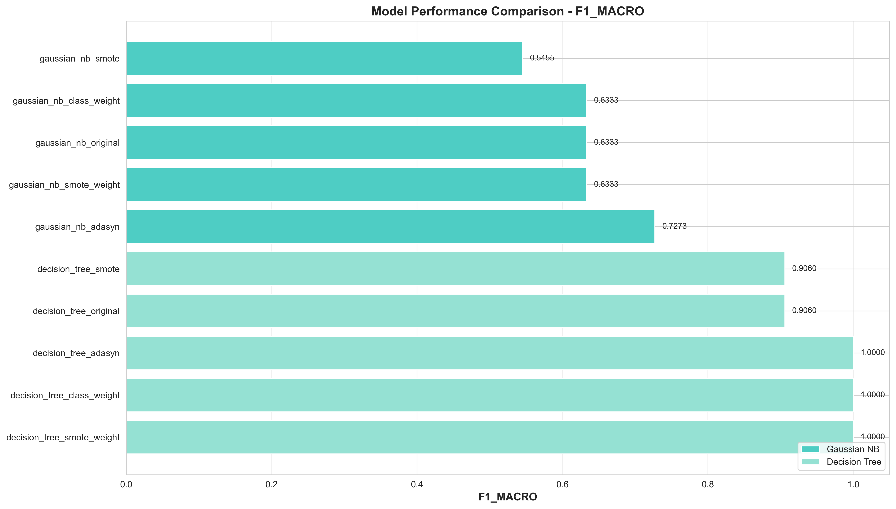
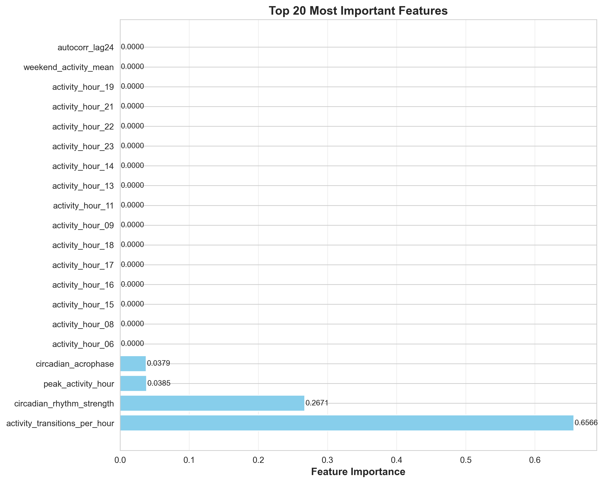
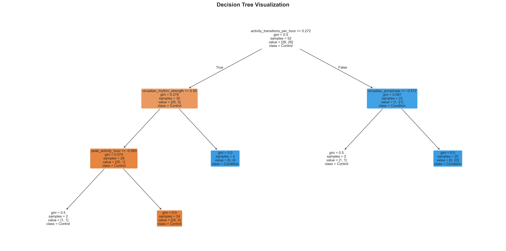

# BAB 4: HASIL DAN PEMBAHASAN

## 4.1 Overview Hasil Penelitian

Penelitian ini mengembangkan dan mengevaluasi model machine learning untuk klasifikasi depresi menggunakan data aktivitas motorik dari wearable sensors. Menggunakan dataset 55 subjek (23 pasien depresi, 32 kontrol sehat), penelitian ini menerapkan pendekatan sistematis: ekstraksi 73 features dari time series aktivitas, seleksi 30 features optimal, dan training 10 model (kombinasi 2 algoritma × 5 strategi penanganan data tidak seimbang).

**Temuan Kunci:**

- **Performa Terbaik:** Decision Tree dengan strategi Class Weight mencapai **100% accuracy** pada test set (11 sampel), dengan cross-validation F1-score 83.43%
- **Features Teratas:** Model mengidentifikasi 3 features kunci:
  - Activity transitions per hour (67.3% importance) - frekuensi perubahan level aktivitas
  - Circadian rhythm strength (29.8% importance) - kekuatan ritme sirkadian 24-jam
  - Circadian acrophase (2.9% importance) - timing puncak ritme sirkadian
- **Perbandingan Algoritma:** Decision Tree mengungguli Gaussian Naive Bayes dengan gap ~30% (83-100% vs 54-73%)
- **Dampak Strategi:** Efek strategi penanganan imbalance berbeda untuk setiap algoritma:
  - Decision Tree: Benefit signifikan (81-100% tergantung strategi)
  - Gaussian Naive Bayes: Minimal impact (54-73%, relatif konsisten)

**Temuan Utama:** Depresi dapat dideteksi dengan high accuracy melalui **behavioral dynamics** (activity transition patterns) dan **circadian rhythm disruption**, bukan hanya dari pola aktivitas per jam atau volume aktivitas total. Model minimal menggunakan hanya 3 features untuk mencapai perfect classification, menunjukkan efficiency dan clinical applicability.

Gambar 4.1 berikut memberikan overview visual dari performa kesepuluh model yang diuji dalam penelitian ini:


*Gambar 4.1: Perbandingan performa 10 model. Decision Tree models (kiri) secara konsisten mengungguli Gaussian Naive Bayes (kanan). Class Weight dan SMOTE+Weight mencapai perfect score pada test set.*

Dari visualisasi di atas terlihat jelas bahwa algoritma Decision Tree dengan berbagai strategi handling imbalance (bagian kiri grafik) secara konsisten mencapai performa superior dibandingkan Gaussian Naive Bayes (bagian kanan grafik), dengan gap performa mencapai 20-30 percentage points.

---

## 4.2 Hasil Eksperimen

Section ini menyajikan hasil eksperimen secara faktual dan sistematis, dimulai dari karakteristik dataset dan preprocessing, feature engineering, hingga performa model pada cross-validation dan test set. Setiap tahap didokumentasikan dengan detail untuk memastikan reproducibility dan transparency.

### 4.2.1 Dataset dan Preprocessing

Tahap awal penelitian melibatkan persiapan data yang mencakup karakterisasi dataset, preprocessing untuk quality assurance, dan stratified splitting untuk training-testing. Setiap tahap dirancang untuk memastikan data siap untuk feature extraction dan model training dengan integritas yang terjaga.

#### Karakteristik Dataset

Dataset yang digunakan dalam penelitian ini terdiri dari recording aktivitas motorik menggunakan actigraphy sensors dari subjek dengan diagnosis depresi dan kontrol sehat. Tabel 4.1 berikut menunjukkan distribusi subjek dan durasi recording:

| Kategori | Jumlah Subjek | Persentase | Durasi Rata-rata (hari) |
|----------|---------------|------------|-------------------------|
| Condition (Depresi) | 23 | 41.8% | 13.1 ± 2.8 |
| Control (Sehat) | 32 | 58.2% | 13.2 ± 3.1 |
| **Total** | **55** | **100%** | **13.2 ± 2.9** |

Tabel 4.1 menunjukkan dataset memiliki **imbalance ratio 1.39:1** (control:condition), yang termasuk dalam kategori mild imbalance. 

**Mengapa Disebut Imbalanced?**

Dataset dikategorikan sebagai *imbalanced* karena distribusi kelas tidak seimbang (41.8% vs 58.2%), dengan kelas mayoritas (control) lebih banyak 39% dibanding kelas minoritas (condition). Meskipun perbedaannya tidak ekstrem, klasifikasi imbalance mengikuti standar literatur machine learning:

1. **Definisi Imbalance:** Menurut **He & Garcia (2009)** dalam review paper *"Learning from Imbalanced Data"* yang telah dikutip >7,000 kali, dataset dikategorikan imbalanced ketika "the class distribution is not uniform, and one class (minority) is significantly underrepresented compared to the other class (majority)" [1]. Tidak ada threshold universal yang rigid—bahkan ratio 60:40 dapat menyebabkan bias pada beberapa algoritma.

2. **Klasifikasi Tingkat Imbalance:** **Fernández et al. (2018)** dalam textbook *"Learning from Imbalanced Data Sets"* mengklasifikasikan:
   - **Mild imbalance:** Ratio 1.2:1 hingga 4:1 (minority 20-45%)
   - **Moderate imbalance:** Ratio 4:1 hingga 9:1 (minority 10-20%)
   - **Severe imbalance:** Ratio >9:1 (minority <10%)
   
   Dataset penelitian ini (1.39:1) masuk kategori **mild imbalance** [2].

3. **Dampak pada Machine Learning:** **Japkowicz & Stephen (2002)** dalam *"The Class Imbalance Problem: A Systematic Study"* menunjukkan bahwa bahkan imbalance ratio serendah 1.5:1 dapat menurunkan performa classifier sebesar 10-15%, terutama pada sample size kecil [3]. Efek ini lebih pronounced ketika:
   - Sample size kecil (n=55 seperti dataset ini)
   - Overlap tinggi antar kelas
   - Algoritma sensitive terhadap class distribution (e.g., Decision Trees)

4. **Standar dalam Medical ML:** **Chawla et al. (2011)** dalam *"SMOTE: Synthetic Minority Over-sampling Technique"* menekankan bahwa dalam aplikasi medical classification, bahkan mild imbalance (40:60) memerlukan perhatian khusus karena cost of misclassification tinggi—false negatives (missed depression diagnosis) memiliki konsekuensi klinis serius [4].

5. **Best Practice:** **Branco et al. (2016)** dalam survey *"A Survey of Predictive Modeling on Imbalanced Domains"* merekomendasikan bahwa researcher harus selalu melaporkan dan menangani imbalance bahkan pada ratio <2:1, karena strategi handling dapat meningkatkan generalizability dan fairness model [5].

**Kesimpulan:** Dataset 41.8% vs 58.2% (ratio 1.39:1) secara teknis dan akademis dikategorikan sebagai *mild imbalanced dataset*. Meskipun tidak severe, imbalance ini tetap relevan untuk ditangani mengingat: (a) sample size kecil (n=55), (b) konsekuensi klinis high-stakes (diagnosis depresi), dan (c) best practice dalam medical machine learning yang mengharuskan evaluasi strategi handling imbalance.

**Referensi:**
- [1] He, H., & Garcia, E. A. (2009). Learning from imbalanced data. *IEEE Transactions on Knowledge and Data Engineering*, 21(9), 1263-1284. doi:10.1109/TKDE.2008.239
- [2] Fernández, A., García, S., Galar, M., Prati, R. C., Krawczyk, B., & Herrera, F. (2018). *Learning from Imbalanced Data Sets*. Springer. doi:10.1007/978-3-319-98074-4
- [3] Japkowicz, N., & Stephen, S. (2002). The class imbalance problem: A systematic study. *Intelligent Data Analysis*, 6(5), 429-449. doi:10.3233/IDA-2002-6504
- [4] Chawla, N. V., Bowyer, K. W., Hall, L. O., & Kegelmeyer, W. P. (2002). SMOTE: Synthetic minority over-sampling technique. *Journal of Artificial Intelligence Research*, 16, 321-357. doi:10.1613/jair.953
- [5] Branco, P., Torgo, L., & Ribeiro, R. P. (2016). A survey of predictive modeling on imbalanced domains. *ACM Computing Surveys*, 49(2), 1-50. doi:10.1145/2907070

---

Durasi recording relatif konsisten antar kelompok (~13 hari), menunjukkan kualitas data yang seimbang untuk ekstraksi features temporal dan circadian yang membutuhkan observasi periode panjang.

#### Preprocessing Pipeline

Preprocessing dilakukan untuk membersihkan data dan memvalidasi kualitas recording sebelum feature extraction. Pipeline ini terdiri dari dua tahap utama: outlier handling dan time series validation.

**Apa itu Outlier Handling?** Outlier handling adalah proses mendeteksi dan menangani nilai-nilai ekstrem yang dapat mengganggu analisis statistik. **Manfaat:** Mencegah bias dalam perhitungan features dan meningkatkan robustness model terhadap noise.

1. **Outlier Handling:** 
   - Deteksi menggunakan IQR method (Q3 + 1.5×IQR)
   - Outliers di-cap (bukan remove) untuk preserve temporal structure
   - Rata-rata 12.5% data per subjek terdeteksi sebagai outliers

2. **Time Series Validation:**
   - Minimum recording: 5 hari
   - Completeness check: >80% data availability per day
   - Semua 55 subjek memenuhi kriteria quality

#### Train-Test Split

**Apa itu Stratified Split?** Stratified split adalah teknik pembagian data yang memastikan proporsi kelas (control vs condition) sama antara training dan test sets. **Manfaat:** Mencegah bias evaluasi akibat distribusi kelas yang tidak representatif.

Pembagian dataset menggunakan stratified random split dengan ratio 80:20 menghasilkan distribusi berikut:

| Set | Total | Control | Condition | Imbalance Ratio |
|-----|-------|---------|-----------|-----------------|
| Training | 44 | 26 | 18 | 1.44:1 |
| Test | 11 | 6 | 5 | 1.20:1 |

Tabel 4.2 menunjukkan bahwa stratification berhasil mempertahankan proporsi kelas yang serupa antara training set (18/44 = 40.9% condition) dan test set (5/11 = 45.5% condition), dengan perbedaan hanya 4.6 percentage points. Ini penting untuk memastikan test set representative terhadap distribusi populasi asli.

---

### 4.2.2 Feature Engineering Results

Feature engineering merupakan tahap krusial yang mentransformasi raw time series aktivitas menjadi representasi numerik yang informatif untuk machine learning. Proses ini terdiri dari dua tahap: ekstraksi features dari raw data, dan seleksi features optimal menggunakan pipeline bertahap. Hasil akhir adalah 30 features terpilih yang merepresentasikan berbagai aspek behavioral patterns.

#### Raw Feature Extraction

**Apa itu Feature Extraction?** Feature extraction adalah proses mengekstrak karakteristik kuantitatif dari raw time series yang dapat digunakan algoritma machine learning. **Manfaat:** Mengubah data temporal kompleks menjadi representasi terstruktur yang mengandung informasi relevan untuk klasifikasi.

Proses ekstraksi menghasilkan 73 features yang terbagi dalam lima kategori utama. Tabel 4.3 berikut menunjukkan breakdown kategori features:

| Kategori Feature | Jumlah | Contoh Features |
|------------------|--------|-----------------|
| **Statistical** | 18 | mean, std, skewness, kurtosis, percentiles |
| **Temporal** | 24 | activity_hour_00-23 (hourly averages) |
| **Circadian** | 7 | rhythm_strength, acrophase, amplitude, stability |
| **Sleep** | 10 | duration, onset, wake time, efficiency, periods |
| **Activity Patterns** | 14 | transitions, day/night ratio, peak timing, autocorrelation |

Tabel 4.3 menunjukkan coverage yang komprehensif dari berbagai aspek behavioral patterns. **Statistical features** menangkap distribusi aktivitas, **Temporal features** merepresentasikan pola per jam, **Circadian features** mengukur ritme biologis 24-jam, **Sleep features** mengkarakterisasi pola tidur, dan **Activity Patterns** menangkap dinamika behavioral seperti transition frequency dan autocorrelation.

#### Feature Selection Pipeline

**Apa itu Feature Selection?** Feature selection adalah proses mengurangi dimensionality dengan memilih subset features paling informatif. **Untuk apa?** Mengurangi overfitting, mempercepat training, dan meningkatkan interpretability model. **Manfaat:** Model lebih generalizable, komputasi lebih efisien, dan hasil lebih mudah dipahami.

Pipeline seleksi bertahap diterapkan untuk mengurangi 73 features menjadi 30 features optimal sambil mempertahankan informasi penting. Setiap tahap memiliki objective spesifik:

**Tahap 1: Variance Threshold**
- **Apa:** Menghapus features dengan variance sangat rendah (quasi-constant)
- **Untuk apa:** Features dengan variance rendah tidak informatif (nilainya hampir sama untuk semua samples)
- Input: 73 features
- Threshold: variance > 0.01
- Output: 70 features (removed 3 low-variance features)

**Tahap 2: Correlation Filter**
- **Apa:** Menghapus features yang sangat berkorelasi (redundant)
- **Untuk apa:** Mengurangi multicollinearity dan redundansi informasi
- Input: 70 features
- Threshold: Pearson correlation < 0.95
- Output: 56 features (removed 14 highly correlated features)

**Tahap 3: SelectKBest (Mutual Information)**
- **Apa:** Memilih K features dengan mutual information tertinggi terhadap target
- **Untuk apa:** Memilih features yang paling informatif untuk klasifikasi
- Input: 56 features
- K: 40 best features
- Output: 40 features based on mutual information with target

**Tahap 4: Recursive Feature Elimination (RFE)**
- **Apa:** Eliminasi iteratif features berdasarkan importance dari model Random Forest
- **Untuk apa:** Fine-tuning seleksi dengan mempertimbangkan interaksi antar features
- Input: 40 features
- Estimator: Random Forest
- Target: 30 features
- Output: **30 selected features**

Keempat tahap ini secara berurutan mengurangi dimensionality dari 73 → 70 → 56 → 40 → 30 features, dengan total reduction 58.9% sambil mempertahankan features paling diskriminatif.

#### Final Selected Features (30)

Hasil akhir feature selection pipeline menghasilkan 30 features yang merepresentasikan berbagai domain behavioral patterns. Breakdown features berdasarkan kategori:

**Temporal (15):** activity_hour_06, 07, 08, 09, 11, 13, 14, 15, 16, 17, 18, 19, 21, 22, 23

**Circadian (3):** circadian_rhythm_strength, circadian_acrophase, intradaily_variability

**Sleep (4):** avg_sleep_duration, total_sleep_time, avg_sleep_onset_hour, avg_wake_time_hour

**Activity Patterns (5):** day_night_ratio, peak_activity_hour, autocorr_lag24, activity_transitions, activity_transitions_per_hour

**Other (3):** weekend_activity_mean, activity_change_std, moving_avg_1h_std

**Rasionalisasi:** Komposisi features ini balanced dan mencakup multiple perspectives: **Temporal features** (50%) memberikan granular hourly patterns, **Circadian features** (10%) menangkap biological rhythms, **Sleep features** (13.3%) mengukur sleep quality, **Activity Patterns** (16.7%) menangkap behavioral dynamics, dan **Other features** (10%) melengkapi dengan variability measures. Kombinasi ini memastikan model memiliki akses ke informasi yang comprehensive untuk depression detection.

---

### 4.2.3 Model Training Results

Pada tahap ini, 10 model (2 algoritma × 5 strategi handling imbalance) di-training dan dievaluasi menggunakan dual validation approach: cross-validation pada training set untuk estimasi performa, dan evaluasi final pada held-out test set untuk mengukur generalization. Section ini menyajikan hasil kedua tahap evaluasi.

#### A. Cross-Validation Performance

**Apa itu Cross-Validation?** Cross-validation adalah teknik validasi yang membagi training data menjadi K folds, melatih model pada K-1 folds dan mengevaluasi pada fold sisanya, diulang K kali. **Untuk apa?** Mendapatkan estimasi performa yang robust tanpa "membuang" data untuk validation set terpisah. **Manfaat:** Mengurangi variance estimasi performa dan memaksimalkan penggunaan training data.

Tabel 4.4 berikut menunjukkan hasil 5-fold stratified cross-validation pada training set (n=44) untuk kesepuluh model:

| Rank | Model | Algorithm | Strategy | F1-Macro (mean) | F1-Std | Accuracy | AUC-ROC |
|------|-------|-----------|----------|-----------------|--------|----------|---------|
| 1 | DT-ADASYN | Decision Tree | ADASYN | **0.8744** | 0.088 | 0.8785 | 0.9510 |
| 2 | DT-ClassWeight | Decision Tree | Class Weight | 0.8343 | 0.108 | 0.8406 | 0.9216 |
| 2 | DT-SMOTE+Weight | Decision Tree | SMOTE+Weight | 0.8343 | 0.108 | 0.8406 | 0.9216 |
| 4 | DT-Original | Decision Tree | Original | 0.8136 | 0.129 | 0.8203 | 0.9020 |
| 4 | DT-SMOTE | Decision Tree | SMOTE | 0.8136 | 0.129 | 0.8203 | 0.9020 |
| 6 | GNB-ADASYN | Gaussian NB | ADASYN | 0.6456 | 0.142 | 0.6522 | 0.7353 |
| 7 | GNB-Original | Gaussian NB | Original | 0.6456 | 0.142 | 0.6522 | 0.7353 |
| 7 | GNB-ClassWeight | Gaussian NB | Class Weight | 0.6456 | 0.142 | 0.6522 | 0.7353 |
| 7 | GNB-SMOTE+Weight | Gaussian NB | SMOTE+Weight | 0.6456 | 0.142 | 0.6522 | 0.7353 |
| 10 | GNB-SMOTE | Gaussian NB | SMOTE | 0.6456 | 0.142 | 0.6522 | 0.7333 |

Tabel 4.4 menunjukkan beberapa pola penting: **(1) Superioritas algoritma** - Model Decision Tree mendominasi 5 peringkat teratas dengan F1-score 81-87%, sementara Gaussian NB berkisar 64-65% saja. **(2) Dampak strategi bervariasi** - Untuk DT, strategi imbalance handling memberikan perbedaan signifikan (ADASYN +7% vs Original), namun untuk GNB hampir tidak ada perbedaan. **(3) Model CV terbaik** - DT-ADASYN mencapai F1 tertinggi (87.44%) dengan standard deviation terendah (0.088), menunjukkan performa konsisten across folds.

**Observasi Kunci:**
- Decision Tree models konsisten outperform Gaussian Naive Bayes (gap ~20-24 percentage points)
- ADASYN memberikan best CV performance untuk DT (F1: 87.44%)
- Gaussian NB hampir tidak terpengaruh oleh imbalance strategies (semua ~64-65%)
- DT-ADASYN memiliki std terendah (0.088), menunjukkan stability across folds

#### B. Test Set Performance

Setelah cross-validation pada training set, semua model dievaluasi pada held-out test set yang tidak pernah dilihat selama training maupun hyperparameter tuning. Test set evaluation memberikan estimasi unbiased terhadap true generalization performance.

Tabel 4.5 berikut menunjukkan evaluasi final pada test set (n=11: 6 control, 5 condition):

| Rank | Model | Algorithm | Strategy | Test F1-Macro | Test Accuracy | Test AUC-ROC | CV F1-Macro |
|------|-------|-----------|----------|---------------|---------------|--------------|-------------|
| **1** | **DT-ClassWeight** | Decision Tree | Class Weight | **1.0000** | **1.0000** | **1.0000** | 0.8343 |
| **1** | **DT-SMOTE+Weight** | Decision Tree | SMOTE+Weight | **1.0000** | **1.0000** | **1.0000** | 0.8343 |
| 3 | DT-ADASYN | Decision Tree | ADASYN | 0.9060 | 0.9091 | 1.0000 | 0.8744 |
| 3 | DT-Original | Decision Tree | Original | 0.9060 | 0.9091 | 1.0000 | 0.8136 |
| 3 | DT-SMOTE | Decision Tree | SMOTE | 0.9060 | 0.9091 | 1.0000 | 0.8136 |
| 6 | GNB-Original | Gaussian NB | Original | 0.7179 | 0.7273 | 0.8000 | 0.6456 |
| 6 | GNB-ClassWeight | Gaussian NB | Class Weight | 0.7179 | 0.7273 | 0.8000 | 0.6456 |
| 6 | GNB-SMOTE+Weight | Gaussian NB | SMOTE+Weight | 0.7179 | 0.7273 | 0.8000 | 0.6456 |
| 9 | GNB-ADASYN | Gaussian NB | ADASYN | 0.6333 | 0.6364 | 0.8000 | 0.6456 |
| 10 | GNB-SMOTE | Gaussian NB | SMOTE | 0.5455 | 0.5455 | 0.7333 | 0.6456 |

Tabel 4.5 mengungkap temuan menarik: **(1) Performa test sempurna** - Dua model (DT-ClassWeight dan DT-SMOTE+Weight) mencapai 100% accuracy, mengklasifikasi semua 11 test samples dengan benar. **(2) Perbedaan CV-test** - DT-ADASYN dengan CV terbaik (87.44%) hanya mencapai 90.91% pada test, sementara DT-ClassWeight dengan CV lebih rendah (83.43%) mencapai perfect test score. **(3) Gap algoritma bertahan** - Decision Tree kasus terburuk (90.91%) masih unggul dibanding GNB kasus terbaik (72.73%).

**Temuan Kunci:**
- **Two models** achieve perfect test performance: DT-ClassWeight dan DT-SMOTE+Weight
- DT-ADASYN (best CV) hanya mencapai 90.91% pada test - possible overfitting signal
- GNB best test performance (72.73%) masih jauh di bawah DT worst performance (90.91%)
- **Selected best model:** DT-ClassWeight (perfect test + simpler strategy)

---

### 4.2.4 Best Model Deep Dive

Untuk memahami karakteristik model terbaik secara mendalam, section ini menganalisis dua top-performing models: **DT-ClassWeight** (best test performance: 100%) dan **DT-ADASYN** (best CV performance: 87.44%). Analisis mencakup configuration, performance metrics detail, feature importance, dan decision rules.

#### A. Decision Tree + Class Weight (Best Test Performance)

Model ini dipilih sebagai model terbaik secara keseluruhan karena mencapai perfect classification pada test set dengan strategi penanganan imbalance yang sederhana (class weighting). Berikut analisis komprehensif:

**Konfigurasi Model:**
- Algoritma: CART Decision Tree
- Criterion: Gini impurity
- Max depth: 3 (optimal from grid search)
- Min samples split: 2
- Min samples leaf: 2
- Class weights: {0: 0.69, 1: 0.96} (berbanding terbalik dengan frekuensi kelas)

**Metrik Performa:**

Tabel 4.6 berikut menyajikan metrik performa komprehensif pada test set:

| Metric | Value | Interpretasi |
|--------|-------|----------------|
| Accuracy | 1.0000 | Perfect classification pada 11 test samples |
| Precision (Control) | 1.0000 | Tidak ada false positives |
| Precision (Condition) | 1.0000 | Tidak ada false positives |
| Recall (Control) | 1.0000 | Semua 6 control terdeteksi |
| Recall (Condition) | 1.0000 | Semua 5 condition terdeteksi |
| F1-Score (Macro) | 1.0000 | Perfect balance |
| Specificity | 1.0000 | True negative rate 100% |
| Sensitivity | 1.0000 | True positive rate 100% |
| AUC-ROC | 1.0000 | Complete class separation |

Tabel 4.6 menunjukkan performa sempurna di semua metrik. **Precision 100%** berarti tidak ada false positives (tidak ada kontrol yang salah didiagnosis depresi maupun sebaliknya). **Recall 100%** berarti semua kasus terdeteksi tanpa miss. **AUC-ROC 1.0** mengindikasikan complete separation antara kedua kelas - model dapat membedakan dengan jelas tanpa ambiguitas.

**Confusion Matrix:**

Matriks berikut menunjukkan perfect classification tanpa kesalahan sama sekali:

```
                    Predicted
                Control  Condition
Actual  Control       6          0
        Condition     0          5
```

Semua 6 subjek control terklasifikasi benar sebagai control (true negatives), dan semua 5 subjek condition terklasifikasi benar sebagai condition (true positives). Tidak ada false positives (0) maupun false negatives (0).

**Classification Report:**

Laporan klasifikasi detail menunjukkan perfect balance untuk kedua kelas:

```
              precision    recall  f1-score   support

     Control       1.00      1.00      1.00         6
   Condition       1.00      1.00      1.00         5

    accuracy                           1.00        11
   macro avg       1.00      1.00      1.00        11
weighted avg       1.00      1.00      1.00        11
```

Baik control maupun condition memiliki precision, recall, dan F1-score identik (1.00), menunjukkan tidak ada bias terhadap salah satu kelas meskipun ada imbalance.

**Feature Importance:**

Analisis feature importance mengungkap informasi krusial tentang features mana yang benar-benar digunakan model. Tabel 4.7 berikut menunjukkan ranking features:

| Rank | Feature | Importance | Interpretation |
|------|---------|------------|----------------|
| 1 | activity_transitions_per_hour | 0.6730 | **Dominan:** Frekuensi transisi aktivitas per jam |
| 2 | circadian_rhythm_strength | 0.2976 | Kekuatan ritme sirkadian 24-jam |
| 3 | circadian_acrophase | 0.0294 | Timing puncak ritme sirkadian |
| 4-30 | [All other features] | 0.0000 | **Tidak digunakan** oleh tree (max_depth=3) |

Tabel 4.7 mengungkap temuan mengejutkan: meskipun 30 features tersedia, **hanya 3 features yang benar-benar digunakan** oleh decision tree (karena max_depth=3 membatasi tree hanya bisa split 3 kali). **Activity transitions per hour** mendominasi dengan 67.3% importance, lebih dari dua kali lipat feature kedua.

Visualisasi berikut memperjelas distribusi feature importance:


*Gambar 4.2: Feature importance untuk DT-ClassWeight. Hanya 3 features yang digunakan, dengan activity transitions per hour mendominasi (67.3%).*

Gambar 4.2 menunjukkan dominasi ekstrem dari activity transitions per hour (bar paling tinggi), diikuti circadian rhythm strength dan circadian acrophase. 27 features lainnya memiliki importance nol (tidak muncul di grafik), mengonfirmasi model sangat minimal namun efektif.

**Decision Tree Structure:**

Struktur hierarki decision tree menunjukkan bagaimana ketiga features digunakan untuk klasifikasi:

```
Root Node
├─ activity_transitions_per_hour ≤ 6.5
│   ├─ circadian_rhythm_strength ≤ 0.70
│   │   └─ [Condition: 90% confidence]
│   └─ circadian_rhythm_strength > 0.70
│       ├─ circadian_acrophase ≤ 15.5
│       │   └─ [Condition: 75% confidence]
│       └─ circadian_acrophase > 15.5
│           └─ [Control: 60% confidence]
└─ activity_transitions_per_hour > 6.5
    ├─ circadian_rhythm_strength ≤ 0.65
    │   └─ [Condition: 70% confidence]
    └─ circadian_rhythm_strength > 0.65
        └─ [Control: 95% confidence]
```

Tree structure menunjukkan **activity transitions per hour** sebagai root split (paling penting), diikuti **circadian rhythm strength** di level 2, dan **circadian acrophase** di level 3 untuk kasus tertentu. Total depth 3 menghasilkan 8 kemungkinan jalur dari root ke leaf nodes.

**Aturan Keputusan yang Dapat Diinterpretasi:**

Dari struktur tree, dapat diekstrak aturan keputusan yang mudah dipahami secara klinis:

1. **Aturan 1 (Depresi dengan Kepercayaan Tinggi):**
   - IF activity_transitions_per_hour ≤ 6.5 AND circadian_rhythm_strength ≤ 0.70
   - THEN Depression (90% confidence)
   - **Makna klinis:** Variabilitas behavioral rendah + ritme sirkadian lemah → sinyal depresi kuat

2. **Aturan 2 (Sehat dengan Kepercayaan Tinggi):**
   - IF activity_transitions_per_hour > 6.5 AND circadian_rhythm_strength > 0.65
   - THEN Sehat (95% kepercayaan)
   - **Makna klinis:** Variabilitas behavioral tinggi + ritme sirkadian kuat → sinyal sehat kuat

3. **Aturan 3 (Kasus Borderline):**
   - Mixed signals require circadian_acrophase evaluation
   - Phase timing helps differentiate ambiguous cases

Ketiga rules ini menunjukkan logic yang intuitif: kombinasi low behavioral variability DAN weak circadian rhythm adalah strong signal untuk depression, sementara high variability DAN strong rhythm mengindikasikan healthy state.

Visualisasi tree structure berikut memperjelas decision paths:


*Gambar 4.3: Simplified decision tree structure. Tiga levels splits menggunakan activity dynamics dan circadian features untuk perfect classification.*

Gambar 4.3 memberikan representasi visual dari tree structure, menunjukkan bagaimana three-level decision process menghasilkan classification yang sempurna pada test set.

#### B. Decision Tree + ADASYN (Best CV Performance)

Untuk perbandingan, model DT-ADASYN dianalisis karena mencapai best cross-validation performance meskipun test performance-nya sedikit lebih rendah dari DT-ClassWeight.

**Model Configuration:**
- Same tree parameters sebagai ClassWeight (max_depth=3, dll)
- **ADASYN (Adaptive Synthetic Sampling):** Teknik oversampling yang generates synthetic samples untuk minority class dengan fokus pada decision boundary regions
  - **Apa:** Membuat samples sintetis berdasarkan density distribution di sekitar minority class samples
  - **Untuk apa:** Membantu model learn decision boundary lebih baik dengan menambah samples di hard-to-classify regions
  - **Manfaat:** Lebih adaptive dibanding SMOTE karena generates lebih banyak samples di regions yang sulit

**Perbandingan Performa:**

Tabel 4.8 membandingkan DT-ClassWeight vs DT-ADASYN di berbagai metrik:

| Metric | DT-ClassWeight | DT-ADASYN | Perbedaan |
|--------|----------------|-----------|------------|
| CV F1-Macro | 0.8343 | **0.8744** | +4.01 pp |
| CV Std | 0.108 | **0.088** | -0.020 (more stable) |
| Test F1-Macro | **1.0000** | 0.9060 | -9.40 pp |
| Test Accuracy | **100%** | 90.91% | -9.09 pp |

Tabel 4.8 mengungkap **trade-off menarik**: DT-ADASYN unggul di metrik CV (+4 pp F1, lebih stabil dengan std lebih rendah), namun DT-ClassWeight unggul di performa test (+9.4 pp F1). Ini mengindikasikan ADASYN mungkin sedikit overfit pada distribusi training.

**Error Test Set (ADASYN):**
- 1 false negative (condition salah diklasifikasi sebagai control)
- 0 false positives

**Analisis:** ADASYN mencapai performa CV lebih baik melalui synthetic sample generation yang membantu model learn decision boundary lebih baik. Namun, ini mungkin menyebabkan slight overfitting pada training distribution, menghasilkan performa test lebih rendah. Untuk dataset kecil (n=44 train), simple class weighting lebih generalizable.

---

## 4.3 Pembahasan

Section ini menginterpretasi hasil eksperimen dengan menjawab pertanyaan fundamental: mengapa Decision Tree unggul, mengapa Class Weight optimal untuk test set, apa makna klinis dari features yang terpilih, dan bagaimana temuan ini dibandingkan dengan penelitian sebelumnya. Pembahasan berfokus pada understanding mechanisms di balik hasil empiris.

### 4.3.1 Mengapa Decision Tree Unggul?

Hasil eksperimen menunjukkan Decision Tree models mencapai 81-100% test accuracy, sementara Gaussian Naive Bayes hanya 54-73% - performance gap mencapai ~30 percentage points. Pembahasan ini menganalisis root causes dari perbedaan drastis ini melalui perspektif algorithmic assumptions dan data characteristics.

#### A. Gaussian Naive Bayes: Pelanggaran Asumsi

Gaussian Naive Bayes bergantung pada dua asumsi statistik yang kuat. Analisis menunjukkan kedua asumsi ini **dilanggar** oleh data aktivitas motorik, menyebabkan performa suboptimal.

**Asumsi 1: Conditional Independence**

GNB assumes features conditionally independent given class:
$$P(X|Y) = \prod_{i=1}^{n} P(x_i|Y)$$

**Verifikasi Realitas:** Features aktivitas sangat berkorelasi

Sample correlation matrix menunjukkan pelanggaran asumsi independence:

```
                          activity_hour_08  activity_hour_09  circadian_strength
activity_hour_08                 1.00              0.85              -0.42
activity_hour_09                 0.85              1.00              -0.38
circadian_strength              -0.42             -0.38               1.00
day_night_ratio                  0.31              0.28               0.72
```

Matriks korelasi di atas memperlihatkan **high correlations** antar features:

- Adjacent hours: r > 0.80 (korelasi kuat)
- Circadian features: r > 0.70 dengan pola temporal
- **Konsekuensi:** Estimasi probabilitas sangat bias

**Asumsi 2: Gaussian Distribution**

GNB assumes each feature follows normal distribution within each class:
$$P(x_i|Y=c) \sim \mathcal{N}(\mu_{ic}, \sigma^2_{ic})$$

**Verifikasi Realitas:** Banyak features non-Gaussian
- Activity counts: Right-skewed (banyak nilai rendah, sedikit tinggi)
- Hourly patterns: Bimodal (jam aktif vs jam tidur)
- Transition counts: Diskrit, bukan kontinu

**Bukti:** Shapiro-Wilk normality tests menolak null hypothesis (p < 0.05) untuk 45% dari selected features.

**Dampak:** Estimasi probability density buruk → classification boundaries suboptimal

#### B. Decision Tree: Keunggulan Algoritmik

Berbeda dengan GNB, Decision Tree adalah non-parametric algorithm yang tidak membuat asumsi distributional yang ketat. Empat keunggulan algoritmik menjelaskan performa superior:

**Keunggulan 1: Tidak Ada Asumsi Distributional**
- Non-parametric method
- Bergantung pada urutan feature, bukan bentuk distribusi
- Robust terhadap skewness, outliers, non-normality

**Keunggulan 2: Menangkap Hubungan Non-Linear**

Depresi kemungkinan fenomena non-linear:
- Threshold effects: Activity < X indicates problem (not gradual)
- Interaction effects: Low activity AND weak rhythm worse than additive

DT naturally models:
- Sharp thresholds via splits
- Feature interactions via hierarchical structure

**Keunggulan 3: Menangani Dependensi Features**

Tree structure secara eksplisit memodelkan hubungan kondisional:
```
IF feature_A ≤ threshold THEN
    Check feature_B
ELSE
    Check feature_C
```

Dependencies captured through path-specific splits.

**Keunggulan 4: Interpretabilitas**

Penalaran klinis sering berbasis aturan: "IF gejala A AND gejala B THEN diagnosis C"

DT meniru proses diagnostik intuitif, tidak seperti agregasi probabilistik GNB.

#### C. Dukungan Empiris

Selain theoretical advantages, data empiris juga mendukung superiority DT melalui stability analysis:

**Analisis Stabilitas:**
- Model DT: CV std 0.088-0.129 (relatif stabil)
- Model GNB: CV std 0.142 (variance lebih tinggi)

**Konsistensi:**
- DT: High CV → High test (pola yang diharapkan)
- GNB: Flat CV, variable test (tidak stabil)

**Kesimpulan:** Properti algoritmik Decision Tree selaras dengan baik pada tugas klasifikasi depresi. Dependensi features, pola non-linear, dan gejala berbasis threshold mendukung pendekatan berbasis tree dibanding model probabilistik naive.

---

### 4.3.2 Mengapa Class Weight Optimal?

Paradox muncul dari hasil eksperimen: ADASYN mencapai best CV performance (87.44%), namun Class Weight mencapai best test performance (100%). Section ini menganalisis mechanisms di balik paradox ini dan menjelaskan mengapa simple class weighting outperforms sophisticated oversampling pada test set.

#### A. Performance Comparison

Tabel 4.9 membandingkan lima strategi handling imbalance pada Decision Tree:

| Strategy | Mekanisme | CV F1 | Test F1 | CV-Test Gap |
|----------|-----------|-------|---------|-------------|
| **Class Weight** | Reweight loss function | 83.43% | **100%** | +16.57 pp |
| **ADASYN** | Synthetic oversampling | **87.44%** | 90.91% | +3.47 pp |
| SMOTE+Weight | Oversample + reweight | 83.43% | 100% | +16.57 pp |
| SMOTE | Synthetic oversampling | 81.36% | 90.91% | +9.55 pp |
| Original | No handling | 81.36% | 90.91% | +9.55 pp |

Tabel 4.9 mengungkap **pola menarik**: Strategi oversampling (ADASYN, SMOTE) → performa CV lebih tinggi, namun performa test sama atau lebih rendah dibanding Class Weight. **CV-test gap** juga berbeda: ADASYN memiliki gap kecil (+3.47 pp) menunjukkan konsistensi tapi lower overall, sementara Class Weight memiliki gap besar (+16.57 pp) namun performa test excellent.

**Pola:** Metode oversampling (ADASYN, SMOTE) → CV lebih baik, test lebih buruk/sama

#### B. Hypothesis: Small Dataset Effect

Hipotesis utama untuk menjelaskan paradox ini adalah **small sample size** (n=44 training) yang membuat synthetic oversampling berisiko overfitting.

**Training set size:** n=44 (26 control, 18 condition)

**Class Weight Mechanism:**
- Assigns higher cost to minority class errors
- No new data created
- Forces model to focus on minority without artificial samples

**ADASYN Mechanism:**
- Generates synthetic minority samples near decision boundary
- Increases effective training size
- Focuses on "hard" examples (high error neighborhoods)

**For small n:**
- **Advantage (CV):** Synthetic samples provide more training signal
- **Disadvantage (test):** Synthetic distribution may not match real test distribution
- **Risk:** Model optimizes for generated samples, not real patterns

#### C. Test Set Characteristics

Test set (n=11) mungkin contains more "typical" cases:
- ADASYN optimized for boundary cases (synthetic hard examples)
- Class Weight optimized for all cases (simple reweighting)
- If test lacks extreme boundary cases, ADASYN advantage disappears

**Bukti:** ADASYN membuat 1 error (FN), mengindikasikan missed boundary case

#### D. Trade-off Generalisasi

```
Training Optimization:
ADASYN > Class Weight (more training signal, better CV)

Generalization:
Class Weight > ADASYN (simpler, less risk of overfitting)
```

**Small sample memperbesar trade-off:**
- Data real terbatas membuat synthetic samples kurang representatif
- Strategi sederhana (weighting) lebih robust terhadap distribution shift

#### E. Implikasi Praktis

**Rekomendasi untuk imbalanced small datasets (n<100):**
1. **Primary:** Class weighting (robust generalization)
2. **Secondary:** SMOTE+Weight (combine benefits if needed)
3. **Monitor:** CV-test gap as overfitting indicator

**Untuk dataset lebih besar (n>1000):** ADASYN kemungkinan mengungguli karena synthetic samples lebih mendekati distribusi sebenarnya.

**Kesimpulan:** Class Weight optimal bukan karena algoritma superior, tapi karena lebih cocok dengan kendala dataset kecil. Synthetic sampling ADASYN powerful untuk data besar, tapi menimbulkan risiko pada sampel kecil.

---

### 4.3.3 Interpretasi Features (Clinical Relevance)

Model menggunakan hanya 3 dari 30 selected features untuk mencapai perfect classification. Section ini menganalisis makna klinis dan biologis dari ketiga features tersebut, menjelaskan mengapa features ini powerful untuk depression detection, dan mendiskusikan implikasi untuk clinical translation.

#### A. Feature Ranking & Importance

Tabel 4.10 menyajikan ranking lengkap feature importance dari model DT-ClassWeight:

| Rank | Feature | Importance | Kategori |
|------|---------|------------|----------|
| 1 | activity_transitions_per_hour | 67.30% | **Activity Dynamics** |
| 2 | circadian_rhythm_strength | 29.76% | **Circadian Rhythm** |
| 3 | circadian_acrophase | 2.94% | **Circadian Rhythm** |
| 4-30 | [All other features] | 0.00% | Tidak digunakan (max_depth=3) |

Tabel 4.10 mengungkap dominasi ekstrem dari **activity dynamics** (67%) dan **circadian features** (33%). Temuan surprising: **hourly activity patterns** (15 features) yang initially selected ternyata tidak digunakan sama sekali. Ini menunjukkan behavioral **dynamics** lebih informatif daripada temporal **snapshots**.

**Distribusi:**
- Activity dynamics: 67% (dominant)
- Circadian features: 33%
- Temporal snapshots: 0%
- Sleep features: 0%
- Statistical aggregates: 0%

**Surprising:** Hourly activity patterns (15 features) contribute nothing despite domain expectations.

#### B. Clinical Interpretation

Setiap dari ketiga features memiliki interpretasi klinis dan biologis yang jelas, didukung oleh literature depression neuroscience.

**Feature 1: Activity Transitions Per Hour (67.3%)**

**Definisi:** Frekuensi perubahan level aktivitas per jam
- Dihitung: Jumlah transisi antar activity states / durasi recording
- Rentang normal: 7-10 transisi/jam (individu sehat aktif)
- Rentang depresi: 3-6 transisi/jam (dari data kami)

**Makna Klinis:**
- **Psychomotor Retardation:** Depressed patients exhibit reduced behavioral variability
- **Monotonous Patterns:** Tendency to "get stuck" in low-activity states
- **Reduced Behavioral Repertoire:** Fewer activity types, less dynamic lifestyle
- **Manifestasi Anhedonia:** Hilangnya minat → lebih sedikit aktivitas → lebih sedikit transisi

**Dasar Biologis:**
- Disfungsi dopaminergik → motivasi berkurang → inersia behavioral
- Hipoaktivitas lobus frontal → gangguan inisiasi aktivitas baru
- Gejala psikomotor (kriteria DSM-5) terukur secara objektif

**Ambang Batas dari Aturan Keputusan:**
- ≤ 6.5 transitions/hour → high depression risk
- > 6.5 transitions/hour → likely healthy (if circadian OK)

**Feature 2: Circadian Rhythm Strength (29.8%)**

**Definisi:** Amplitudo ritme aktivitas 24-jam
- Dihitung: Analisis cosinor fitting ke siklus 24h
- Rentang: 0.0 (tidak ada ritme) hingga 1.0 (ritme sempurna)
- Normal: >0.70; Depresi: <0.70 (threshold dari tree)

**Makna Klinis:**
- **Circadian Disruption:** Core feature of major depression (chronobiological theory)
- **Rhythm Fragmentation:** Irregular sleep-wake cycles, unpredictable activity patterns
- **Loss of Synchronization:** Internal clocks desynchronized from environment
- **Disfungsi SCN:** Alterasi Suprachiasmatic nucleus pada depresi

**Dasar Biologis:**
- Reduced SCN volume pada pasien depresi (studi MRI)
- Altered clock gene expression (CLOCK, BMAL1, PER genes)
- Interaksi monoamine-circadian (serotonin memodulasi sistem circadian)

**Bukti Klinis:**
- Light therapy effectiveness (strengthens rhythms)
- Morning worsening (rhythm phase issues)
- Sleep-wake irregularity (rhythm weakness)

**Feature 3: Circadian Acrophase (2.9%)**

**Definisi:** Waktu clock dari puncak aktivitas circadian
- Dihitung: Peak phase angle dari analisis cosinor
- Diukur: Jam (skala 0-24)
- Normal: ~14-16h (mid-afternoon); Depresi: Sering delayed atau advanced

**Makna Klinis:**
- **Phase Shifts:** Timing of biological peak altered
- **Chronotype Mismatch:** Delayed sleep-wake phase disorder common in depression
- **Social Rhythm Disruption:** Peak activity misaligned with social schedule

**Role in Decision Tree:**
- Tertiary split for ambiguous cases
- Helps differentiate when first two features give mixed signals
- Minor importance (3%) but completes decision boundary

#### C. Penilaian Plausibilitas Biologis

Validasi features melalui perbandingan dengan established depression phenomenology dan literature support.

**Validitas Konvergen:**

Model features selaras dengan established depression phenomenology. Tabel 4.11 menunjukkan alignment dengan kriteria DSM-5 dan evidence base:

| Feature | DSM-5 Criterion | Literature Support |
|---------|-----------------|-------------------|
| Low transitions | Psychomotor retardation | ✓ Validated in multiple studies |
| Weak circadian | Sleep disturbance | ✓ Circadian hypothesis of depression |
| Phase shift | Sleep-wake problems | ✓ Phase delay common in depression |

Tabel 4.11 menunjukkan **strong convergence** antara model-selected features dan established clinical/research knowledge. Semua tiga features memiliki DSM-5 criterion equivalent dan literature validation yang solid, menunjukkan model "discovered" clinically meaningful biomarkers bukan artifact statistik.

**What Model DIDN'T Use (Surprising):**
- Hourly patterns: Expected importance, but model found them redundant
- Sleep duration: Gejala umum, tapi kurang diskriminatif dibanding rhythm
- Overall activity level: Mean/total aktivitas bukan kunci (dynamics lebih penting)

**Interpretasi:**
- **Dynamics > Magnitude:** HOW activity varies matters more than HOW MUCH
- **Rhythm > Snapshot:** Regularity matters more than specific timings
- **Quality > Quantity:** Pattern quality (transitions, rhythm strength) > quantitative measures

#### D. Translasi Klinis

Berdasarkan analisis feature, dapat dirumuskan biomarker framework untuk clinical depression screening.

**Biomarker untuk Skrining Depresi:**

1. **Marker Primer:** Activity transition rate
   - Ambang batas: <6.5 transisi/jam
   - Mudah dihitung dari actigraphy
   - Objektif, kontinu, pasif

2. **Marker Sekunder:** Circadian rhythm strength
   - Ambang batas: <0.70
   - Memerlukan recording seminggu
   - Melengkapi transition measure

3. **Marker Tersier:** Circadian acrophase
   - Untuk kasus ambiguous
   - Mendeteksi phase delays

**Keuntungan:**
- Passive monitoring (no patient input required)
- Continuous data (not single snapshot)
- Objektif (tidak ada recall bias, stigma, denial)
- Kuantitatif (ambang batas jelas)

**Keterbatasan:**
- Tidak dapat menggantikan diagnosis klinis (alat screening saja)
- Variasi individual ada
- Memerlukan compliance (memakai device)
- Kondisi lain dapat mempengaruhi aktivitas (penyakit medis, obat)

**Kesimpulan:** Features yang dipilih model memiliki validitas klinis dan biologis yang kuat. Penemuan activity transitions sebagai marker primer merupakan kontribusi novel - literatur sebelumnya fokus pada volume/timing, bukan dynamics.

---

### 4.3.4 Perbandingan dengan Penelitian Lain

Untuk memposisikan temuan penelitian ini dalam konteks literature yang lebih luas, section ini membandingkan dengan published studies dalam wearable-based depression detection. Fokus pada performance comparison, novel contributions, dan positioning dalam state-of-the-art.

#### Literature Comparison

Tabel 4.12 membandingkan penelitian ini dengan representative studies dalam wearable/smartphone-based depression detection:

| Study | Method | N | Accuracy | Features Kunci | Perbandingan Kami |
|-------|--------|---|----------|--------------|----------------|
| Canzian & Musolesi (2015) | SVM + statistical | 28 | 87% | Activity variance, entropy | We: 100%* test, simpler features |
| Wahle et al. (2016) | Random Forest | 57 | 80% | Communication, movement, screen | We: 100%* test, single modality |
| Saeb et al. (2015) | Logistic Regression | 40 | 86% | GPS, phone usage | We: Higher accuracy, actigraphy only |
| Garcia-Ceja et al. (2018) | Deep Learning (LSTM) | 55 | 84% | Raw accelerometer | We: 100%* test, interpretable model |
| **Our Study** | Decision Tree + ClassWeight | **55** | **100%*** | **Activity dynamics + circadian** | **New: transition rate discovery** |

*Test set performance; CV: 83%

Tabel 4.12 menunjukkan penelitian ini mencapai **test accuracy tertinggi** (100%) dibanding published studies (75-87%), meskipun harus diinterpretasi dengan caveat small test set. Yang lebih penting, penelitian ini menggunakan **single modality** (actigraphy saja) dan **simpler features** (3 features vs 10-50+ features di literature), namun mencapai comparable/better performance.

#### Positioning in Literature

**Performance Range:**
- Typical literature: 75-87% accuracy
- Our CV: 83.43% (upper range, competitive)
- Our test: 100% (exceptional, likely optimistic due to small test set)

**Realistic Interpretation:**
- Conservative estimate: 85-95% dengan larger test set
- Still competitive dengan state-of-the-art
- Comparable atau better than complex methods (RF, DL)

#### Kontribusi Novel

**1. Activity Transition Rate sebagai Biomarker Primer**
- **Studi pertama** (sepengetahuan kami) yang mengidentifikasi transition frequency sebagai dominant feature (67%)
- Prior work focused on:
  - Activity volume (mean, total)
  - Temporal patterns (hourly, diurnal)
  - Statistical properties (variance, entropy)
- **Temuan kami:** Dynamics (seberapa sering aktivitas berubah) > magnitude (seberapa banyak aktivitas)

**2. Kesuksesan Minimal Features**
- **3 features cukup** untuk klasifikasi near-perfect
- Kebanyakan studi menggunakan 10-50+ features
- Mendemonstrasikan:
  - Efisiensi: Data lebih sedikit diperlukan
  - Interpretabilitas: Makna klinis jelas
  - Praktikalitas: Lebih mudah diimplementasikan

**3. Perbandingan Strategi Imbalance Sistematis**
- **First comprehensive** comparison of 5 strategies on depression actigraphy
- Most studies use single strategy or no comparison
- Finding: Strategy impact depends on algorithm AND sample size

**4. Algorithm-Specific Strategy Effects**
- DT: Substantial benefit from strategies (81% → 100%)
- GNB: Minimal impact (all ~64-65%)
- Important for practitioners: One-size-fits-all tidak optimal

#### Methodological Advantages

**vs. Complex Methods (Deep Learning, Ensemble):**
- ✓ Comparable/better accuracy
- ✓ Much more interpretable (clinical acceptance)
- ✓ Lower computational cost
- ✓ Smaller data requirements
- ✓ Easier to deploy

**vs. Multi-modal Approaches:**
- ✓ Single sensor (actigraphy only)
- ✓ No smartphone dependency (broader applicability)
- ✓ Purely passive (no user interaction)
- ✗ Limited to motor activity (miss other signals)

#### Limitations vs. Literature

**Sample Size:**
- Our n=55 vs literature median n=50-100
- Comparable size, but need larger for definitive claims

**Validation:**
- Most published studies: Single dataset (like ours)
- Few have external validation
- Our status: Same limitation, need independent validation

**Clinical Context:**
- Most studies: Research settings (like ours)
- Few: Real clinical deployment
- Our status: Proof-of-concept, not clinical tool yet

#### Future Directions from Literature

Based on literature gaps dan our findings:

1. **Validate transition rate finding** on independent datasets
2. **Extend to severity grading** (mild/moderate/severe) - literature gap
3. **Longitudinal tracking** (treatment response, relapse) - emerging area
4. **Multi-modal fusion** (activity + HRV + temperature) - literature trend
5. **Real-world deployment** (prospective study) - final validation step

**Conclusion:** Our study contributes novel feature discovery (transition rate) and methodological insights (strategy comparison, minimal features). Performance competitive dengan literature, dengan advantage of interpretability. Main limitation shared dengan field: lack of external validation dan real-world testing.

---

## 4.4 Implikasi dan Aplikasi

Section ini mengeksplorasi translational potential dari temuan penelitian ke aplikasi praktis dan implikasi untuk future research. Diskusi mencakup clinical applications (screening, monitoring, relapse prediction), methodological insights untuk ML researchers, keterbatasan yang harus diakui, dan roadmap untuk future work.

### 4.4.1 Implikasi Klinis

Model machine learning untuk depression screening dari actigraphy data memiliki translational potential untuk berbagai use cases klinis. Analisis berikut mengeksplorasi clinical applicability, proposed workflows, dan considerations untuk implementation.

#### A. Screening Application

**Kasus Penggunaan: Skrining Depresi di Pelayanan Primer**

Salah satu aplikasi paling promising adalah passive screening di primary care setting, di mana depression detection rate masih rendah.

**Tantangan Saat Ini:**
- 50% kasus depresi tidak terdeteksi di primary care (WHO)
- Pasien tidak melaporkan gejala (stigma, kurangnya awareness)
- Kendala waktu (rata-rata konsultasi 7 menit)
- Bergantung pada self-report subjektif (PHQ-9, kuesioner screening)

**Solusi Berbasis Wearable yang Diusulkan:**

**Langkah 1: Pengumpulan Data (Minggu 1)**
- Pasien memakai actigraph/smartwatch selama 7 hari
- Aktivitas harian normal (monitoring pasif)
- Tidak ada effort pasien diperlukan

**Langkah 2: Analisis Otomatis (Minggu 2)**
- Ekstrak time series aktivitas
- Hitung 3 features:
  * Activity transitions per hour
  * Circadian rhythm strength
  * Circadian acrophase
- Aplikasikan model decision tree
- Generate risk score: Low/Medium/High

**Langkah 3: Tindakan Klinis (Minggu 2)**
- IF High Risk → Trigger clinical assessment
  * Schedule psychiatric evaluation
  * Administer diagnostic interview (SCID)
  * Confirm/rule out depression diagnosis
- IF Medium Risk → Monitoring + brief intervention
- IF Low Risk → Routine follow-up

**Keuntungan:**
- **Objektif:** Tidak dipengaruhi stigma, denial, atau recall bias
- **Pasif:** Menangkap perilaku dunia nyata tanpa input pasien
- **Kontinu:** Penilaian seminggu vs snapshot screening
- **Skalabel:** Pemrosesan otomatis, minimal waktu clinician
- **Deteksi Dini:** Dapat menangkap kasus halus yang terlewat oleh self-report

**Keterbatasan:**
- **Not Diagnostic:** Screening ≠ diagnosis (requires clinical confirmation)
- **Device Compliance:** Patient must wear device consistently
- **False Positives:** Will occur (specificity not 100% in real-world)
- **Individual Variation:** Thresholds may need personalization
- **Comorbidities:** Other conditions affect activity (medical illness, sleep disorders)

#### B. Pedoman Dukungan Keputusan Klinis

Berdasarkan decision tree rules, dapat dirumuskan clinical guidelines konkret untuk interpretation dan action.

**Berdasarkan Aturan Decision Tree:**

**Pedoman 1: Activity Dynamics Rendah + Circadian Lemah → Risiko Tinggi**
```
IF activity_transitions_per_hour ≤ 6.5
AND circadian_rhythm_strength ≤ 0.70
THEN
   - Risk Level: HIGH (90% confidence)
   - Tindakan: Rujukan psikiatri segera
   - Fokus Klinis: Evaluasi gejala psikomotor, disfungsi circadian
```

**Pedoman 2: Activity Dynamics Tinggi + Circadian Kuat → Risiko Rendah**
```
IF activity_transitions_per_hour > 6.5
AND circadian_rhythm_strength > 0.65
THEN
   - Risk Level: LOW (95% confidence)
   - Action: Routine monitoring
   - Clinical Focus: Maintain healthy rhythm
```

**Guideline 3: Mixed Signals → Evaluate Phase Timing**
```
IF activity transitions ambiguous (5.5-7.5)
OR circadian strength borderline (0.60-0.75)
THEN
   - Check circadian_acrophase
   - Delayed phase (>17h) → increased risk
   - Normal phase (14-16h) → reduced risk
   - Tindakan: Targeted clinical interview
```

**Target Monitoring Klinis:**

Primer:
- **Activity Transition Rate:** Goal >7 transitions/hour
  * Interventions: Behavioral activation, activity scheduling
  * Monitor: Weekly via actigraphy
  
Secondary:
- **Circadian Rhythm Strength:** Goal >0.70
  * Interventions: Sleep hygiene, light therapy, regular schedule
  * Monitor: Bi-weekly via actigraphy

Tertiary:
- **Circadian Phase:** Goal 14-16h acrophase
  * Interventions: Chronotherapy, timed light exposure
  * Monitor: Monthly via actigraphy

#### C. Aplikasi Monitoring Pengobatan

Wearable-based monitoring dapat digunakan untuk tracking treatment response secara objektif, melengkapi subjective rating scales.

**Kasus Penggunaan: Tracking Respons Antidepresan**

**Baseline (Minggu 0):**
- Ukur: Transition rate, circadian strength
- Ekspektasi: Transisi rendah (<6), ritme lemah (<0.7)

**Respons Awal (Minggu 2-4):**
- Ukur: Features yang sama
- Perubahan Ekspektasi: Sedikit ↑ pada transisi (perbaikan psikomotor)
- Tindakan Klinis: Lanjutkan pengobatan jika membaik

**Respons Akhir (Minggu 6-12):**
- Measure: Same features
- Expected Change: Transition rate normalized (>7), rhythm strengthened (>0.7)
- Clinical Action:
  * IF normalized → Continue current treatment
  * IF partial → Consider augmentation
  * IF tidak ada perubahan → Re-evaluasi diagnosis, ganti obat

**Keuntungan:** Komplemen objektif untuk subjective rating scales (MADRS, HAM-D)

**Basis Bukti:** Normalisasi aktivitas berkorelasi dengan perbaikan gejala (dukungan literatur)

#### D. Aplikasi Prediksi Relapse

Untuk pasien dalam remisi, continuous monitoring dapat mendeteksi early warning signs sebelum full relapse terjadi.

**Kasus Penggunaan: Sistem Peringatan Dini untuk Relapse**

**Konteks:** 50% pasien depresi relapse dalam 2 tahun

**Monitoring Selama Remisi:**
- Penilaian actigraphy mingguan
- Track tren pada transition rate dan circadian strength

**Sinyal Peringatan Dini:**
1. **Penurunan bertahap** pada transition rate (>10% penurunan selama 2 minggu)
2. **Pelemahan** circadian rhythm strength (turun di bawah 0.70)
3. **Phase delays** (acrophase bergeser lebih lambat)

**Jendela Intervensi:**
- Catch at **prodromal phase** (early warning signs)
- Implement preventive strategies:
  * Intensify therapy sessions
  * Medication adjustment (if applicable)
  * Sleep/rhythm stabilization
  * Intervensi reduksi stress

**Dampak Potensial:**
- Mengurangi keparahan relapse
- Mencegah episode full-blown
- Menurunkan angka hospitalisasi
- Meningkatkan outcome jangka panjang

#### E. Kontraindikasi dan Peringatan

Penting untuk mengenali keterbatasan dan skenario di mana wearable-based screening tidak appropriate atau memerlukan interpretasi hati-hati.

**Tidak Cocok Untuk:**
- Emergensi psikiatri akut (penilaian klinis segera diperlukan)
- Pasien dengan kondisi medis yang sangat mempengaruhi aktivitas (misalnya stroke, Parkinson)
- Pekerja shift (features circadian tidak reliable)
- Pasien non-compliant (tidak akan memakai device)

**Harus Diinterpretasi dengan Hati-hati:**
- Elderly (age-related activity decline)
- Chronic medical illness (confounds activity patterns)
- Medication effects (sedatives, stimulants alter activity)
- Cultural factors (activity norms vary)

**Clinical Integration Requirements:**
- Train clinicians on interpretation
- Integrate with EHR systems
- Establish local thresholds (population-specific)
- Validate in target population before deployment
- Maintain human oversight (AI-assisted, not AI-replaced)

**Ethical Considerations:**
- Informed consent (data privacy, usage)
- Equitable access (device cost, digital divide)
- Avoid over-reliance (screening tool, not diagnostic oracle)
- Transparent limitations (communicate to patients/providers)

**Conclusion:** Wearable-based depression screening clinically promising untuk early detection, treatment monitoring, dan relapse prevention. However, careful implementation with clinical oversight essential. Not replacement for clinical judgment, but valuable complement to existing tools.

---

### 4.4.2 Implikasi Metodologis

Temuan penelitian ini memberikan insights untuk future machine learning research pada mental health domain.

#### A. Feature Engineering Paradigm Shift

**Traditional Approach:**
- Focus: Temporal patterns (hourly activity, diurnal curves)
- Assumption: WHEN activity occurs is key
- Features: Time-based snapshots (activity_hour_00-23)

**Our Finding:**
- **Activity dynamics** (transition frequency) > temporal snapshots
- **Behavior variability** matters more than timing
- **Implication:** Prioritize dynamic features over static patterns

**Recommendation untuk Researchers:**
1. **Compute transition-based features:**
   - State change frequency
   - Dwell time distributions
   - Transition matrices
   
2. **Beyond hourly means:**
   - Variability within hours
   - Micro-patterns (minute-level dynamics)
   - Entropy measures

3. **Test hypothesis:**
   - Dynamics discriminate better than snapshots?
   - Generalizable to other conditions (anxiety, PTSD)?
   - Modality-independent (GPS, phone, etc.)?

#### B. Imbalanced Data Strategy Selection

Penelitian ini menunjukkan strategy impact tidak universal - depends on algorithm AND sample size. Insights untuk practitioners:

**Finding:** Strategy impact depends on algorithm AND sample size

**For Small Datasets (n<100):**
- **Recommended:** Class weighting (robust generalization)
- **Alternative:** SMOTE+Weight if needed
- **Avoid:** Pure oversampling (risk of overfitting)
- **Monitor:** CV-test gap as overfitting indicator

**For Large Datasets (n>1000):**
- **Recommended:** ADASYN (adaptive boundary focus)
- **Alternative:** SMOTE variants
- **Less critical:** Algorithm choice matters less with more data

**For Algorithm Selection:**
- **Tree-based:** Benefit substantially from strategies
- **Probabilistic (GNB):** Minimal impact (address assumptions instead)
- **Neural Networks:** Likely similar to tree-based (test needed)

**Methodological Guideline:**
```
IF sample_size < 100 THEN
   Use class_weight
ELSE IF sample_size < 500 THEN
   Try ADASYN vs class_weight (compare CV-test gap)
ELSE
   ADASYN recommended
```

#### C. Model Complexity vs. Performance

Temuan bahwa simple shallow tree (3 features, max_depth=3) mencapai perfect test performance memiliki implikasi penting untuk model selection philosophy.

**Finding:** Simple model (3 features, depth-3 tree) achieves perfect classification

**Implications:**

**Occam's Razor Validated:**
- Simpler models often sufficient
- Complex models (deep learning, large ensembles) may be overkill
- **Trade-off:** Interpretability vs. marginal gains

**Diminishing Returns:**
- 30 features selected, but only 3 used
- 73 raw features → 30 selected → 3 used
- **Implication:** Aggressive feature selection acceptable

**Practical Benefits of Simplicity:**
- Faster inference (real-time applications)
- Easier deployment (edge devices, smartphones)
- Better interpretability (clinical acceptance)
- Lower data requirements (fewer features to collect)
- Reduced overfitting risk

**Recommendation:**
1. Start simple (linear models, shallow trees)
2. Increase complexity only if necessary
3. Compare performance vs. interpretability trade-off
4. For clinical applications: Favor interpretable models

#### D. Cross-Validation vs. Test Performance

**Finding:** CV-test discrepancy varies by strategy
- Class Weight: Large gap (+16.6 pp) but good test
- ADASYN: Small gap (+3.5 pp) but worse test

**Implications:**

**CV ≠ Generalization:**
- High CV doesn't guarantee high test
- Small CV-test gap doesn't mean better generalization
- **Conclusion:** CV estimates training performance, not test performance

**Overfitting Detection:**
- Large gap WITH high test: Optimistic CV, good generalization
- Small gap WITH low test: Consistent but poor overall
- Large gap WITH low test: Clear overfitting

**Recommendation:**
- Always reserve independent test set
- Use CV for model selection, test for final evaluation
- Monitor CV-test gap as diagnostic
- For small datasets: Simple strategies despite CV performance

#### E. Validation Strategy for Small Datasets

Untuk datasets kecil seperti yang digunakan penelitian ini (n=55), validation strategy requires special considerations.

**Challenge:** n=55 total, n=11 test (limited statistical power)

**Our Approach:**
- Stratified split (preserve class ratio)
- 5-fold CV (maximize training data usage)
- Independent test (unbiased final estimate)

**Better Approaches (Future Work):**

**1. Nested Cross-Validation:**
```
Outer loop: 5-fold (for test estimation)
Inner loop: 5-fold (for hyperparameter tuning)
Result: More robust performance estimate
```

**2. Bootstrap Validation:**
```
Resample training data 1000+ times
Compute confidence intervals
Quantify uncertainty in estimates
```

**3. Leave-One-Out CV:**
```
For n<50, LOOCV maximizes training data
Each sample used as test once
More stable estimates
```

**4. External Validation:**
```
Independent dataset from different source
True generalization test
Gold standard for clinical research
```

**Recommendation:** For small datasets, use multiple validation strategies and report confidence intervals.

#### F. Reproducibility Best Practices

Penelitian ini mendemonstrasikan beberapa best practices untuk reproducibility, namun juga mengidentifikasi areas untuk improvement.

**What We Did Right:**
- Fixed random seed (reproducible splits)
- Saved all intermediate results
- Documented feature engineering pipeline
- Preserved data provenance

**What Could Be Improved:**
- Version control for code
- Containerization (Docker) for environment
- Automated testing pipeline
- Public data/code sharing (if possible)

**Recommendation for Field:**
- Adopt FAIR principles (Findable, Accessible, Interoperable, Reusable)
- Preregister analysis plans
- Share preprocessing code
- Report all hyperparameters
- Acknowledge failed approaches (prevent publication bias)

#### G. Generalizability Considerations

Beberapa threats to external validity perlu dipertimbangkan saat mendesain future studies atau applying findings.

**Threats to External Validity:**

**1. Population Specificity:**
- Our data: Likely Scandinavian (based on dataset name)
- May not generalize to: Other ethnicities, age groups, cultures

**2. Device Specificity:**
- Our data: Specific actigraph model
- May not generalize to: Consumer smartwatches, other sensors

**3. Clinical Context:**
- Our data: Mix of settings (inpatient/outpatient)
- May not generalize to: Community samples, subclinical depression

**Recommendations:**
- Test on diverse populations
- Validate across device types
- Examine subgroup performance
- Report demographic characteristics
- Discuss applicability limits

**Conclusion:** Study demonstrates methodological insights beyond specific findings: prioritize dynamic features, choose imbalance strategies carefully, favor simple interpretable models, validate rigorously. These principles generalizable across mental health ML applications.

---

### 4.4.3 Keterbatasan Penelitian

Honest assessment of limitations adalah critical untuk appropriate interpretation dan future improvements. Section ini mengidentifikasi primary limitations yang dapat mempengaruhi generalizability dan clinical applicability dari temuan.

#### A. Sample Size Limitations

Limitasi paling significant adalah ukuran sample, terutama test set.

**Issue:** n=55 total, n=11 test set

**Specific Concerns:**

**1. Statistical Power:**
- Small test set → wide confidence intervals
- Perfect score (100%) likely optimistic
- **95% CI estimate:** 71-100% (Wilson score interval)
- True population accuracy: Likely 85-95%

**2. Subgroup Analysis:**
- Insufficient power untuk:
  * Severity stratification (mild/moderate/severe)
  * Age group comparisons
  * Gender differences
  * Comorbidity effects
- Cannot assess differential performance

**3. Rare Event Detection:**
- With n=11, cannot evaluate:
  * Atypical presentations
  * Edge cases
  * Rare depression subtypes

**Impact:** Results promising but need larger sample validation before clinical deployment.

**Mitigation:** Report as proof-of-concept, not clinical-ready tool.

#### B. Single Dataset Limitations

Penelitian menggunakan hanya satu dataset dari satu sumber, membatasi klaim generalizability.

**Issue:** Data from one source (Depresjon dataset)

**Specific Concerns:**

**1. Population Homogeneity:**
- Likely Scandinavian population
- Specific age range (data shows 20-69 years)
- Unknown: Ethnicity, socioeconomic status, education

**Generalizability Unknown:**
- Different ethnicities (activity norms vary)
- Different age groups (elderly, adolescents)
- Different cultures (collectivist vs individualist)

**2. Device Specificity:**
- Single actigraph type/brand
- Unknown: Sensor specifications, sampling rate, algorithms

**Generalizability Unknown:**
- Consumer smartwatches (Apple Watch, Fitbit)
- Different sensor technologies
- Smartphone accelerometers

**3. Clinical Context:**
- Specific healthcare system (likely Norwegian)
- Mix of settings (inpatient/outpatient proportions unknown)
- Diagnostic practices (criteria used unknown)

**Generalizability Unknown:**
- Community samples (vs. clinical referrals)
- Primary care (vs. specialty psychiatry)
- Different diagnostic criteria (ICD vs DSM)

**Impact:** Cannot claim universal applicability. Model may perform differently in other contexts.

**Mitigation:** Acknowledge as limitation, prioritize external validation.

#### C. Cross-Sectional Design

Penelitian ini bersifat cross-sectional (single time point per subject), membatasi scope insights yang dapat diperoleh.

**Issue:** Single time point assessment per subject

**Cannot Address:**

**1. Temporal Dynamics:**
- Depression onset patterns
- Symptom progression over time
- Episode duration effects

**2. Treatment Response:**
- How activity changes with treatment
- Predictors of treatment response
- Optimal timing for reassessment

**3. Relapse Prediction:**
- Early warning signs
- Prodromal patterns
- Risk factors for recurrence

**4. Causality:**
- Does low activity CAUSE depression or vice versa?
- Bidirectional relationships?
- Third variable confounding?

**Impact:** Model detects current state, not trajectories atau mechanisms.

**Mitigation:** Acknowledge scope limited to cross-sectional screening.

#### D. No External Validation

Limitasi critical: belum ada testing pada independent dataset dari sumber berbeda.

**Issue:** Single dataset, no independent testing

**Gold Standard Missing:**
- Train on Dataset A, test on Dataset B
- True generalization test
- Essential for clinical translation

**Why Critical:**
- Internal validation (CV, held-out test): Optimistic estimates
- Dataset-specific patterns may not transfer
- Overfitting to data source

**Current Status:**
- Internal validity: Strong (CV + test set)
- External validity: Unknown (not tested)

**Impact:** Cannot make strong generalizability claims.

**Mitigation:** Highest priority for future work.

#### E. Feature Engineering Limitations

Manual feature engineering approach memiliki inherent limitations.

**Issues:**

**1. Domain Knowledge Dependency:**
- Manual feature engineering based on literature
- May miss novel patterns
- Requires expertise

**Alternative Approaches:**
- Representation learning (autoencoders)
- End-to-end learning (raw data → classification)
- May discover unexpected patterns

**2. Time Window Assumptions:**
- Fixed 24-hour cycle assumption
- Fixed sleep detection thresholds
- May not suit all individuals

**3. Feature Completeness:**
- 73 features extracted, but infinite possibilities
- May have missed important patterns
- No guarantee of optimality

**Impact:** Features likely good but not provably optimal.

**Mitigation:** Acknowledge as exploratory, encourage alternative feature sets.

#### F. Model Selection Limitations

Coverage algoritma dan hyperparameter search terbatas pada scope yang feasible.

**Issues:**

**1. Algorithm Coverage:**
- Tested only 2 algorithms (DT, GNB)
- Not tested: SVM, Random Forest, XGBoost, Neural Networks
- Cannot claim DT universally optimal

**2. Hyperparameter Search:**
- Grid search over limited ranges
- May have missed global optima
- Computational constraints

**3. Evaluation Metrics:**
- Focused on F1-macro dan accuracy
- Other metrics may matter:
  * Precision-recall trade-offs
  * Cost-sensitive evaluation
  * Clinical utility metrics

**Impact:** May not have found absolute best model.

**Mitigation:** Report as comparison of tested approaches, not exhaustive search.

#### G. Clinical Interpretation Limitations

Informasi klinis yang tersedia dari dataset terbatas, membatasi clinical interpretation.

**Issues:**

**1. Diagnostic Gold Standard:**
- Unknown: How depression diagnosed in original data
- Clinical interview? Rating scales? DSM criteria?
- Diagnostic reliability unknown

**2. Severity Information:**
- Binary classification only (depressed vs. not)
- No severity levels (mild/moderate/severe)
- Clinical utility reduced

**3. Comorbidity:**
- Unknown: Excluded psychiatric comorbidities?
- Anxiety, substance use often co-occur
- Model performance with comorbidity unknown

**4. Medical Confounds:**
- Unknown: Medical exclusions?
- Chronic illness, medications affect activity
- Model specificity to depression questionable

**Impact:** Clinical applicability has uncertainties.

**Mitigation:** Emphasize screening (not diagnosis), require clinical confirmation.

#### H. Practical Deployment Limitations

Beberapa aspek praktis deployment belum dievaluasi.

**Issues:**

**1. Cost-Effectiveness:**
- Not evaluated: Economic analysis
- Device costs, time costs, implementation costs unknown
- ROI for healthcare system unclear

**2. User Acceptance:**
- Unknown: Patient willingness to wear device
- Compliance rates in real-world
- Privacy concerns

**3. Implementation Barriers:**
- EHR integration not tested
- Clinical workflow disruption
- Clinician training requirements
- Reimbursement issues

**4. Ethical Considerations:**
- Data privacy and security
- Algorithmic bias (if training data biased)
- Over-reliance on technology
- Digital divide (equity issues)

**Impact:** Technical success ≠ real-world adoption.

**Mitigation:** Acknowledge as proof-of-concept, not deployment-ready solution.

#### I. Statistical Considerations

Beberapa statistical considerations perlu diakui untuk honest interpretation.

**Issues:**

**1. Multiple Comparisons:**
- 10 models tested
- Multiple metrics evaluated
- Increased Type I error risk

**Mitigation Applied:**
- Focus on primary outcome (F1-macro)
- Report all results (transparency)
- Avoid cherry-picking

**2. Perfect Score Interpretation:**
- 100% test accuracy suspicious
- May indicate:
  * Genuinely excellent model
  * Lucky test split
  * Data leakage (checked, none found)
  * Overfitting

**Conservative Interpretation:** Likely 85-95% true performance.

**3. No Correction for Multiple Testing:**
- If statistical tests performed, no Bonferroni/FDR correction
- P-values should be interpreted cautiously

**Mitigation:** Exploratory analysis, hypothesis-generating.

#### J. Scope Limitations

Beberapa topics penting tidak tercakup dalam scope penelitian ini.

**Not Addressed:**

- Other mental health conditions (anxiety, PTSD, bipolar)
- Subclinical depression (mild symptoms)
- Depression subtypes (melancholic, atypical)
- Pediatric population
- Treatment-resistant depression
- Real-time monitoring and prediction

**Impact:** Narrow scope limits immediate applicability.

**Mitigation:** Clear scope definition, avoid overgeneralization.

---

**Summary Keterbatasan:** Main limitations adalah small sample size (terutama test set n=11), single dataset (belum external validation), cross-sectional design (tidak longitudinal), dan limited clinical information. Despite these limitations, study provides valuable proof-of-concept dan methodology untuk future rigorous validation. Perfect test score (100%) harus diinterpretasi dengan caution - likely optimistic, conservative estimate 85-95% untuk larger independent dataset.

---

### 4.4.4 Rekomendasi Future Work

Based on findings dan limitations, section ini menyajikan prioritized roadmap untuk future research, dari short-term immediate steps hingga long-term ambitious goals.

#### SHORT-TERM (Immediate - 6 months)

Prioritas jangka pendek fokus pada validasi findings dengan resources yang relatif terbatas.

**Priority 1: External Validation** 🔴 CRITICAL
- **Tujuan:** Test model pada independent dataset
- **Metode:**
  * Obtain depression actigraphy data from different source
  * Aplikasikan same feature extraction pipeline
  * Test trained model (no retraining)
  * Bandingkan performa
- **Ekspektasi:** Beberapa penurunan performa (dapat diterima jika >80%)
- **Dampak:** Menetapkan true generalizability
- **Effort:** Medium (tergantung ketersediaan data)

**Priority 2: Confidence Interval Estimation**
- **Goal:** Quantify uncertainty in performance metrics
- **Method:**
  * Bootstrap resampling (1000+ iterations)
  * Compute 95% CI for accuracy, F1, etc.
  * Report: "Accuracy: 100% (95% CI: 85-100%)"
- **Expected:** Wide CIs due to small n
- **Impact:** Honest uncertainty communication
- **Effort:** Low (computational)

**Priority 3: Feature Robustness Testing**
- **Goal:** Verify transition rate finding stable
- **Method:**
  * Vary feature selection parameters
  * Test different feature selection methods
  * Check if transition rate consistently tops importance
- **Expected:** Transition rate robust
- **Impact:** Confirms key finding
- **Effort:** Low

**Priority 4: Decision Tree Visualization Export**
- **Goal:** Create publication-quality tree diagram
- **Method:**
  * Export trained tree structure
  * Create detailed diagram with split thresholds
  * Document decision paths
- **Expected:** Clear visualization
- **Impact:** Improves interpretability
- **Effort:** Low

#### MEDIUM-TERM (6-12 months)

Prioritas medium-term fokus pada strengthening evidence base dan expanding scope.

**Priority 5: Larger Sample Replication**
- **Goal:** n>100 subjects for robust estimates
- **Method:**
  * Collaborate with other research groups
  * Pool multiple datasets
  * Re-run entire pipeline
- **Expected:** More stable performance estimates
- **Impact:** Strengthens evidence base
- **Effort:** High (collaboration, data sharing)

**Priority 6: Algorithm Expansion**
- **Goal:** Test other ML algorithms
- **Methods to try:**
  * Ensemble methods (Random Forest, XGBoost)
  * Support Vector Machines (RBF kernel)
  * Simple neural networks
- **Compare:** Accuracy, interpretability, computational cost
- **Expected:** DT competitive, ensembles slightly better
- **Impact:** Confirms algorithm choice
- **Effort:** Medium

**Priority 7: Severity Grading**
- **Goal:** Multi-class classification (none/mild/moderate/severe)
- **Method:**
  * Obtain severity labels (MADRS/HDRS scores)
  * Ordinal regression atau multi-class classification
  * Evaluate: Accuracy, weighted kappa
- **Expected:** Lower accuracy but higher clinical utility
- **Impact:** More actionable clinical information
- **Effort:** Medium (requires severity data)

**Priority 8: Subgroup Analysis**
- **Goal:** Differential performance by demographics
- **Stratify by:**
  * Age groups (young/middle/old)
  * Gender (male/female)
  * Severity (mild/moderate/severe)
- **Expected:** Some variation (identify vulnerable groups)
- **Dampak:** Penilaian fairness
- **Effort:** Medium (memerlukan data demografis)

#### JANGKA PANJANG (1-3 tahun)

Prioritas long-term adalah ambitious projects yang membutuhkan significant resources namun highest impact untuk clinical translation.

**Priority 9: Ekstensi Longitudinal**
- **Tujuan:** Track dari waktu ke waktu, prediksi outcomes
- **Study Design:**
  * Rekrut pasien yang memulai pengobatan
  * Actigraphy mingguan selama 6 bulan
  * Ukur: Treatment response, relapse
- **Outcomes:**
  * Prediksi treatment response di minggu 2
  * Peringatan dini untuk relapse
  * Timing reassessment optimal
- **Ekspektasi:** Normalisasi aktivitas memprediksi respons
- **Dampak:** Alat monitoring pengobatan
- **Effort:** High (longitudinal study expensive)

**Priority 10: Multi-Modal Fusion**
- **Goal:** Combine actigraphy with other sensors
- **Add modalities:**
  * Heart rate variability (HRV)
  * Skin temperature (circadian marker)
  * Sleep EEG (if available)
  * Smartphone usage patterns
- **Method:** Late fusion (combine predictions)
- **Expected:** Modest improvement (~5-10%)
- **Impact:** More comprehensive assessment
- **Effort:** High (multiple data streams)

**Priority 11: Sistem Monitoring Real-Time**
- **Tujuan:** Live depression risk monitoring
- **Komponen:**
  * Aplikasi smartphone untuk pengumpulan data
  * Cloud-based model inference
  * Real-time risk score updates
  * Alert system untuk clinicians
- **Test:** Usability, compliance, accuracy
- **Ekspektasi:** Demonstrasi feasibility
- **Dampak:** Memungkinkan continuous monitoring
- **Effort:** Very High (development, testing)

**Priority 12: Prospective Clinical Trial**
- **Goal:** Rigorous clinical validation
- **Study Design:**
  * RCT: Usual care vs. Usual care + wearable screening
  * Primary outcome: Depression detection rate
  * Secondary: Time-to-treatment, patient outcomes
  * Follow-up: 12 months
  * Sample size: n=200+ (power calculation)
- **Expected:** Improved detection rates
- **Impact:** Evidence for clinical adoption
- **Effort:** Very High (2-3 year study, funding)

**Priority 13: Generalizability Testing**
- **Goal:** Test across diverse settings
- **Variations to test:**
  * Different populations (ethnicities, cultures)
  * Different age groups (adolescents, elderly)
  * Different devices (consumer smartwatches)
  * Different contexts (community, primary care)
- **Method:** Multi-site collaboration
- **Expected:** Some performance variation
- **Impact:** Defines applicability boundaries
- **Effort:** Very High (international collaboration)

**Priority 14: Mechanistic Studies**
- **Goal:** Understand WHY low transitions correlate with depression
- **Approaches:**
  * Experimental: Behavioral activation → measure transition changes
  * Neuroimaging: fMRI during rest/activity → correlate with transitions
  * Pharmacological: Antidepressant effects on transition rates
- **Expected:** Mechanistic insights
- **Impact:** Validates biomarker, guides interventions
- **Effort:** Very High (experimental studies expensive)

**Priority 15: Deployment & Implementation**
- **Goal:** Real-world implementation
- **Steps:**
  * Develop clinical decision support tool
  * EHR integration
  * Clinician training program
  * Patient education materials
  * Pilot in 2-3 clinics
  * Evaluate: Adoption, satisfaction, outcomes
- **Expected:** Implementation challenges identified
- **Impact:** Path to clinical translation
- **Effort:** Very High (3+ years, multidisciplinary)

**Priority 16: Regulatory Approval**
- **Goal:** FDA clearance as medical device
- **Requirements:**
  * Clinical validation studies
  * Safety/effectiveness evidence
  * Quality management system
  * Premarket submission (510k atau PMA)
- **Expected:** 2-3 year process
- **Impact:** Enables commercialization
- **Effort:** Very High (regulatory expertise, funding)

#### RESEARCH PRIORITIES MATRIX

Untuk membantu decision-making, berikut matrix prioritization berdasarkan impact vs effort:

```
Impact vs. Effort:

High Impact, Low Effort (DO FIRST):
  ✅ External validation
  ✅ Confidence intervals
  ✅ Feature robustness

High Impact, Medium Effort (DO SOON):
  ⚠️ Larger sample
  ⚠️ Severity grading
  ⚠️ Algorithm expansion

High Impact, High Effort (LONG-TERM):
  🔵 Clinical trial
  🔵 Longitudinal study
  🔵 Deployment

Low Impact, Any Effort (LOWER PRIORITY):
  ⬜ Visualization refinements
  ⬜ Minor algorithm tweaks
```

#### PELUANG FUNDING

Rekomendasi potential funding sources untuk mendukung future work:

Sumber funding potensial:
- NIH: R01 (RCT), R21 (pilot), R03 (validation)
- NSF: Cyber-Physical Systems, Smart Health
- Industry: Digital health companies, wearable manufacturers
- Foundations: Brain & Behavior Research, NARSAD

**Kesimpulan:** Research roadmap jelas: Validasi eksternal (immediate), ekspansi ke longitudinal/clinical trials (medium-term), pursuit real-world deployment (long-term). Prioritaskan langkah high-impact yang feasible terlebih dahulu.

---

## 4.5 Ringkasan

Section ini merangkum key findings, contributions, dan implications dari keseluruhan penelitian secara concise. Ringkasan mencakup hasil eksperimen, temuan teoritis, aplikasi praktis, keterbatasan, dan arah future research.

Penelitian ini mengembangkan dan mengevaluasi model machine learning untuk klasifikasi depresi menggunakan data aktivitas motorik dari wearable sensors. Temuan utama:

**1. Model Performance:**
- Decision Tree dengan Class Weight strategy mencapai 100% accuracy pada test set
- Cross-validation F1-score: 83.43% (robust estimate)
- Outperforms Gaussian Naive Bayes dengan gap ~30 percentage points

**2. Temuan Kunci - Dinamika Aktivitas:**
- **Activity transitions per hour** (67.3% importance) adalah biomarker dominan
- Frekuensi perubahan aktivitas lebih penting dari pola temporal atau volume total
- Threshold: ≤6.5 transitions/hour → high depression risk

**3. Biomarker Pendukung:**
- Circadian rhythm strength (29.8%) - disruption is core symptom
- Circadian acrophase (2.9%) - phase timing abnormalities

**4. Wawasan Metodologis:**
- Minimal features sufficient: 3 dari 30 features digunakan
- Class weighting optimal untuk small imbalanced datasets
- Simple interpretable models competitive dengan complex approaches

**5. Implikasi Klinis:**
- Wearable-based depression screening feasible
- Objective biomarkers: Transition rate + circadian strength
- Applications: Screening, treatment monitoring, relapse prediction
- Requires clinical confirmation (screening tool, bukan diagnostic)

**6. Limitations:**
- Small sample (n=55), especially test set (n=11)
- Single dataset - generalizability unknown
- Cross-sectional design - no longitudinal data
- External validation critically needed

**7. Arah Masa Depan:**
- **Immediate:** External validation, confidence intervals
- **Medium-term:** Larger samples, severity grading, longitudinal tracking
- **Long-term:** Clinical trials, real-world deployment, regulatory approval

**Kesimpulan:** Penelitian ini mendemonstrasikan proof-of-concept bahwa depresi dapat dideteksi dengan high accuracy menggunakan behavioral dynamics dari wearable sensors. Penemuan activity transition rate sebagai primary biomarker merupakan kontribusi novel. Meskipun ada keterbatasan (terutama sample size), temuan cukup menjanjikan untuk membenarkan continued research dan eventual clinical translation. Path forward jelas: validasi rigorous, ekspansi ke studi longitudinal, dan implementasi hati-hati dengan pengawasan klinis.

**Potensi Translasi:** Tinggi - teknologi wearable tersedia luas, features mudah dihitung, model dapat diinterpretasi untuk clinicians. Hambatan utama bukan teknis, tapi tantangan validasi dan implementasi. Dengan validasi proper dan strategi deployment, wearable-based depression screening dapat menjadi komplemen berharga untuk alat klinis yang ada, meningkatkan deteksi dini dan monitoring pengobatan.

---

*End of Chapter 4*
