# 📊 DIAGRAM ALUR PENELITIAN
## Klasifikasi Depresi menggunakan Machine Learning pada Data Aktivitas Motorik

---

## Diagram Alur Lengkap

```mermaid
flowchart TD
    Start([Mulai Penelitian]) --> DataCollection[📁 Pengumpulan Data]
    
    DataCollection --> DataDesc{Deskripsi Data}
    DataDesc --> Condition[Condition Group<br/>23 subjek depresi]
    DataDesc --> Control[Control Group<br/>32 subjek sehat]
    DataDesc --> Scores[Scores Data<br/>MADRS & HDRS]
    
    Condition --> DataLoading[1️⃣ DATA LOADING]
    Control --> DataLoading
    Scores --> DataLoading
    
    DataLoading --> LoadTS[Load Time Series<br/>Activity Data]
    LoadTS --> LoadScores[Load Clinical Scores]
    LoadScores --> TotalData[Total: 55 Subjek<br/>23 Condition + 32 Control]
    
    TotalData --> Preprocessing[2️⃣ PREPROCESSING]
    
    Preprocessing --> PreStep1[Handling Missing Values<br/>Forward Fill Method]
    PreStep1 --> PreStep2[Outlier Detection<br/>IQR Method]
    PreStep2 --> PreStep3[Data Normalization<br/>Z-Score]
    PreStep3 --> PreStep4[Time Alignment<br/>Hourly Resampling]
    
    PreStep4 --> FeatureExt[3️⃣ FEATURE EXTRACTION]
    
    FeatureExt --> StatFeatures[Statistical Features<br/>Mean, Std, Variance, etc.]
    FeatureExt --> TimeFeatures[Temporal Features<br/>Hourly, Daily, Weekly]
    FeatureExt --> SleepFeatures[Sleep Features<br/>Duration, Onset, Wake Time]
    FeatureExt --> CircadianFeatures[Circadian Features<br/>Rhythm Strength, Acrophase]
    FeatureExt --> ActivityFeatures[Activity Features<br/>Peak, Valley, Transitions]
    
    StatFeatures --> FeatureMatrix[Feature Matrix<br/>73 Features × 55 Samples]
    TimeFeatures --> FeatureMatrix
    SleepFeatures --> FeatureMatrix
    CircadianFeatures --> FeatureMatrix
    ActivityFeatures --> FeatureMatrix
    
    FeatureMatrix --> EDA[4️⃣ EXPLORATORY DATA ANALYSIS]
    
    EDA --> EDAViz1[Distribution Analysis]
    EDA --> EDAViz2[Correlation Analysis]
    EDA --> EDAViz3[Class Balance Check]
    EDA --> EDAViz4[Feature Importance]
    
    EDAViz1 --> FeatureSelection[5️⃣ FEATURE SELECTION]
    EDAViz2 --> FeatureSelection
    EDAViz3 --> FeatureSelection
    EDAViz4 --> FeatureSelection
    
    FeatureSelection --> VarThreshold[Variance Threshold<br/>Remove Low Variance]
    VarThreshold --> CorrFilter[Correlation Filter<br/>Remove Redundancy]
    CorrFilter --> SelectKBest[SelectKBest<br/>Chi-Square Test]
    SelectKBest --> SelectedFeatures[Selected Features<br/>30 Features]
    
    SelectedFeatures --> DataSplit[6️⃣ DATA SPLITTING]
    
    DataSplit --> TrainSet[Training Set<br/>80% Data]
    DataSplit --> TestSet[Test Set<br/>20% Data]
    
    TrainSet --> ImbalanceHandle[7️⃣ IMBALANCED DATA HANDLING]
    
    ImbalanceHandle --> Strategy1[Strategy 1: Original<br/>No Handling]
    ImbalanceHandle --> Strategy2[Strategy 2: Class Weights<br/>Balanced Weights]
    ImbalanceHandle --> Strategy3[Strategy 3: SMOTE<br/>Synthetic Oversampling]
    ImbalanceHandle --> Strategy4[Strategy 4: ADASYN<br/>Adaptive Sampling]
    ImbalanceHandle --> Strategy5[Strategy 5: SMOTE+Weights<br/>Combined Approach]
    
    Strategy1 --> ModelTraining[8️⃣ MODEL TRAINING]
    Strategy2 --> ModelTraining
    Strategy3 --> ModelTraining
    Strategy4 --> ModelTraining
    Strategy5 --> ModelTraining
    
    ModelTraining --> GNB[Gaussian Naive Bayes<br/>5 Variants]
    ModelTraining --> DT[Decision Tree<br/>5 Variants]
    
    GNB --> TotalModels[Total: 10 Models<br/>2 Algorithms × 5 Strategies]
    DT --> TotalModels
    
    TotalModels --> CrossVal[9️⃣ CROSS-VALIDATION]
    CrossVal --> CV5Fold[5-Fold CV<br/>Training Performance]
    
    CV5Fold --> TestEval[🔟 TEST EVALUATION]
    TestEval --> Metrics[Performance Metrics<br/>Accuracy, Precision, Recall<br/>F1-Score, AUC-ROC]
    
    Metrics --> ModelComp[1️⃣1️⃣ MODEL COMPARISON]
    ModelComp --> StatTest[Statistical Tests<br/>Friedman Test<br/>Wilcoxon Test]
    
    StatTest --> BestModel[1️⃣2️⃣ BEST MODEL SELECTION]
    
    BestModel --> Visualization[1️⃣3️⃣ VISUALIZATION]
    Visualization --> ConfMatrix[Confusion Matrix]
    Visualization --> ROCCurve[ROC Curves]
    Visualization --> FeatureImp[Feature Importance]
    Visualization --> ActivityPattern[Activity Patterns]
    Visualization --> ModelComp2[Model Comparison]
    
    ConfMatrix --> Results[1️⃣4️⃣ HASIL & KESIMPULAN]
    ROCCurve --> Results
    FeatureImp --> Results
    ActivityPattern --> Results
    ModelComp2 --> Results
    
    Results --> End([Selesai])
    
    style Start fill:#e1f5e1
    style End fill:#e1f5e1
    style BestModel fill:#90EE90
    style DataCollection fill:#E6F3FF
    style Preprocessing fill:#FFE6F0
    style FeatureExt fill:#FFF4E6
    style EDA fill:#F0E6FF
    style FeatureSelection fill:#E6FFF9
    style ModelTraining fill:#FFE6E6
    style Results fill:#FFFFCC
```

---

## Penjelasan Tahapan Penelitian

### 1. Pengumpulan Data (Data Collection)
- **Condition Group**: 23 subjek dengan depresi mayor
- **Control Group**: 32 subjek sehat
- **Scores Data**: Data skor klinis MADRS dan HDRS
- **Total**: 55 subjek dengan data aktivitas motorik time series

### 2. Data Loading
- Load data time series aktivitas motorik dari file CSV
- Load data skor klinis
- Integrasi data berdasarkan ID subjek

### 3. Preprocessing
Tahapan pembersihan dan persiapan data:
- **Handling Missing Values**: Metode forward fill untuk mengisi nilai kosong
- **Outlier Detection**: Metode IQR untuk mendeteksi dan menangani outlier
- **Data Normalization**: Z-score standardization
- **Time Alignment**: Resampling ke interval hourly untuk konsistensi

### 4. Feature Extraction
Ekstraksi 73 fitur dari data time series:
- **Statistical Features**: Mean, standard deviation, variance, skewness, kurtosis, dll.
- **Temporal Features**: Pola aktivitas per jam, harian, dan mingguan
- **Sleep Features**: Durasi tidur, waktu onset, waktu bangun
- **Circadian Features**: Kekuatan ritme, acrophase, amplitude
- **Activity Features**: Peak activity, valley, transisi aktivitas

### 5. Exploratory Data Analysis (EDA)
Analisis eksplorasi untuk memahami data:
- **Distribution Analysis**: Distribusi fitur untuk setiap kelas
- **Correlation Analysis**: Korelasi antar fitur
- **Class Balance Check**: Verifikasi ketidakseimbangan kelas
- **Feature Importance**: Identifikasi fitur yang paling informatif

### 6. Feature Selection
Reduksi dimensi dari 73 fitur menjadi 30 fitur:
- **Variance Threshold**: Menghapus fitur dengan varians rendah
- **Correlation Filter**: Menghapus fitur yang sangat berkorelasi (redundan)
- **SelectKBest**: Seleksi fitur terbaik menggunakan Chi-Square test

### 7. Data Splitting
- **Training Set**: 80% data untuk pelatihan model
- **Test Set**: 20% data untuk evaluasi final

### 8. Imbalanced Data Handling
Lima strategi penanganan data tidak seimbang:
1. **Original**: Tanpa penanganan (baseline)
2. **Class Weights**: Pembobotan kelas yang seimbang
3. **SMOTE**: Synthetic Minority Over-sampling Technique
4. **ADASYN**: Adaptive Synthetic Sampling
5. **SMOTE + Weights**: Kombinasi SMOTE dan class weights

### 9. Model Training
Pelatihan 10 model:
- **Gaussian Naive Bayes**: 5 varian (sesuai 5 strategi)
- **Decision Tree**: 5 varian (sesuai 5 strategi)

### 10. Cross-Validation
- **5-Fold Cross-Validation** pada training set
- Evaluasi performa model selama pelatihan
- Validasi stabilitas dan konsistensi model

### 11. Test Evaluation
Evaluasi pada test set menggunakan metrik:
- **Accuracy**: Akurasi keseluruhan
- **Precision**: Ketepatan prediksi positif
- **Recall (Sensitivity)**: Kemampuan deteksi kasus positif
- **F1-Score**: Harmonic mean precision dan recall
- **AUC-ROC**: Area under ROC curve

### 12. Model Comparison
- **Friedman Test**: Uji statistik untuk membandingkan multiple models
- **Wilcoxon Test**: Pairwise comparison antar model
- Identifikasi perbedaan signifikan antar strategi

### 13. Best Model Selection
Pemilihan model terbaik berdasarkan:
- Performa metrik evaluasi
- Hasil uji statistik
- Stabilitas cross-validation
- Interpretabilitas

### 14. Visualization
Visualisasi hasil penelitian:
- **Confusion Matrix**: Matriks kesalahan klasifikasi
- **ROC Curves**: Kurva ROC untuk semua model
- **Feature Importance**: Ranking fitur paling penting
- **Activity Patterns**: Pola aktivitas condition vs control
- **Model Comparison**: Perbandingan performa antar model

### 15. Hasil & Kesimpulan
- Ringkasan temuan penelitian
- Interpretasi hasil
- Implikasi klinis
- Rekomendasi dan penelitian lanjutan

---

## Catatan Penting

### Keunikan Pendekatan
1. **Multi-Strategy Comparison**: Membandingkan 5 strategi penanganan data tidak seimbang
2. **Two Algorithms**: Gaussian Naive Bayes dan Decision Tree untuk perspektif berbeda
3. **Comprehensive Metrics**: Evaluasi menyeluruh dengan 5 metrik utama
4. **Statistical Validation**: Penggunaan uji statistik untuk validasi hasil

### Output Penelitian
- 10 model terlatih (2 algoritma × 5 strategi)
- Dataset fitur mentah (73 fitur)
- Dataset fitur terseleksi (30 fitur)
- Hasil evaluasi lengkap
- Visualisasi dan grafik
- Model terbaik untuk deployment

---

**Dokumen ini merupakan representasi visual dari alur penelitian lengkap, dari pengumpulan data hingga kesimpulan.**
